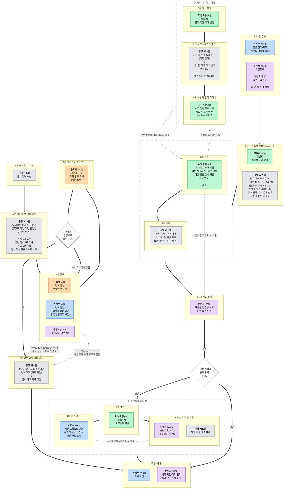

# UI/UX 개발 방법론

## 한 줄 요약

**법·서류·원칙으로 사용자를 짐작해서 만들고, 짐작한 것은 표시해 뒀다가 나중에 확인한다.**

## 지금 어디까지 왔나 (2026-09-17)

| 단계 | 상태 | 결과물 |
|---|---|---|
| 1 할 일 목록 · 2 흐름도 · 3 사용자 특징 | 끝남 | 이 문서 1~3단계 |
| 4 화면 시안 + 점검 | **진행 중 — 시제품 단계** | 흑백 스케치(`4단계_시안/`, 결정 기록) → **폰에서 눌러 보는 시제품(`시제품/`, 이후 화면의 정본)** |
| 5 주변 사람에게 시켜 보기 | 준비 중 | 시제품으로 진행 (5단계 절 참고) |

- 시제품 실행: `시제품/serve.sh` → PC `http://localhost:8765/` · 같은 와이파이의 휴대폰은 `serve.sh`가 알려 주는 주소. 계정·초대 코드·조작판은 `시제품/README.md`.
- 시제품은 **UI/UX 연구 도구**다. 화면·흐름에 공을 들이고 서버·DB·인증·AI·번역은 적당히 돌아갈 만큼만 흉내 낸다 (사용자 방침).
- 원칙 전체 점검(`4단계_시안/260917_원칙전체점검.md`)은 A·B·C·D와 E 일부를 반영했고, 남은 E는 시제품에서 고친다.
- 시제품을 원칙 4묶음으로 다시 점검했다(`시제품/260917_시제품_원칙점검.md`) — 크다 20건, 작다 약 45건. 사용자가 시제품을 직접 써 본 뒤 함께 고친다.
- **2026-09-18**: 사용자가 아이폰 홈 화면 앱으로 직접 쓰기 시작했다. 나온 것부터 고쳤다 — 고무줄 스크롤·팝업 뒤 스크롤·확대/축소, 받은 경보 자세히(W4-나), 지킴이 앱 설명 걷어내기, **점검 화면을 목록 한 장으로 합침**(G5), 그에 맞춰 **흐름도 B 묶음 순서 변경**. 아래 "폰에서 쓰기 시작한 뒤 고친 것" 절 참고.
- **2026-09-22 전제가 바뀌었다 (사용자 결정).** 화성산업진흥원의 기존 산업안전지킴이 웹은 참고 대상이 아니라 **우리가 당장 도입할 곳**이다. 진흥원이 화성시 공장·제조시설을 관리하고 지킴이를 보내 점검한다. 그래서 **이 문서에서 먼저 정한 방식보다 기존 웹이 쓰는 방식을 따른다.** 기존 방식은 `260921_기존시스템_분석.md`(2026-09-21, 관리자 계정으로 화면 구조를 읽음). 부딪히는 곳 — 운영자 승인·반려, 4인 1조와 읍·면·동 권역 배정, 34문항(공통 14 + 설비별 20)과 판 번호, 점검 결과 종류, 주간 보고 — 은 아래 "남은 일"의 첫 줄에서 고친다.
  - 같은 날 이어서 정함 — **기존 웹은 쓰지 않는다고 가정하고, 우리 앱 2개(근로자·지킴이)와 웹 1개(공장주·운영자)를 새로 만든다.** 기존 웹이 하던 일(기업등록·점검조 편성·점검항목 관리·제출 검사·통계·주간 보고)까지 우리 것이 맡는다. **지역 이름은 앱 제목에만 쓰지 않고 나머지(권역·공장 위치 등)에는 쓴다.** 연구 단계라 설계는 언제든 바뀔 수 있다.

## 우리 상황

- 시스템(TSFM 이상탐지 + LLM 체크리스트)은 어느 정도 설계·구현되어 있다.
- 사용자는 4역할이다: 운영자(화성산업진흥원), 근로자, 공장주, 지킴이(화성산업진흥원, 현장 방문).
- **공장 방문과 사용자 직접 테스트는 할 수 없다.**

## 표준 방법론과의 관계

인간중심설계(HCD, ISO 9241-210) 절차를 따르되, 할 수 없는 부분을 다른 방법으로 대신한다.

> 현장 조사는 문헌·통계 분석으로, 사용자 테스트는 원칙 기반 점검과 대리 사용자 테스트로 대체한다.

대리 사용자 테스트는 5단계 "주변 사람에게 시켜 보기"를 말한다. 표준 용어로는 복도 테스트다 — 이 문서는 세 이름을 같은 뜻으로 쓴다.

---

## 모르는 것을 만났을 때 (2026-09-16)

**이 연구의 목적은 화면 설계다.** 서비스가 돌아가는 규칙을 전부 정하는 것이 아니다. 공장에 가 볼 수 없으므로 모르는 것은 계속 나오는데, 그것을 다 정하고 나서 그리려 하면 화면을 영영 못 그린다. 그래서 모르는 것을 만나면 **하나만 묻는다.**

> **이걸 모르면 화면이 어떻게 되나?**
>
> 1. **틀리게 그린다** → **지금 정한다.** 안 그러면 나중에 통째로 다시 그린다.
> 2. **아예 못 그린다** → **지금 정한다.** 화면의 시작점이나 핵심 동작이 없는 경우다.
> 3. **화면은 그대로다** → **가설로 적고 그냥 그린다.** 구현할 때 정한다.

1번의 실제 사례가 전력계다. 전력계가 기계별인 줄 알고 "2번 프레스 전력 이상"이라고 그렸다면 존재할 수 없는 화면이 된다. 반대로 "경보를 몇 분 안까지 한 건으로 묶나"는 5분이든 10분이든 **그림이 똑같다** — 3번이다.

가설로 넘긴 것은 "가설 관리와 나중 확인" 절의 규칙대로 표시하고 모은다.

**이 기준으로 가른 결과 (2026-09-16)**

| 정할 것 | 언제 | 왜 |
|---|---|---|
| ~~방문 일정·담당 배정~~ | **정함** (2026-09-16) | 지킴이 앱의 시작점을 "내 할 일 목록" 하나로 정했다. 2단계 "B 시나리오에서 정한 것" 참고 |
| ~~사진 ↔ 점검 항목 연결~~ | **정함** (2026-09-16) | AI 항목에 사진이 붙어 다니되 참고용으로만 보인다. 2단계 "B 시나리오에서 정한 것" 참고 |
| ~~설비(기계) 등록~~ | **정함** (2026-09-17) | 운영자가 센서를 설치할 때 기계 이름·센서 위치·구역 이름을 등록한다. 공장주는 보기만 한다. 등록 화면은 운영자 웹에 생긴다 |
| ~~기본 체크리스트 관리 주체·판~~ | **정함** (2026-09-17) | 운영자가 운영자 웹에서 등록·개정하고, 지난 점검 기록은 그때의 판을 가리킨다. 항목 내용은 여전히 실제 체크리스트를 받아야 정해진다 |
| ~~기본 체크리스트 발행 기준 (업종인가 분야인가)~~ | **정함** (2026-09-17) | 업종 × 분야. 운영자 체크리스트 화면(M4)의 목록 모양이 갈려서 정했다 |
| 근로자 명단·방문 배정 | **정함** (2026-09-17) | 근로자 명단은 공장주가 초대로 관리한다(O6). 지킴이 담당 공장과 새 방문은 운영자가 배정하고 날짜는 지킴이가 적는다(G2) |
| ~~"확인했어요"로 다시 알림을 몇 번까지 미루나~~ | **정함** (2026-09-17) | 한도(2번, 값은 가설)를 넘으면 "다시 조치했어요"만 남고 공장주·운영자에게 알린다 — 2단계 "A 시나리오" |
| ~~센서 고장으로 값이 계속 이상할 때 누가 경보를 닫나~~ | **정함** (2026-09-17) | 공장주가 신고하고 운영자가 "센서 수리 중"으로 돌려 닫는다 — 2단계 "A 시나리오" |
| ~~흐름도 밖 의무(근로자 작업중지·대피 보고, 공장주 종사자 의견 듣기)를 넣나~~ | **정함** (2026-09-17) | 대피 보고는 범위 밖, 의견 듣기는 넣는다 — 1단계 "흐름도에 아직 없는 의무" |
| ~~로그인 방식~~ | **정함** (2026-09-17) | 공장주는 휴대폰 번호 인증, 앱·웹 같은 계정(O8·W8-라). 근로자는 초대로만 들어온다 (다시 들어오는 길은 가설) |
| ~~공지·의견 번역~~ | **정함** (2026-09-17) | AI 자동 번역 + "틀릴 수 있어요" 표시 + 원문 보기(W5-다·O7-다). 경보 문구는 미리 번역해 둔 문구 |
| ~~경보 화면에서 닫기·홈 가기를 허용하나~~ | **정함** (2026-09-17) | 허용하지 않는다. 조치 완료나 미루기로만 벗어나고, 조치 안 된 경보가 있으면 앱을 열 때 경보 화면이 뜬다 (W1-라 · 시안 15차) |
| 경보 받을 사람 (수신 대상 규칙·소속 모델) | 나중 | 서버가 누구에게 보낼지 정하는 일이고 화면은 안 바뀐다 |
| ~~센서 끊김 상태 (`이상 없음`과 `모름` 구분)~~ | **정함** (2026-09-17) | "모름"으로 표시하고 공장주·운영자에게 알린다. 근로자에게 경보는 보내지 않는다. 처음에는 "나중"으로 분류했으나, 근로자 홈의 "지금 이상 없음"이 거짓이 되는 문제라 함께 정했다 |
| 경보 묶음 시간창·재발 취급 | 나중 | 값만 다르고 그림은 같다 |
| ~~재점검에서 "안 고쳐짐"일 때의 루프~~ | **정함** (2026-09-17) | 재점검 확인 화면의 문구가 갈려서 정했다. 공장주에게 다시 간다 — 2단계 "B 시나리오에서 정한 것" |

이 표는 2026-09-16 이전에 "이것을 다 정해야 화면을 그릴 수 있다"고 묶어 두었던 8개를 다시 가른 것이다. 다시 갈라 보니 화면 때문에 지금 필요한 것은 2개였다. 나머지는 화면이 아니라 서버 규칙이라 이 연구의 범위가 아니다.

---

## 전체 흐름

| 단계 | 할 일 | 표준 이름 | 대신하는 것 |
|---|---|---|---|
| 1 | 역할별 할 일 목록 | 과업 분석 (문헌 기반) | 현장 관찰 |
| 2 | 흐름도 | 서비스 블루프린트 | — (대체가 아니라 설계 그 자체) |
| 3 | 평균 사용자 특징 | 사용자 프로파일 | 사용자 인터뷰 |
| 4 | 화면 시안 + 점검 (스케치 → 눌러 보는 시제품) | 프로토타이핑 + 휴리스틱 평가 + 인지적 워크스루 | 사용자 테스트 (전문가 눈으로) |
| 5 | 주변 사람에게 시켜 보기 → 4단계 반복 | 복도 테스트, 반복 설계 | 사용자 테스트 (동료에게 시켜서) |
| 나중 | 가설 확인 + 사용 로그 | — | 현장 검증 |

```
1 할 일 목록 → 2 흐름도 → 3 사용자 특징 → 4 화면 시안·점검 ⇄ 5 시켜 보기
                                                    ↓
                                          나중: 가설 확인·사용 로그
```

---

## 서비스 구성 (2026-09-15 결정)

사용자가 쓰는 화면 묶음은 **3개**, 서버는 **1개**다.

```
 [근로자 앱]           [지킴이 앱]      [공장주·운영자 웹]
  근로자 + 공장주        지킴이만         로그인한 역할에 따라 화면이 다름
  (로그인 역할에 따라)
      \               |               /
       ┌──────────────────────────────┐
       │ 서버 1개                        │
       │ 로그인·권한 (누가 무엇을 보나 표) │
       │ 기록 저장 · 알림 보내기           │
       │ 분석 엔진 (TSFM, 사진 인식·사고   │
       │ 사례 검색·LLM)                  │
       └──────────────────────────────┘
                     ▲ 센서 값
               ThingsBoard ← 공장 센서
```

| 묶음 | 사용자 | 방식 | 이렇게 정한 이유 |
|---|---|---|---|
| 근로자 앱 | 근로자, **공장주** | 처음엔 PWA, 나중에 자체 앱으로 바꿀 수 있음. **설치는 필수** | 경보는 반드시 울려야 한다. 자체 앱으로 바꿀 때 지킴이 앱과 따로 옮길 수 있게 독립시킨다. 공장주도 현장에 나가 있을 때 경보를 늦게 알면 안 되므로 이 앱에 로그인해 같은 경보 화면을 쓴다 (2026-09-16 결정). 공장주용 앱은 따로 만들지 않는다. |
| 지킴이 앱 | 지킴이 | 처음엔 PWA, 나중에 자체 앱으로 바꿀 수 있음 | 사진·전파 약한 곳 저장 등 요구가 근로자와 전혀 다르다. |
| 공장주·운영자 웹 | 공장주, 운영자 | 웹 하나, 로그인에 따라 화면이 다름 | 둘 다 현황판·기록 조회가 중심이라 겹치는 화면이 많다. |

- 누가 무엇을 볼 수 있는지는 **서버가 막는다.** 화면을 나눈 것은 보안이 아니라 만들기·배포의 편의를 위한 것이다.
- 세 묶음은 같은 서버를 쓰므로 경보·기록은 어디서 보든 같은 1건이다.
- 시제품은 이 구성을 그대로 흉내 낸다 — 근로자 앱(`worker.html`) · 지킴이 앱(`guard.html`) · 공장주·운영자 웹(`web.html`)이 작은 로컬 서버(`server.py`) 하나를 함께 쓴다. 실제 서버 구조가 아니라 연구용 대역이다.

---

## 실증 현장의 센서 (실물 기준, 2026-09-16)

화면 설계는 "센서가 무엇을 재고 어디에 붙어 있나"를 전제로 한다. 그 전제가 틀리면 경보 화면이 통째로 틀린다. 실물 구성의 정본은 `../field_deployment/` 두 문서(제품리스트·전체시스템 구성도)이고, 여기에는 화면 설계가 달라지는 것만 옮겨 적는다.

**실증은 사이트 3곳, 사이트마다 센서 5개 안팎이다** (사용자, 2026-09-17). 사이트는 실증 현장(공장이나 빌딩) 하나를 말한다 — 사업계획서의 "실증 서비스 적용 사이트 3개소", 제품리스트의 "1개 사이트 집중 실증"과 같은 뜻이다(최종 확인은 실증 담당). 아래 표는 제품리스트의 "1개 사이트 집중 실증" 구성이고, 나머지 사이트는 이 가운데 5개 안팎을 고른 구성으로 본다. 시제품은 공장 3곳에 센서 5개씩(기계 1대 · 가스 · 전기 · 누수 · 온습도)을 붙였다.

사업계획서의 실증 지역은 **강원도**이고, 이 연구의 예시·참고 시스템은 **화성** 산업안전지킴이다. 둘은 따로이므로 **화면에는 지역 이름을 쓰지 않는다** — 운영 쪽 이름은 "산업안전 운영", "산업안전지킴이 운영센터"만 쓴다 (사용자, 2026-09-17).

1개 사이트 집중 실증 구성의 센서는 **7개**, 여기에 IP 카메라 1대가 더 있다.

| 센서 | 재는 것 | 붙는 자리 | 화면에서 갈리는 점 |
|---|---|---|---|
| 3상 전력계 1대 (CT 3개) | 전압·전류·전력·역률·고조파 | 공장 인입 배전반 한 곳 | **기계별이 아니다.** 어느 기계 때문인지 말해 주지 못한다 |
| 진동센서 2대 | 3축 속도·가속도 RMS, 변위 | 기계 표면에 직접 | 한 대가 여러 값을 낸다. 화면에는 값마다가 아니라 센서 단위로 보인다 |
| 접촉온도 1세트 (PT100) | 설비 표면·배관 온도 | 기계 표면·배관에 직접 | 같은 기계에 붙으면 진동과 한 경보로 묶인다 |
| 가스센서 1대 | 가연성가스 또는 CO 농도 | 공간의 공기 | 기계 이름을 쓸 수 없다 |
| 온·습도센서 1대 | 실내 온도·습도 | 공간의 공기 | 기계 이름을 쓸 수 없다 |
| 누수센서 1세트 (필름 1m) | 물이 닿았나 / 선이 끊겼나 | 바닥·배관 밑 1m 한 줄 | **숫자가 없다.** 정상 범위 띠도 "평소 몇 배"도 못 그린다 |
| IP 카메라 1대 | 영상 (5MP, 야간 적외선) | 한 장면이 보이는 고정 위치 | 이 서비스 화면에는 나오지 않는다 (아래 참고) |

**붙는 자리가 두 가지다.** 진동과 접촉온도는 **기계 한 대**에 붙고, 전력·가스·온습도·누수·카메라는 기계가 아니라 **공간**에 붙는다. 그래서 경보를 묶는 단위도 두 가지가 된다 — **기계 한 대**, 그리고 공간에 붙은 **센서 한 대**다 (2026-09-17 결정, 4단계 "경보 묶는 단위 다시 보기" 참고).

**전력계는 공장 전체 전기를 잰다.** 그러므로 "진동과 전력을 한 설비 경보로 묶는다"는 설명은 성립하지 않는다. 실제로 한 기계로 묶이는 것은 **진동센서 1대가 내는 여러 값**과, 같은 기계에 붙은 접촉온도뿐이다. 근로자앱 시안 W2-가의 `진동 외 2개`는 이 뜻으로 맞게 그려져 있다.

**누수는 켜짐·꺼짐 두 상태뿐이다.** 다른 센서처럼 정상 범위 띠와 "평소 몇 배"로 그릴 수가 없으므로, 화면에 값 칸이 아니라 상태 칸이 필요하다. 게다가 이 제품은 **누수와 단선을 둘 다 감지하는데 그 둘을 따로 받을 수 있는지가 아직 확인되지 않았다**(제품리스트: 배선도 확인 필요). 따로 못 받으면 화면에는 "누수 또는 단선"이라고만 쓸 수 있다.

**카메라 영상은 이 서비스의 어느 화면에도 나오지 않는다** (2026-09-16 결정). 영상은 서버가 저장·분석만 한다. 장비는 실증 구성에 들어가 있지만 사람이 보는 화면에는 자리를 주지 않는다는 뜻이고, 나중에 필요해지면 그때 화면을 새로 설계한다. **지킴이가 점검하며 휴대폰으로 찍는 사진과는 다른 물건이므로 섞지 않는다.**

**아직 안 정한 것**

| 정할 것 | 지금 상태 | 화면에 미치는 영향 |
|---|---|---|
| 진동센서 2대를 어느 기계에 붙이나. 서로 다른 기계 하나씩인가, 같은 기계 두 군데인가. 접촉온도는 어느 기계인가 | **미정 — 현장조사에서 정함.** 제품리스트도 설치 위치는 현장조사 확정 사항으로 둔다 | 감시하는 기계가 1대인지 2대인지가 갈린다. **화면은 어느 쪽이든 그대로 돌아가게 만든다** |
| 경보 첫 줄에 "어디"를 어떻게 쓰나. 공장을 한 덩어리로 보나, 공장 안을 구역 몇 칸으로 나누나 | **미정 — 현장 보고 정함** (2026-09-16). 공장이 좁으면 "우리 공장" 한 줄로 충분하고, 넓으면 "도장실"처럼 갈 곳을 알려 줘야 한다 | 구역으로 나누면 구역 이름은 **운영자가 설치 때 등록한다** (2026-09-17 결정) |
| 누수·단선을 따로 받을 수 있나 | 미정 — 배선도 확인 필요 | 화면에 상태를 하나로 쓸지 둘로 쓸지 |
| 가스 종류(가연성가스인지 CO인지)와 측정 범위 | 미정 — 현장조사에서 확정 | 경보 문구와 "정상 범위" 표시 |

---

## 1단계. 역할별 할 일 목록

**질문**: 4역할은 각자 무슨 일을 해야 하는 사람인가?

**볼 자료**
- 산업안전보건법: 사업주·근로자 의무, 위험성평가, 작업중지
- 중대재해처벌법 시행령: 경영책임자의 점검 의무
- 사업장 위험성평가에 관한 지침 (고용노동부 고시)
- 화성산업진흥원 사업 자료: 산업안전지킴이 제도, 현장개선 지원사업
- **기존 화성 산업안전지킴이 웹** (2026-09-21 관리자 계정으로 화면 구조를 읽음 → `260921_기존시스템_분석.md`). **2026-09-22부터 이 웹의 업무 방식을 따른다.** 아래 표에서 "(기존 웹)"이 붙은 것이 여기서 온 일이다
- 기존 목업 (`../Proj_SafetyAI/docs/visualization/mockup_code/` — 이 저장소 밖, 형제 폴더): 지킴이 앱 · 안전책임자 웹 · 운영 콘솔. 참고만 하고, 기능은 이 문서의 설계를 따르며 만들면서 고쳐 나간다. 목업의 "안전책임자"가 이 문서의 공장주인지 별도 담당자인지는 확인 필요 (아래 가설 목록 참고).

**자료를 어디에 쓰나**

사용자에게 "무슨 일을 하세요?"라고 물을 수 없으니, **그 사람이 해야 하는 일이 적힌 문서**를 대신 읽는다. 문서에 적힌 의무는 곧 화면에 있어야 할 기능이 된다.

- 법·지침 → 공장주·근로자가 **반드시 해야 하는 일**
- 진흥원 사업 자료 → 운영자·지킴이가 **실제로 하는 일**

**역할별 할 일** (2단계 흐름도의 A·B 시나리오 기준)

| 역할 | 근거 자료에 적힌 의무 | 화면에 필요한 기능 |
|---|---|---|
| 근로자 [App] | 사업주의 조치에 따른다 (산업안전보건법 제6조) | 경보 알림 (무엇이·어디서)<br>조치 완료 표시<br>다시 알림을 받았을 때 "확인했어요"<br>받은 경보 기록 조회 (2026-09-17)<br>안전 공지 읽기·읽음 표시 (2026-09-17)<br>알림 소리·언어 설정 (2026-09-17)<br>공장주 초대로 앱에 들어오기 · 알림 허용 (2026-09-17)<br>의견 보내기·답 보기 (이름 빼기 가능, 2026-09-17)<br>공지·의견을 자기 언어로 보기 (AI 자동 번역, 2026-09-17)<br>내 정보 (언어·알림만 고침) |
| 공장주 [Web] | 유해·위험요인을 파악해 개선한다 (산업안전보건법 제5조)<br>위험성평가 결과를 기록·보존한다 (같은 법 제36조)<br>개선 여부를 반기 1회 이상 점검한다 (중대재해처벌법 시행령 제4조) | 우리 공장 현황판 [Web]<br>경보 알림·조치 완료 표시 [App] (근로자 앱에 로그인, 근로자와 같은 화면)<br>센서 이상·점검 기록 조회 [Web]<br>개선 요청 항목 개선 완료 표시 [Web]<br>반기 점검 증빙 출력 [Web]<br>안전 공지 올리기·읽음 현황·다시 알리기 [Web] (2026-09-17)<br>근로자 초대·명단 관리 [Web] (2026-09-17)<br>작업 예정 알리기 — AI가 읽고 그 시간 경보 기준을 맞춤 [App·Web] (2026-09-17)<br>센서 고장 신고 [App·Web] (2026-09-17)<br>근로자 의견 받기·답하기·조치함 표시 [Web] (2026-09-17)<br>휴대폰 번호 인증 로그인, 앱·웹 같은 계정 (2026-09-17)<br>**점검 신청·거부** [Web] (기존 웹, 2026-09-22 — 거부도 기록에 남는다)<br>**개선 요청은 운영자가 점검을 승인한 뒤에 받는다** (기존 웹, 2026-09-22) |
| 지킴이 [App] | 50인 미만 제조업을 방문해 분야별로 점검하고 개선을 요청한다 (화성시 산업안전지킴이)<br>**4인 1조(조장 + 조원 3)로 읍·면·동 권역을 맡는다** (기존 웹) | **사전조사 — 조별로 방문예정일 잡기** (기존 웹, 2026-09-22)<br>**현장점검 — 기본 체크리스트 34문항(공통 14 + 설비별 20)에 답하고 제출** (기존 웹)<br>**반려되면 고쳐서 다시 제출** (기존 웹)<br>**주간 보고 — 조별 주간 실적** (기존 웹)<br>사진 촬영·업로드<br>AI 생성 항목에서 점검할 항목 선별<br>항목별 점검 입력<br>방문 전 센서 이상 기록 조회<br>재방문 개선 확인 입력<br>내 점검 기록 조회 · 담당 공장 목록 (2026-09-17)<br>방문 날짜 적기 (2026-09-17) |
| 운영자 [Web] | 지킴이 점검 목표를 관리하고, 개선 요청이 개선 완료됐는지 추적한다 (화성산업진흥원 산업안전본부) | 전체 공장 현황판<br>공장별 기록·이력 관리<br>개선율 통계<br>AI 품질 확인 (초안과 최종 항목 비교)<br>공장 등록 · 기계·센서·구역 등록 · 기본 체크리스트 관리 · 지킴이 담당 공장·방문 배정 (2026-09-17)<br>고장 신고 확인·센서 수리 중 전환 (2026-09-17)<br>**기업등록** — 들어오는 길 다섯(현장등록·점검신청·점검거부·기업DB·기타), 소유형태·기업종류·행정구역 (기존 웹, 2026-09-22)<br>**점검조 편성(조장 + 조원 3)·읍·면·동 권역 배정** (기존 웹)<br>**점검항목 판 관리** — 34문항 5영역, 판 번호 (기존 웹)<br>**제출 검사 — 승인·반려** (기존 웹)<br>**개선 요청·완료 확인** (기존 웹)<br>**주간점검 보기 · 통계현황** (기존 웹)<br>**회원 관리** — 가입 승인·반려, 분야(소방·전기·화학·공통), 근무 상태 (기존 웹)<br>공지사항·자료실 (기존 웹) |

중앙 시스템(기호 A①~B⑨와 2026-09-22에 끼워 넣은 B⓪·B⑥-1은 2단계 흐름도에서 정의한다. A① 센서 정보 수신 · A② 이상 판정 · A⑤ 센서 이상 기록 · B① 체크리스트 준비 · B④ AI 체크리스트 추가 · B⑥ 점검 기록 · B⑨ 개선 확인 이력 기록)은 사용자가 아니므로 표에서 뺀다.

**흐름도에 아직 없는 의무** — 자료에는 있지만 A·B 시나리오에 자리가 없는 것. 흐름도에 넣을지 나중에 정한다.

| 역할 | 자료에 적힌 의무 | 근거 |
|---|---|---|
| 근로자 | 급박한 위험이면 작업을 멈추고 대피한 뒤 보고한다 | 산업안전보건법 제52조 — **2026-09-17 범위 밖으로 정함.** 급박한 순간에는 앱 양식이 아니라 대피하고 말로 알리는 것이 맞다. 앱 의견 보내기(W6) 맨 위에 "지금 위험하면 먼저 피하고 말로"를 적어 둔다 |
| 근로자 | 위험성평가 결과를 공유받는다 (작업 전 안전점검회의) | 사업장 위험성평가에 관한 지침 — **2026-09-17 근로자 앱 "안전 공지"로 화면에 들어감.** 흐름도에는 아직 넣지 않았다 (화면이 달라지지 않음) |
| 공장주 | 종사자 의견을 듣고 필요하면 조치한다 | 중대재해처벌법 시행령 제4조 — **2026-09-17 서비스에 들어감.** 근로자 앱 "의견 보내기"(W6, 이름 빼기 가능) → 공장주 웹 "의견"(O7, 답·조치함) → 반기 증빙(O4). 흐름도에는 넣지 않았다 (화면이 달라지지 않음) |

지킴이의 "개선을 요청한 뒤 조치됐는지 다시 확인한다"(개선율 산출의 바탕)는 2026-09-15 흐름도 B⑧로 옮겼다.

**확인 필요 (가설)** — 자료로는 알 수 없어 짐작한 것. 인터뷰·시범 운영 기회가 생기면 먼저 확인한다.
- ~~지킴이는 지금 점검 결과를 무엇으로 기록하나?~~ → **기존 웹의 "현장점검"에 적어 제출한다** (2026-09-21 확인). 현장에서 바로 적는지, 종이에 적었다가 옮기는지는 아직 모른다
- ~~운영자와 지킴이 사이의 보고 방식은?~~ → **점검마다 제출 → 운영자 승인·반려, 조별 주간점검** (2026-09-21 확인)
- 지킴이 분야는 회원 정보에 **소방·전기·화학·공통**으로 적힌다(2026-09-21 확인). 이것이 조 단위인지 사람 단위인지, 우리 센서(전력·진동·접촉온도·가스·온습도·누수)와 어떻게 맞물리는지는 아직 모른다
- 기존 가입유형 **"행정인력"** 은 무슨 일을 하나? 우리 역할 넷 중 어디에도 없다 (2026-09-22)
- 점검 결과 **"패트롤"** 은 어떤 점검인가? (점검완료·재점검·패트롤·기타 중, 2026-09-22)
- 지킴이·공장주가 로그인했을 때 보는 메뉴와 **점검표를 적는 화면**은 아직 못 봤다 (관리자 화면만 봄)
- 소규모 공장에 안전 담당자(관리감독자)가 따로 있나, 공장주가 직접 챙기나?
- 근로자가 업무 중 휴대폰을 쓸 수 있나? 외국인 근로자 비율은?
- 역할별 기기 배정(근로자·지킴이 App, 공장주·운영자 Web)이 실제와 맞나?

**결과물**: 역할별 "제도상 하는 일 / 우리 서비스에서 할 일" 표

---

## 2단계. 흐름도

**질문**: 이상이 생기면 누가, 언제, 무엇을 원하나?

사건이 시작되는 길은 둘이고, 마지막 확인은 같다. 위에서 아래로 따라가며, 단계마다 **누가 무엇을 하는지** 카드로 적는다. 카드 색은 역할을 뜻한다.

- **A. 센서 이상**: 센서 정보 수신 → AI 모델 이상 판정·경보 발생 → 경보 → 근로자 안전조치 후 조치 완료 표시 → (센서가 정상으로 돌아오면) 경보 해제·기록 마감 → 확인. 조치 완료를 표시했는데도 센서가 이상하면 다시 알린다.
- **B. 점검** (2026-09-22 기존 웹 방식으로 고침): **운영자가 판을 깐다**(기업등록 → 점검조 편성·읍면동 권역 배정, B⓪) → 조가 **사전조사**로 방문예정일을 잡고 중앙 시스템이 체크리스트를 준비한다(B①) → 지킴이가 현장점검 후 **제출**(B②·B⑥, 사진·AI는 원할 때 곁길 B③~B⑤) → **운영자가 제출을 검사해 승인 또는 반려**(B⑥-1, 반려면 지킴이가 고쳐 다시 낸다) → 승인된 점검에 문제 항목이 있으면 **개선 요청**으로 공장주에게 간다 → 공장주 개선 조치(B⑦) → 지킴이 재점검(B⑧) → **운영자 완료 확인**·기록(B⑨) → 확인. 아래는 2026-09-18까지의 설명이다 — 방문 전 체크리스트(운영자가 업종 × 분야 판으로 관리하고 중앙 시스템이 발행하는 기본 체크리스트 + 이 공장 과거 문제 항목)는 방문 전에 이미 준비되어 있다 → 지킴이 사진 → AI가 체크리스트 항목을 추가로 생성 → 지킴이가 AI 항목만 선별 → 지킴이 점검·개선 요청 → 점검 기록 → (문제 항목이 있으면) 공장주 개선 조치 → 지킴이 재방문 점검 → 개선 확인 이력 기록 → 확인. 재점검에서 안 고쳐진 항목은 공장주 개선 조치로 되돌아가 고쳐질 때까지 반복한다 (2026-09-17). 문제 항목이 없으면 점검 기록에서 바로 확인으로 간다.



색: 회색 중앙 시스템 · 주황 근로자 · 파랑 공장주 · 초록 지킴이 · 보라 운영자
[App] 근로자 앱(근로자·공장주가 로그인)·지킴이 앱 (각각 따로) · [Web] 공장주·운영자 공통 웹 (로그인에 따라 화면이 다름) — 위 "서비스 구성" 참고
공장주는 경보를 **근로자 앱으로 받는다.** 근로자와 같은 화면이고 조치 완료도 누를 수 있다 (2026-09-16 결정, 아래 "A 시나리오에서 정한 것" 참고)
(2026-09-15 확정한 흐름. 같은 날 4단계에서 고침: 방문 전 체크리스트(업종별 기본 체크리스트·이 공장 과거 문제 항목)는 B① 방문 전 준비, 문제 항목 갈림길·B⑦ 공장주 개선 조치·B⑧ 재점검·B⑨ 기록. **2026-09-18 사용자 지시로 B 묶음 순서를 고침** — 기본 체크리스트로 바로 점검하고(B②), 사진·AI 항목 추가(B③~B⑤)는 지킴이가 원할 때 들어가는 곁길이 되었다. 점검 도중에도 더할 수 있고 이미 답한 항목은 그대로 남는다. 옛 번호는 B② 사진 · B③ AI 추가 · B④ 선별 · B⑤ 점검이었다. 나중에 다시 바뀔 수 있다. **2026-09-22 기존 웹 방식을 따르면서 B⓪ 판 깔기(공장주 점검 신청·거부, 운영자 기업등록·점검조·권역)와 B⑥-1 제출 검사(운영자 승인·반려)를 끼워 넣었다.** 옛 결정 기록 속 번호가 흐려지지 않게 B①~B⑨ 번호는 그대로 두고 새 단계만 끼웠다. B①은 사전조사(방문예정일)를 품고, B⑨는 운영자 완료 확인을 품는다)

**A 시나리오에서 정한 것** (2026-09-16)

경보 하나에 도장을 **두 개** 찍는다. 둘은 따로 움직이므로, 어느 하나만으로 경보를 끝내지 않는다.

| 도장 | 누가 찍나 | 무엇을 뜻하나 |
|---|---|---|
| 사람 확인 | 근로자 (A④) | 안전조치를 했다고 표시한 것 |
| 기계 확인 | 중앙 시스템 (A⑤) | 센서 값이 정상으로 돌아온 것 |

둘 다 찍히면 경보가 끝난다. 그래서 네 경우가 생기고, 흐름도의 갈림길이 그 넷을 가른다.

| | 센서 아직 이상 | 센서 정상으로 돌아옴 |
|---|---|---|
| 근로자가 아직 표시 안 함 | 계속 알린다 | 미확인 종료로 기록에 남긴다 (점선) |
| 근로자가 조치 완료 표시 | 다시 알린다 (A③으로 돌아감) | 경보 해제·기록 마감 (A⑤) |

- **근로자는 경보를 해제하지 않는다.** 근로자가 누르는 것은 "조치했다"는 표시다. 해제는 센서 값을 보고 중앙 시스템이 한다. 조치했는데도 값이 이상하면 위험이 남아 있다는 뜻이므로 경보를 끄지 않는다. 산업 경보 표준 ISA-18.2가 사람 확인과 상태 해제를 나누는 이유가 이것이다 (4단계 ②묶음 근거).
- **센서 이상 기록은 경보가 생기는 A②에서 시작한다.** 근로자가 아무것도 누르지 않은 경보도 기록에 남아야 한다. 공장주의 반기 점검 증빙이자 운영자의 이력이기 때문이다. A④·A⑤에서 일어난 일은 그 기록에 덧붙고, 해제 시점에 마감된다.
- **공장주도 경보를 앱으로 받고 조치 완료를 누를 수 있다** (2026-09-16). 공장주는 근로자 앱에 로그인해 **근로자와 같은 경보 화면**을 쓴다. 작은 공장일수록 조치하는 사람이 공장주 본인이기 때문이다. 그래서 사람 확인 도장은 "근로자가 찍는다"가 아니라 "**근로자 또는 공장주가 찍는다**"이고, 기록에는 **누가 눌렀는지**를 함께 남긴다. 자세한 근거는 3단계 "정한 것" 참고.
- **다시 알림을 받은 근로자가 누르는 "확인했어요"는 경보를 끄지 않는다.** 다시 알리는 간격을 한 번 미루는 것이다 (시안 W2-다). 바뀌는 것은 알림뿐이고 경보 상태는 그대로다. 누른 사실은 기록에 남긴다(O2-나 "일어난 일"). 미루는 시간은 아래 "아직 안 정한 것"에 있다.
- **아무도 확인하지 않은 채 센서가 정상으로 돌아온 경보**는 기록에 "미확인 종료"로 남긴다. 이런 것이 쌓이면 임계값이 너무 예민하거나 근로자가 앱을 보지 않는다는 신호이므로, 지우지 않고 세어 둔다.

- **"확인했어요"로 미룰 수 있는 횟수에 한도를 둔다** (2026-09-17 결정). 한도(2번 — 값은 가설)를 다 쓰면 그다음 다시 알림에는 "확인했어요"가 없고 **"다시 조치했어요"만** 남는다. 동시에 **공장주와 운영자에게 알린다.** 한도가 없으면 이 버튼이 경보를 끄는 버튼이 되기 때문이다 (시안 W2-다·W2-라).
- **센서 고장은 공장주가 신고하고 운영자가 닫는다** (2026-09-17 결정). 공장주가 경보 화면에서 "센서 고장 같아요"를 누르면(W2-마·O1-마) 운영자에게 가고, 운영자가 최근 값을 보고 "**센서 수리 중**"으로 돌리면(M2-마) 그 센서의 열린 경보가 닫히고 되돌릴 때까지 새 경보가 울리지 않는다. 닫힌 경보는 "센서 수리로 닫힘"으로 기록에 남는다. 흐름도 A③ → A⑤ 두 번째 점선.
- **값이 안 들어오는 센서는 "모름"으로 보여 준다** (2026-09-17 결정). "이상 없음"으로 두지 않는다. 공장주와 운영자에게 알리고, 근로자에게 경보는 보내지 않는다 — 근로자가 조치할 위험이 아니라 장비 문제다. 대신 근로자 홈은 "일부 센서 확인 안 됨"으로 바뀐다(W1-마). 몇 분 뒤부터 끊김으로 볼지, 수리 중에도 값을 기록할지는 가설이다.

**A 시나리오에서 정한 것 (2026-09-17, 원칙 전체 점검 뒤)**
- **한 사람이 조치 완료를 누르면 같은 경보를 받은 모두의 화면이 같이 바뀐다.** 누가 언제 눌렀는지가 보이고 조치 완료 버튼은 사라진다. 센서가 아직 이상이면 **다시 알림은 모두에게** 간다 — 누른 사람만 받으면 그 사람이 자리를 비웠을 때 아무도 모른다 (시안 W2-바).
- **미루기 횟수는 경보 하나에 2번**(횟수는 가설)이고, 누가 누르든 함께 줄어든다 — 사람마다 세면 여럿이 돌아가며 한도를 무너뜨린다.
- **다시 알림에는 "다시 조치했어요"와 미루기("5분 뒤 다시 알려 주세요")를 함께 둔다.** 다시 손을 쓴 사람이 미루기를 눌러 기록이 "미룸"으로 남는 일을 막는다. "확인했어요"라는 이름은 끝났다는 뜻으로 읽혀 버렸다 (시안 W2-다).
- **작업 때문에 생기는 헛경보는 "작업 예정 알리기"로 막는다 — 센서를 끄지 않는다.** TSFM 엔진에는 이미 현장 메모 기능이 있다(`submit_memo`). 공장주가 "오늘 18~22시 도장 작업, 전력 50 부근까지 오를 예정"처럼 쓰면
  - AI(LLM)가 **한 번만** 읽어 센서(등록된 현장 이름으로 고름) · 시작·끝(없으면 보낸 때부터 2시간) · 작업 · **목표 수준(숫자를 그대로 받아 적음)** · 평소에도 있던 일인지를 뽑는다.
  - 엔진은 그 시간 예보를 **목표 수준 ÷ 예상값 비율로 곱해** 범위를 올려 잡고(센서 하나일 때만), 시작·끝 무렵 판정을 잠시 보류하고, 작업 중 폭을 평소 폭으로 고정한다. 평소에도 있던 일이면 보류·폭 고정은 걸지 않는다.
  - **사양서 안전 한계는 바뀌지 않는다.**
  - "아무것도 안 바뀐" 경우를 셋(못 알아들음 · 평소에도 있던 일 · 바꿀 내용 없음)으로 나눠 돌려주고, 경고(숫자가 있는데 수준을 못 읽음 · 센서가 둘이라 수준 적용 안 됨)를 붙인다 — 화면은 이것을 그대로 보여 준다.
  - 오래 가는 변화("새 금형 이후 계속 높음")는 이 글이 붙어 있으면 엔진이 서서히 밀리는 값을 심사할 때 정상 사유로 보고 **기준을 다시 잡는다**(재보정). 글이 없으면 곧바로 이상으로 확정한다.
  - **쓰는 사람은 공장주**(앱 W2-사·아, 웹 O1-사·아·자). 근로자는 쓰지 않는다(센서 값을 보지 않는다). 운영자는 공장 기록(M2-다)에서 본다. 고장 신고 창과 운영자 수리 중 화면에서 이 길을 먼저 안내한다 — **수리 중은 센서가 진짜 고장일 때만** 쓴다.
  - **엔진에 없는 것**: 넣은 글을 **취소**해 되돌리는 기능이 없다(같은 시간에 고쳐 쓰면 덮어쓰기는 된다). 작업이 취소·연기되면 조정이 그대로 걸린다 — 엔진 보강이 필요하다. 시안에는 "작업 취소" 버튼을 가설로 그렸다.

**A 시나리오에서 아직 안 정한 것** — 모두 "몇 분"짜리 값이다. 이 값이 없으면 경보를 구현할 수 없다.

| 정할 것 | 왜 필요한가 | 제안 |
|---|---|---|
| 센서가 정상으로 몇 분 유지되면 해제하나 | 임계값 근처에서 값이 떨리면 경보가 켜졌다 꺼졌다 반복한다 | 센서 종류별로 다르게 둔다. 가스는 짧게, 진동·전력은 길게 |
| 조치 완료 표시 뒤에도 이상할 때 다시 알리는 간격 | 흐름도의 "다시 알림" 갈래가 이 값으로 돈다 | 시안 W2-다에 이미 5분으로 그려져 있다 |
| 아무도 조치 표시를 안 할 때 누구에게 몇 분 뒤 올리나 | 야간·무인 시간에 경보가 방치된다 | 공장주 먼저, 더 지나면 운영자 |

**B 시나리오에서 정한 것 — 기존 웹 방식 (2026-09-22)**

기존 화성 산업안전지킴이 웹의 방식을 따르기로 하면서 아래가 바뀌었다. 이 아래의 2026-09-16·17 결정과 부딪히면 이쪽이 이긴다.

- **지킴이가 낸 점검은 운영자가 검사한다** (B⑥-1). 승인하면 그 점검의 문제 항목이 **개선 요청**으로 공장주에게 가고, 반려하면 지킴이가 고쳐서 다시 낸다. 그래서 **공장주는 승인된 점검만 본다.**
- 그래서 **점검 결과가 굳는 때는 "제출"이 아니라 "승인"이다.** 반려된 점검은 지킴이가 다시 고칠 수 있다. 반려 사유를 적는 칸이 있는지, 반려 뒤 어디까지 고칠 수 있는지는 아직 모른다 `가설`.
- **지킴이는 4인 1조(조장 + 조원 3)로 움직이고, 조가 읍·면·동 권역을 맡는다.** 운영자가 조를 짜고 권역을 준다(B⓪). 공장 하나하나를 사람에게 배정하던 앞의 결정("지킴이 담당 공장과 새 방문은 운영자가 배정")은 **조·권역 배정으로 바뀐다.** 조 안에서 누가 적고 누가 내는지는 아직 모른다 `가설`.
- **방문예정일은 조가 사전조사로 잡는다** (B①). 앞의 "방문 날짜는 지킴이가 적는다"와 같은 자리다.
- **공장이 들어오는 길은 다섯이다** — 현장등록 · 점검신청 · 점검거부 · 기업DB · 기타. 공장주가 **점검을 거부해도 기록으로 남는다**(B⓪).
- **기본 체크리스트는 34문항 5영역**(공통 14 + 설비별 20)이고 **판 번호**(`26VER01`)가 붙는다. 앞의 "업종 × 분야 판"은 이 구조로 바뀐다. 지난 점검이 어느 판으로 이뤄졌는지 남는다.
- **점검 결과 종류는 점검완료 · 재점검 · 패트롤 · 기타**다. 패트롤이 무엇인지는 아직 모른다 `가설`.
- **개선 완료는 운영자가 확인한다** (B⑨). 지킴이 재점검 결과를 보고 운영자가 완료를 찍는 것으로 본다 `가설`. 재점검도 제출 검사를 거치는지는 모른다 `가설`.
- **조별 주간 보고가 있다.** 지킴이 조가 주마다 점검 기업 수와 결과별 수(완료·재점검·패트롤·기타)를 낸다. 흐름도 밖의 정기 보고라 그림에는 넣지 않았다.
- **개선율의 "무엇을 세나"**(아래 표)는 **승인된 점검의 문제 항목**으로 좁혀 읽는다. 반려된 점검의 항목은 세지 않는다.

**B 시나리오에서 정한 것** (2026-09-16)

- **지킴이가 고르는 것은 AI가 만든 항목뿐이다.** 업종별 기본 체크리스트와 이 공장 과거 문제 항목은 빼지 못하고 전부 점검한다.
  - 기본 체크리스트는 업종별로 이미 정해져 있는 점검 항목을 중앙 시스템이 발행한 것이다. 이것을 뺄 수 있게 하면, 반드시 봐야 할 항목이 지킴이가 한 번 고르지 않은 것만으로 점검 기록에서 사라진다. 그 기록이 공장주의 반기 점검 증빙이므로 증빙에 구멍이 생긴다.
  - 과거 문제 항목도 같다. 지난번에 문제였던 곳을 다시 보는 것이 재방문의 이유다.
  - 고르는 대상이 AI 항목뿐이므로, AI 채택률은 AI 제안 수를 기준으로 센다. 4단계 운영자 시안의 "업종별 기본·지난번 문제 항목은 세지 않음"이 이 뜻이다.
- 화면에서 기본 항목과 과거 문제 항목은 **고르는 목록이 아니라 점검할 목록**으로 보인다. 아무것도 고르지 않은 상태로 시작하는 것은 AI 제안에만 적용된다.
- **개선율은 이렇게 센다.** 세 가지를 같이 정했다.

| 정한 것 | 내용 | 왜 이렇게 정했나 |
|---|---|---|
| 무엇을 세나 | 지킴이가 **문제로 찍은 항목 전부**. 문제로 찍으면 그것이 곧 개선 요청이고, 지킴이가 따로 요청 표시를 하지 않는다 | 지킴이 입력을 늘리지 않는다(3단계 원칙). 요청을 적게 할수록 개선율이 올라가는 구조를 만들지 않아야, 성과 지표를 현장에서 조절할 수 없다 |
| 아직 재점검 안 한 항목 | 개선율에서 **빼고**, "아직 확인 못 함 ○○개"를 나란히 보여 준다 | 함께 세면 점검 직후 0%에서 시작해 시간이 가면 저절로 오른다. 그러면 낮은 숫자가 "안 고쳐졌다"인지 "아직 안 가 봤다"인지 구분되지 않는다 |
| 어느 기간으로 묶나 | **점검한 달** 기준. 화면에는 "○월 점검분"이라고 밝혀 쓴다 | 항목이 속한 달이 나중에 바뀌지 않아 추적할 수 있다. 다만 최근 달은 재점검이 아직 안 끝나 낮게 보이므로, 개선율은 몇 달 전 점검분으로 본다 |

- 그래서 화면에는 숫자 두 개가 나란히 선다. 예: `5월 점검분 개선율 100% (3/3 확인) · 아직 확인 못 함 2개`
- 큰 공사가 필요해 당장 못 고치는 항목도 분모에 들어간다. 그 억울함은 분모를 좁혀서 풀지 않고, 재점검에서 "안 고쳐짐"의 사정을 남기는 방식으로 푼다 (아래 "아직 안 정한 것" 참고).

- **사진은 항목에 붙어 다니되, 화면의 주인공이 아니다** (2026-09-16 결정).
  - AI가 만든 항목은 **그 항목을 만들어 낸 사진에 연결된다.** 지킴이가 따로 붙이는 일은 없다. 사진 한 장이 두 가지 일을 한다 — AI에게 보여줄 재료이면서, 나중까지 남는 증빙이다.
  - 그 연결은 기록에 남는다. 지킴이가 항목을 고를 때(시안 G4-다의 "근거 보기")뿐 아니라, **공장주가 웹에서 문제 항목을 볼 때와 몇 달 뒤 증빙을 열 때도 같은 사진이 딸려 온다.** 사진 없이 "배전반 앞 적치물 — 문제 있음"만 받으면 공장주는 무엇을 고치라는 것인지 알 수 없다.
  - **다만 사진을 보는 것이 목적은 아니다.** 화면에서 사진은 참고용이다. 먼저 읽혀야 하는 것은 항목 글이고, 사진은 작게 딸리거나 눌러야 열린다. 사진이 자리를 크게 차지하면 점검 항목이 뒤로 밀린다.
- **지킴이 앱의 시작점은 "내 할 일 목록" 하나다** (2026-09-16 결정).
  - 공장주의 개선 완료로 자동으로 올라온 재점검과, 새로 갈 방문이 **한 목록에 같이 선다.** 목록에서 하나를 골라 들어가면 그 공장의 점검이 시작된다.
  - 신규 방문이 그 목록에 어떻게 들어오는지(지킴이가 직접 넣나, 운영자가 배정하나)는 **가설로 두고 화면은 둘 다 되게 그린다.** 운영자와 지킴이의 조직 관계를 모르기 때문이다.

- **재점검에서 안 고쳐진 항목은 공장주에게 다시 간다** (2026-09-17 결정).
  - 공장주 "고칠 것"에 다시 오르고, 공장주가 또 고쳤다고 표시하면 지킴이 재점검 목록에 다시 오른다. 고쳐질 때까지 반복한다. 흐름도에서 B⑦과 B⑨ 사이 점선("← 안 고쳐짐이면 다시 요청"). 되돌아가는 화살표로 그리면 B⑦~B⑨ 칸 순서가 뒤집혀 렌더되므로, 선은 B⑦에서 B⑨로 적고 방향은 글자로 보인다.
  - 반복 횟수에 끝을 두지 않는다. 몇 번 넘게 돌면 운영자에게 알릴지는 서버 규칙이라 나중에 정한다.
  - 두 번째 재점검에서 고쳐지면 개선율에서는 **처음 점검한 달**로 센다 (가설 — 위 "점검한 달 기준"을 그대로 따른다. 화면은 달라지지 않는다).
- **안 고쳐진 사정은 지킴이가 재점검할 때 누름표로 남긴다. 고르지 않아도 된다** (2026-09-17 결정).
  - 사정은 공장주에게 현장에서 들은 대로 고른다: 큰 공사 필요 · 부품·업체 기다림 · 이유 모름 (목록은 가설). 글은 쓰지 않는다 — 지킴이 입력을 늘리지 않는다.
  - 운영자는 이것으로 낮은 개선율의 이유를 본다. 공장주는 되돌아온 항목에서 본다.

- **기본 정보는 이렇게 나눠 넣는다** (2026-09-17 결정).
  - 공장이 서비스에 들어오는 것(공장 등록)은 진흥원 사업으로 들어오므로 **운영자**가 한다 (전제).
  - **근로자 명단은 공장주가 초대로 관리한다.** 사람마다 초대(QR·링크)를 만들고, 그만둔 사람은 뺀다. 뺀 사람이 남긴 기록은 이름 그대로 남는다. 이 명단이 경보를 받는 사람이자 공지 읽음의 분모다.
  - **기계 이름·센서 위치·구역 이름은 운영자가 센서를 설치할 때 등록한다.** 공장주는 보기만 한다.
  - **기본 체크리스트는 운영자가 등록·개정한다.** 지난 점검 기록은 그때의 판을 가리킨다. 판은 **업종 × 분야**로 묶는다 — 업종 판 안에 화재·전기·유해물질 묶음이 있고, 지킴이에게는 자기 조 분야 묶음이 내려간다 (조와 분야의 대응은 가설).
  - **지킴이 담당 공장과 새 방문은 운영자가 배정하고, 방문 날짜는 지킴이가 적는다.** 재점검은 전처럼 공장주의 "고쳤어요"로 자동으로 오른다.

- **AI가 늦거나 멈춰도 점검은 시작할 수 있다** (2026-09-17). 기본 항목과 지난번 문제 항목만으로 G5를 시작하고, AI 제안이 뒤늦게 오면 점검 도중 한 줄로 알려 고르게 한다 (시안 G4-가·G5-가).
- **번역이 이상하면 근로자가 한 번 눌러 알린다** (2026-09-17). 이유는 적지 않는다. 공장주 읽음 현황에 표시되고 공장주가 직접 설명하거나 새 공지를 올린다. 읽음 현황에는 어느 언어의 AI 번역으로 읽었는지도 적는다 (시안 W5-다·O5-다).

**B 시나리오에서 아직 안 정한 것**

| 정할 것 | 왜 필요한가 |
|---|---|
| 과거 문제 항목을 몇 회분·몇 년까지 올리나. 이미 고쳐짐 확인된 항목도 계속 올리나 | 뺄 수 없게 되었으므로 해마다 쌓이면 점검 목록이 계속 길어진다. 4단계 점검에 이미 "항목이 10개 넘으면 다시 봄"이라고 적어 두었다 |
| 눈으로 찾은 문제에는 사진이 없다. 그대로 두나, 그 자리에서 찍게 하나 | AI 항목을 받으려고 찍는 사진(B③)과 "문제 있음"으로 찍은 항목(B②)은 따로다. 그래서 점검하다 눈으로 발견한 문제는 AI에 올린 사진에 안 나와 있을 수 있다. 시제품은 "문제 있음" 시트에서 그 자리에서 찍게 해 두었고(안 찍어도 됨), 2026-09-18 순서 변경으로 **점검 도중에도 사진을 찍어 AI 항목을 더할 수 있다.** 지킴이가 현장에서 사진을 몇 장이나 찍는지는 여전히 모르므로 현장을 본 뒤 정한다 |
| ~~점검 결과에 "해당 없음"·"확인 못 함"을 둘 것인가~~ → **"해당 없음"은 2026-09-18에 넣었고, 기존 34문항 중 20개가 설비별이라는 것이 2026-09-21에 확인되어 근거가 섰다.** "확인 못 함"은 아직 | 지금은 문제 있음·이상 없음 둘뿐이다. 뺄 수 없는 항목이 늘었으므로, 그 공장에 없는 설비나 가동 중이라 못 본 항목을 적을 값이 필요하다. 어떤 값이 몇 개 필요한지는 실제 항목 문구를 봐야 알 수 있다 |

이어서 **누가 무엇을 보나 표**를 채운다.

칸에는 **봄 / 씀 / 안 봄**을 적는다. "씀"은 새로 만들어 넣는 것이다. 이미 쓴 기록을 나중에 고치는 일은 아무도 하지 않는다 (아래 원칙).

| 정보 | 나오는 단계 | 근로자 [App] | 공장주 [Web] | 지킴이 [App] | 운영자 [Web] |
|---|---|---|---|---|---|
| 보는 범위 | — | 자기 공장 | 자기 공장 | 조의 권역 (2026-09-22) | 전체 공장 |
| 센서 현황 (값·그래프) | A①~A② | 안 봄 | 봄 | 안 봄 | 봄 |
| 경보 | A③ | 봄 | 봄 | 안 봄 | 봄 |
| 받은 경보 기록 (언제·무엇이·누가 조치·끝났나, 센서 값 없음) | A③~A⑤ | 봄 (2026-09-17) | 봄 | 안 봄 | 봄 |
| 조치 완료 여부 | A④ | 씀 | 씀 | 봄 | 봄 |
| 센서 이상 기록 | A②~A⑤ | 안 봄 | 봄 | 봄 | 봄 |
| 체크리스트 초안 (기본 체크리스트 + AI 추가 항목) | B① · B④ | 안 봄 | 안 봄 | 봄 | 봄 |
| 참고한 사고 사례 | B④ | 안 봄 | 안 봄 | 봄 | 봄 |
| 체크리스트 점검 기록 (선별 항목·점검 결과·사진) | B②~B⑥ | 안 봄 | **승인된 것만** 봄 (2026-09-22) | 씀 | 봄 |
| 제출 검사 (승인·반려, 반려 사유는 `가설`) | B⑥-1 | 안 봄 | 안 봄 | 봄 | 씀 |
| 개선 조치 (문제 항목을 고쳤다는 표시 · 한 줄 설명과 사진은 선택) | B⑦ | 안 봄 | 씀 | 봄 | 봄 |
| 개선 확인 결과 (재점검에서 고쳐졌나) | B⑧~B⑨ | 안 봄 | 봄 | 씀 | 봄 |
| 공장 비교·개선율 통계 | 확인 | 안 봄 | 안 봄 | 안 봄 | 봄 |
| 안전 공지 (위험성평가 결과 공유) | 흐름도 밖 | 봄 + 읽음 표시 씀 | 씀 + 누가 읽었나 봄 + 다시 알리기 | 안 봄 | 봄 (가설) |
| 센서 상태 (모름 · 수리 중) | A①~A② | 봄 (홈 한 줄) | 봄 + 고장 신고 씀 | 안 봄 | 봄 + 점검 중 전환 씀 |
| 근로자 의견 (이름을 뺀 것은 보낸 사람 없이) | 흐름도 밖 | 씀 + 자기 것의 답 봄 | 봄 + 답·조치함 씀 | 안 봄 (가설) | 건수만 봄 (가설) |
| 작업 예정 알림 (현장 메모와 AI가 알아들은 내용) | A② 입력 | 안 봄 | 씀 + 봄 | 안 봄 | 봄 (공장 기록 안에서) |
| 근로자 명단 (이름·언어·앱 알림 상태) | 흐름도 밖 | 안 봄 (자기 것만) | 씀 (초대·빼기) | 안 봄 | 봄 (가설) |
| 기계·센서·구역 등록 정보 | A① 이전 | 기계·구역 이름만 봄 (경보 안에서) | 봄 | 봄 (센서 이상 기록 안에서) | 씀 (설치 때) |
| 기본 체크리스트 판 | B① 이전 | 안 봄 | 안 봄 | 봄 | 씀 (등록·개정) |
| 기업 등록 정보 (들어온 길·소유형태·기업종류·행정구역) | B⓪ | 안 봄 | 자기 것 봄 (가설) · 점검 신청·거부 씀 | 권역 안 공장 봄 | 씀 |
| 점검조·권역 배정 · 방문예정일 | B⓪ · B① | 안 봄 | 방문 날짜만 봄 (가설) | 조·권역 봄 + 방문예정일 씀 | 조 편성·권역 씀 + 날짜 봄 |
| 주간 보고 (조별 점검 기업 수·결과별 수) | 흐름도 밖 | 안 봄 | 안 봄 | 씀 (조별) | 봄 |

**표를 채우며 정한 원칙**
- **기록은 중앙 시스템이 쓰고 아무도 고치지 않는다.** A⑤·B⑥·B⑨ 기록은 공장주의 반기 점검 증빙이자 운영자의 이력이므로, 사람이 나중에 고칠 수 있으면 증빙으로 쓸 수 없다. 운영자의 "이력 관리"는 보관·조회·내보내기이고 고치는 것이 아니다.
- **되돌리기는 기록이 굳기 전까지만 된다.** 위의 원칙과 "잘못 누르면 되돌릴 수 있나"(4단계 ①묶음)는 굳는 시점을 정해서 함께 지킨다. 근로자의 조치 완료 표시는 누른 뒤 5초 안에 취소할 수 있고, 공장주의 개선 완료 표시는 지킴이 재점검이 시작되기 전까지 취소할 수 있다. 그 시점이 지나면 취소가 아니라 새 사실로 덧붙는다. 점검 결과는 제출하면 바로 굳고, 개선 완료 표시와 재점검 결과는 그 아래에 따로 쌓인다. **→ 2026-09-22부터 점검 결과가 굳는 때는 운영자 승인이다**(반려되면 지킴이가 고쳐 다시 낸다, 위 "기존 웹 방식" 참고).
- **같은 이름을 두 일에 쓰지 않는다.** 근로자가 센서 경보에 누르는 것은 "조치 완료 표시"(A④), 공장주가 문제 항목을 고치고 누르는 것은 "개선 완료 표시"(B⑦)다. 둘은 주체·대상·권한이 다르므로 이름을 나눈다 (2026-09-16).
- **사진은 따로 보는 정보가 아니라 점검 기록에 붙은 증빙이다.** 사진만 모아 보는 화면은 두지 않고, 점검 기록 안에서 항목과 함께 보인다.
- **AI 초안과 참고 사례는 고르는 지킴이와 AI 품질을 관리하는 운영자만 본다.** 공장주는 지킴이가 고르고 점검한 **최종 기록**만 본다.
  - 운영자는 지킴이 평가가 아니라 AI 개선에 쓴다. 지킴이가 뺀 항목을 따지기 시작하면 지킴이가 초안을 전부 채택해 사람이 고르는 단계가 사라진다.
  - 운영자 화면에서는 현황판이 아니라 점검 기록 상세 안에 접어 두고, 주로 AI 품질 통계(항목별 채택률, 자주 빠지는 항목, 엉뚱하게 뽑힌 사례)로 본다.
  - 나중에 비교할 수 있도록 B⑥ 점검 기록에 AI 초안 원본과 참고 사례도 함께 저장한다.
- **공장주는 자기 공장만, 다른 공장과의 비교는 운영자만** 본다.
- **지킴이는 실시간 정보가 아니라 기록을 본다.** 경보·센서 현황은 안 보고, 방문 전에 그 공장의 센서 이상 기록과 조치 여부를 참고한다.

**결과물**: 흐름도 1장 + 누가 무엇을 보나 표 1장

---

## 3단계. 평균 사용자 특징

**질문**: 이 역할을 맡은 사람들은 대체로 어떤 조건에서 쓰나?

한 사람을 지어내지 않고, 역할별 **평균적인 특징**을 같은 항목으로 정리한다.

| 항목 | 묻는 것 |
|---|---|
| 어디서 | 사무실, 현장, 이동 중 |
| 무엇으로 | PC, 태블릿, 휴대폰 |
| 얼마나 자주 | 상시, 하루 몇 번, 경보 올 때만 |
| 한 번에 얼마나 | 몇 초, 몇 분 |
| 디지털 익숙함 | 높음, 보통, 낮음 |
| 몸 상태 | 장갑, 소음, 한 손 사용, 밝은 곳 |
| 언어 | 한국어, 외국인 근로자 포함 여부 |
| 제일 궁금한 것 | 화면에서 가장 먼저 알고 싶은 것 |

**근거**
- 공개 통계: 제조업 종사자 연령, 사업장 규모, 외국인 근로자 비율
- 1단계 자료: 역할별 업무에서 빈도·관심사를 추론

**결과물**: 역할별 특징 표 + 표에서 나온 화면 원칙 (예: 근로자는 큰 버튼, 한 화면에 할 일 하나)

**역할별 특징** (2026-09-15 초안) — "(가설)"은 자료로 확인하지 못하고 짐작한 것

| 항목 | 근로자 [App] | 공장주 [Web] | 지킴이 [App] | 운영자 [Web] |
|---|---|---|---|---|
| 어디서 | 작업장 안, 기계 옆 | 공장 안 사무실. 현장에도 자주 나감 (가설) | 방문한 공장 현장, 이동 차량 | 진흥원 사무실 |
| 무엇으로 | 개인 휴대폰 (가설) | PC. 경보는 근로자 앱(휴대폰)으로 받음 | 휴대폰 (가설) | PC |
| 얼마나 자주 | 경보 올 때만 (드묾) | 하루 한두 번, 경보 때, 반기 점검 때 | 매일. 조마다 하루 약 2곳 | 업무 시간 내내 |
| 한 번에 얼마나 | 몇 초 | 몇 분 | 공장 한 곳에 수십 분 (가설). 항목 입력은 몇 초 | 몇 분~수십 분 |
| 디지털 익숙함 | 보통~낮음 | 보통~낮음 | 보통 (가설) | 높음 |
| 몸 상태 | 장갑, 소음, 한 손, 기름·먼지 | 작은 글씨가 힘들 수 있음 | 한 손 (다른 손은 사진·손전등), 장갑, 어두운 구석, 전파 약한 곳 | 제약 적음 |
| 언어 | 외국인 근로자 많음. 한국어는 기초 수준 | 한국어. 법률 용어는 낯섦 | 한국어. 안전 전문 용어에 익숙 | 한국어. 행정 용어 |
| 제일 궁금한 것 | 지금 위험한가? 뭘 해야 하나? | 우리 공장 괜찮나? 뭘 고쳐야 하나? | 이 공장에서 뭘 봐야 하나? AI 항목이 맞나? | 어디가 밀렸나? 개선율은? AI는 잘 되나? |

**근거**
- 근로자
  - 300인 미만 중소기업 근로자의 48.6%가 50세 이상이다 (2024년 기준).
  - 60대의 디지털정보화 수준은 일반 국민의 79.7%, 70대 이상은 53.6%다 (NIA 2025 디지털정보격차 실태조사).
  - 화성시는 외국인 노동자 수 전국 1위다. 외국인 주민 약 6만 명(인구의 6.7%), E-9 비자 17,583명(2021년 6월).
  - E-9 근로자는 기초 수준의 한국어 시험(EPS-TOPIK)에 합격하고 들어온다.
  - 외국인은 전체 취업자의 3.4%지만 산재 사망자의 8.2%다 (사망 위험 2.4배).
  - 대기업을 중심으로 작업 중 휴대폰 사용을 금지하는 곳이 늘고 있다.
- 공장주
  - 제조업 대표의 33.5%가 60세 이상이고, 평균 55.3세다 (2022년, 중소기업중앙회).
  - 20~50인 제조업은 안전보건관리담당자 1명을 두되 다른 일과 겸직할 수 있고, 20인 미만은 의무가 없다. 작은 공장일수록 공장주가 직접 챙길 가능성이 높다.
- 지킴이
  - 2025년 발족 때 화재·전기·유해물질 분야 3인 1조, 10개 조, 4개 권역으로 시작했다.
  - 2026년 50명·18개 조가 연 8,000곳을 맡는다. 조마다 연 약 440곳, 근무일 기준 하루 약 2곳이다.
  - 진흥원은 안전 점검 인력을 계약직(기간제)으로 뽑는다.
- 운영자: 진흥원 산업안전본부 직원의 사무실 PC 업무로 보았다 (가설).
- 공통: 2024년 산재 사망자의 52.8%가 60세 이상, 61.9%가 50인 미만 사업장이다.

**표에서 나온 화면 원칙**

| 역할 | 원칙 | 이유 |
|---|---|---|
| 근로자 | 한 화면에 할 일 하나, 장갑으로 누를 만큼 큰 버튼 | 장갑·한 손·몇 초 |
| 근로자 | 글보다 그림·색·아이콘. 문장은 짧은 쉬운 한국어 + 주요 모국어 | 외국인 근로자, 디지털 익숙함 낮음 |
| 근로자 | 소리만으로 알리지 않는다 (진동 + 화면) | 소음 |
| 공장주 | 첫 화면 맨 위에 결론 한 줄 ("이상 없음" / "확인할 것 2건") | 몇 분만 봄, 궁금한 건 "괜찮나?" |
| 공장주 | 큰 글씨, 법률 용어는 쉬운 말로 풀어 씀. 반기 점검 증빙은 버튼 하나로 | 고령, 법률 용어 낯섦 |
| 공장주 | 경보는 근로자 앱으로 받고, 경보 화면도 근로자와 같게 둔다 | 현장에 나가 있어도 바로 알아야 함. 큰 버튼·짧은 문장은 고령 공장주에게도 맞다 |
| 지킴이 | 주요 버튼은 엄지가 닿는 아래쪽에. 입력은 고르기 위주, 글자 입력 최소 | 한 손·장갑 |
| 지킴이 | 전파가 없어도 저장되고 연결되면 올라감. AI 초안을 기다리는 동안 진행 상태 표시 | 공장 구석은 전파 약함 |
| 운영자 | 한 화면에 정보가 많아도 된다. 표·필터·정렬 | 상시 사용, 디지털 익숙함 높음 |
| 운영자 | 문제 있는 곳(밀린 곳, 조치 안 된 곳, 경보 난 곳)이 위로 | 8,000곳 중 볼 곳을 골라야 함 |

**3단계에서 정한 것** (2026-09-15)
- **공장주**: 웹은 관리용으로 그대로 두고, **경보는 근로자 앱에 로그인해서 받는다** (2026-09-16 결정). 현장에 나가 있어도 경보를 늦게 알지 않게 하려는 것이다. 공장주용 앱은 따로 만들지 않는다.
  - 앱에서 보는 경보 화면은 **근로자와 같다.** 조치 완료 표시 버튼도 같으므로 공장주가 직접 누를 수 있다. 작은 공장일수록 공장주가 직접 챙기기 때문이다 (위 근거: 20인 미만은 안전보건관리담당자 의무가 없다). 대신 기록에 **누가 눌렀는지**를 남긴다.
  - **앱 설치는 필수**로 하고 문자·알림톡은 쓰지 않는다. 알림 경로를 하나로 두어 "설치했나 안 했나"로 갈리지 않게 한다.
  - 앱 이름은 나중에 정한다. 근로자만 쓰는 것이 아니게 되었으므로 "근로자 앱"이라는 이름은 맞지 않는다.
  - 이전 결정(2026-09-15): 웹 알림 또는 문자·알림톡으로 보낸다 — PWA 설치 여부로 갈리는 번거로움 때문에 위와 같이 바꿨다.
- **근로자**: 경보는 App으로 받는다. 작업 중 휴대폰을 못 쓰는 공장의 대안(경광등, 현장 모니터)은 화면이 아니라 설비 문제라서 가설로 남긴다.

**확인 필요 (가설)** — 1단계 목록에 더해
- 작업 중 휴대폰을 못 쓰는 공장은 얼마나 되나? 그런 공장에는 경광등·현장 모니터가 필요한가?
- 외국인 근로자의 주요 국적은? (다국어 우선순위)
- 지킴이의 연령대와 업무 기기 (개인 휴대폰, 지급 태블릿)
- 지킴이가 공장 한 곳을 점검하는 데 걸리는 시간

**출처**
- [중소기업 직원 중 절반은 50세 이상 (다음뉴스, 2025.3)](https://v.daum.net/v/20250309200402711)
- [디지털정보격차 실태조사 (NIA)](https://www.nia.or.kr/site/nia_kor/ex/bbs/View.do?cbIdx=81623&bcIdx=27832&parentSeq=27832) · [2025 조사 보도 (경인매일)](https://www.kmaeil.com/news/articleView.html?idxno=651038)
- [화성시 외국인 노동자 전국 1위 (화성시민신문)](https://www.hspublicpress.com/news/articleView.html?idxno=2276)
- [외국인 산재 사망률 한국인의 2.4배 (한국경제, 2025.8)](https://www.hankyung.com/article/202508209631i)
- [외국인근로자(E-9) 취업절차 (찾기쉬운 생활법령정보)](https://easylaw.go.kr/CSP/CnpClsMain.laf?popMenu=ov&csmSeq=2042&ccfNo=2&cciNo=1&cnpClsNo=2)
- [산업현장 휴대폰 사용 금지 확산 (아시아에이)](https://www.asiaa.co.kr/news/articleView.html?idxno=98739)
- [제조업 CEO 3명 중 1명 환갑 지나 (뉴시스, 2024.5)](https://www.newsis.com/view/NISX20240524_0002747911)
- [50명 미만 제조업 안전보건관리담당자 (고용노동부)](https://www.moel.go.kr/news/enews/report/enewsView.do?news_seq=6600)
- [화성시 전국 최초 산업안전지킴이 발족 (KPI뉴스)](https://www.kpinews.kr/newsView/1065600202490982)
- [화성산업진흥원 채용 공고](https://www.hsbiz.or.kr/prog/bbsArticle/BBSMSTR_000000000042/list.do)
- [산재 사망자 절반이 60세 이상, 50인 미만 62% (경향신문, 2025.5)](https://www.khan.co.kr/article/202505051409001)

---

## 4단계. 화면 시안 + 점검

### 순서

1. **시안 그리기**: 역할별 핵심 화면을 흑백 스케치로 그린다. (시안 1~15차, `4단계_시안/`)
2. **원칙으로 점검**: 아래 4묶음 질문에 답한다. 전체 항목으로 한 번 더 훑는다 (원칙 전체 점검).
3. **눌러 보는 시제품으로 옮기기**: 스케치를 폰에서 눌러 볼 수 있는 시제품으로 만들고, 남은 수정은 시제품에서 한다 (2026-09-17 사용자 결정, 아래 "시제품" 절).
4. **따라가기**: 시제품의 시연 조작판으로 이상을 일으키고(센서 에뮬레이터를 대신함), 3단계의 사용자 조건(장갑, 휴대폰, 몇 초)으로 화면을 한 단계씩 눌러 본다. 헤드리스 크롬 시험(`시제품/_시험/`)으로 흐름이 끝까지 이어지는지 확인한다.
5. **고치기**: 큰 문제부터 고치고 5단계로 넘어간다.

### 점검 원칙 4묶음

각 묶음은 사용자가 곤란해지는 서로 다른 경우를 막는다.

| 묶음 | 막는 곤란함 | 대상 화면 | 근거 |
|---|---|---|---|
| ① 쓰기 편한가 | 헷갈려서 못 쓴다 | 모든 화면 | 닐슨 10원칙 |
| ② 경보가 잘 전달되나 | 경보를 놓치거나 무시한다 | 근로자 경보 · 공장주 현황판 | ISA-101, ISA-18.2 |
| ③ AI를 적당히 믿게 하나 | AI를 맹신하거나 아예 안 믿는다 | 체크리스트 화면 | Microsoft 사람-AI 상호작용 가이드라인 |
| ④ 현장에서 쓸 수 있나 | 알아도 몸이 못 쓴다 | 전체, 특히 근로자·지킴이 | KWCAG 2.2 + 현장 조건 |

#### ① 쓰기 편한가 — 닐슨 10원칙

사용성 전문가 제이콥 닐슨이 정리한, 화면 사용성 점검에 가장 널리 쓰는 원칙.

- 지금 무슨 상태인지 보이나?
- 현장에서 쓰는 말인가? (`Accelerometer1RMS` ✕ → "진동 1" ○)
- 잘못 누르면 되돌릴 수 있나?
- 빼도 되는 것이 화면에 있나?

#### ② 경보가 잘 전달되나 — 산업 화면·경보 원칙

공장·발전소 관제실 화면의 국제 표준. 경보가 너무 많거나 화면이 복잡해 위험을 놓친 사고들의 교훈으로 만들었다.
- **ISA-101**: 화면을 어떻게 그릴지
- **ISA-18.2**: 경보를 어떻게 울릴지

점검 질문
- 정상일 때 화면이 차분한가? (색은 이상할 때만)
- 경보가 너무 많이 울리지 않나? 한 사건에 경보가 쏟아지지 않나?
- 경보에 "무엇이 → 왜 위험 → 무엇을 해야"가 다 있나?
- 숫자만 있지 않고 정상인지 아닌지가 보이나?

#### ③ AI를 적당히 믿게 하나 — 사람-AI 상호작용 원칙

AI 기능이 들어간 화면의 설계 원칙. Microsoft가 18개 항목으로 정리했다. 전제는 **AI는 틀릴 수 있다**이고, 목표는 사람이 AI를 너무 믿지도, 안 믿지도 않게 하는 것이다.

점검 질문
- "AI 초안"이라고 표시했나?
- 항목마다 왜 나왔는지 적혀 있나? (예: 진동이 평소 2배라서 → 베어링 점검)
- 사람이 고칠 수 있나?
- 맞다/틀리다를 남길 수 있나?

#### ④ 현장에서 쓸 수 있나 — KWCAG 2.2 + 현장 조건

**KWCAG**(한국형 웹 콘텐츠 접근성 지침)는 국제 기준 WCAG를 바탕으로 만든 한국 국가표준이다. 누구나, 어떤 조건에서도 화면을 쓸 수 있게 하는 규칙이며, 원래 장애인·고령자를 위해 만들었다. 장애인차별금지법에 따라 공공기관 웹사이트는 접근성을 지켜야 한다.

장갑·햇빛·한 손 조작 같은 현장 조건은 지침에 직접 없으므로, 버튼 크기·글자 대비·색에만 의존하지 않기 항목을 **현장 조건에 빌려 쓴다.**

점검 질문
- 장갑 끼고 누를 수 있을 만큼 버튼이 큰가?
- 밝은 곳에서도 글씨가 보이나?
- 색만으로 구분하지 않나? (색 + 아이콘 + 글자)
- 한 손으로, 몇 초 만에 할 일을 알 수 있나?

### 점검 기록 방법

화면마다 질문에 ○ △ ✕로 답하고, ✕는 문제 크기를 적는다.
- **크다**: 사용자가 할 일을 못 한다 → 바로 고침
- **작다**: 불편하지만 할 수는 있다 → 나중에 고침

| 화면 | 질문 | 답 | 크기 | 고칠 점 |
|---|---|---|---|---|
| 근로자 경보 | 무엇을 해야 하는지 있나? | ✕ | 크다 | 조치 버튼 추가 |
| 근로자 경보 | 장갑 끼고 누르나? | △ | 작다 | 버튼 키우기 |

**결과물**: 화면 시안 + 점검 기록표

### 시안 1차 (2026-09-15)

틀리면 가장 곤란한 두 화면부터 그렸다.

시안 파일은 서비스 구성대로 3개로 나눈다 (폴더 `4단계_시안/`, 파일마다 같은 이름의 `_미리보기.png`가 있다):
- `260915_근로자앱_시안.html`: W1 기본화면 · W2 경보(기계) · W3 경보(공간 센서) · W4 받은 경보 · W5 안전 공지 · W6 의견 보내기 · W7 알림·언어 · W8 처음 설치 · W9 참고: 경보 겹칠 때 비교
- `260915_지킴이앱_시안.html`: G1 기본화면 · G2 내 할 일·방문 전 준비 · G3 점검 시작 · G4 사진·AI 항목 고르기 · G5 항목별 입력 · G6 재점검 · G7 내 점검 기록 · G8 담당 공장
- `260915_공장주운영자웹_시안.html`: O1 지금 현황(공장주 기본화면) · O2 센서 이상 기록 · O3 지킴이 점검·고칠 것 · O4 점검 증빙 · O5 안전 공지 · O6 근로자 · O7 의견 · O8 처음 로그인 · M1 현황판(운영자 기본화면) · M2 공장 · M3 지킴이 배정 · M4 기본 체크리스트 · M5 통계·AI 품질

각 파일은 **맨 위에 기본화면, 그 아래 홈 메뉴 순서대로 기능별** 절이 선다 (2026-09-17 정리, 아래 "시안 정리" 절). 이 절 아래 기록에 나오는 화면 번호도 모두 새 번호로 바꿔 적었다.

- **화면 W2. 근로자 경보** [App]: 경보 도착 → 조치 완료 누른 뒤 → 조치 후에도 이상이 계속될 때
- **화면 W9. 경보가 여러 개 겹칠 때**: A안 센서마다 따로 알림 / B안 설비 하나에 경보 하나로 묶기 (묶는 단위는 2026-09-17에 다시 정함)
- **화면 G4. 지킴이 체크리스트 · AI 항목 더하기** [App]: 점검을 시작하면 **업종별 기본 체크리스트가 먼저 나오고 그대로 점검할 수 있다.** 사진·AI는 지킴이가 원할 때 들어가는 곁길이다 — "사진 찍어 AI 제안 받기" → 사진 올린 뒤 기다림 → AI 항목 고르기 → 항목 근거 보기 → 같은 화면에 더해짐. 점검 도중에도 목록에서 다시 받을 수 있고 이미 답한 항목은 그대로 남는다 (2026-09-18 사용자 지시). 기본 항목과 이 공장 과거 문제 항목은 방문 전부터 있고 빼지 못한다. 고르는 대상은 AI 제안뿐이다. 세 묶음으로 나눠 보여 준다 (흐름도 B①~B⑤). 기본 항목과 과거 문제 항목에는 **체크 칸을 아예 두지 않는다** (2026-09-16). 처음에는 잠긴 회색 칸으로 그렸는데, 잠겨 있어도 칸이 있으면 고르는 것처럼 보여 왜 안 눌리는지 헤매게 된다. 점(·)으로만 줄을 세우고 묶음 제목에 "고르지 않아도 전부 점검"을 붙인다. **고를 수 있는 모양은 AI 제안에만 쓴다.**

**점검 기록** (시안을 그린 사람이 스스로 점검한 것이라 5단계에서 다른 사람 눈으로 다시 본다)

| 화면 | 묶음 | 질문 | 답 | 크기 | 고칠 점 |
|---|---|---|---|---|---|
| 근로자 경보 | ① | 지금 상태가 보이나? | ○ | | 이상 / 완료 보냄 / 아직 이상을 화면으로 구분 |
| 근로자 경보 | ① | 현장에서 쓰는 말인가? | △ | 작다 | 설비 이름("2번 프레스")을 누가 등록하나 정해야 함 |
| 근로자 경보 | ① | 잘못 누르면 되돌릴 수 있나? | ○ | | 5초 취소 |
| 근로자 경보 | ② | 경보에 "무엇이 → 왜 위험 → 무엇을 해야"가 다 있나? | △ | 작다 | 무엇이·어디서·얼마나는 있다. "왜 위험"과 "무엇을 해야"는 넣지 않기로 했다 — 조치 안내가 처음부터 기능에 없다 (2026-09-15 결정). **원칙을 만족하지 못하는 것을 알고 넘긴 칸이다. 질문을 화면에 맞춰 고치지 않는다** (2026-09-16 바로잡음) |
| 근로자 경보 | ② | 정상인지 아닌지 보이나? | ○ | | 평소 대비 배수 + 정상 범위 막대 |
| 근로자 경보 | ② | 한 사건에 경보가 쏟아지지 않나? | ○ | | 설비 하나에 경보 하나로 묶음 (B안, 2026-09-15 결정) |
| 근로자 경보 | ② | 조치 완료와 이상 종료를 구분하나? | ○ | | W2-다 화면. 2단계에서 도장 두 개로 정함 (2026-09-16). 다시 알리는 간격은 2단계 "아직 안 정한 것"에 있음 |
| 근로자 경보 | ④ | 장갑 끼고 누를 수 있나? | ○ | | 버튼 하나, 화면 너비 전체, 아래쪽 |
| 근로자 경보 | ④ | 색만으로 구분하지 않나? | ○ | | 흑백에서도 아이콘·글자로 구분됨 |
| 근로자 경보 | ④ | 모국어로 볼 수 있나? | △ | 작다 | 어떤 언어를 넣을지 미정 (3단계 가설: 주요 국적) |
| 지킴이 선별 | ① | AI가 무엇을 하는지 보이나? | ○ | | 세 단계 진행 표시 |
| 지킴이 선별 | ① | 빼도 되는 것이 있나? | △ | 작다 | 항목마다 근거 줄이 붙어 목록이 길어짐. 항목이 10개 넘으면 다시 봄 |
| 지킴이 선별 | ③ | "AI 초안"이라고 표시했나? | ○ | | 맨 위 문구 |
| 지킴이 선별 | ③ | 항목마다 왜 나왔는지 있나? | ○ | | 사진에서 찾은 것 + 사고 사례 수, 누르면 사례 |
| 지킴이 선별 | ③ | 사람이 고칠 수 있나? | ○ | | 항목 고치기, 직접 추가 |
| 지킴이 선별 | ③ | 맞다/틀리다를 남길 수 있나? | △ | 작다 | 고름/안 고름으로만 남음. 뺀 이유 입력은 지킴이 부담·감시 우려로 넣지 않음 (2단계 원칙) |
| 지킴이 선별 | ③ | AI를 그대로 믿고 넘기지 않게 하나? | ○ | | 아무것도 안 고른 상태로 시작 (2026-09-15 결정) |
| 지킴이 선별 | ④ | 한 손으로 쓸 수 있나? | △ | 작다 | 체크 칸만이 아니라 항목 줄 전체를 누르면 골라지게 |
| 지킴이 선별 | ④ | 전파가 약해도 쓸 수 있나? | ○ | | 사진 먼저 저장, 기다리는 동안 다른 곳 촬영 |
| 지킴이 선별 | ④ | 기다리는 시간이 견딜 만한가? | △ | 작다 | 초안 만드는 데 걸리는 시간을 모름 — 엔진에서 재 봐야 함 |

**정한 것** (2026-09-15)
- 경보에 "해야 할 일"(조치 안내)은 넣지 않는다. 처음부터 기능에 없던 것이다. 1단계 표의 근로자 기능도 "조치 안내"를 빼고 "조치 완료 표시"로 고쳤다.
- 초안 항목은 아무것도 안 고른 상태로 시작한다.
- 경보는 **한 덩어리에 경보 하나**로 묶는다 (B안). 센서 이상 기록(A⑤)도 1건에 이상한 센서 목록을 붙인다.
  - 묶는 덩어리는 **기계 한 대**(진동·접촉온도)이거나 공간에 붙은 **센서 한 대**(전력·가스·온습도·누수 각각)다. 처음 쓴 "설비 하나에 경보 하나"는 전력계가 기계별이라고 잘못 안 것이었고 (2026-09-16 바로잡음), 그때 고친 "공장 전체 한 덩어리"는 2026-09-17에 다시 센서 한 대로 고쳤다 — 4단계 "경보 묶는 단위 다시 보기" 참고.

**경보가 여러 개 겹칠 때 비교** — B안을 고른 근거

| 비교 | A안 센서마다 따로 알림 | B안 설비 하나에 경보 하나 |
|---|---|---|
| 알림·진동 횟수 | 이상한 센서 수만큼 | 설비마다 1번 |
| 조치 완료 누르는 횟수 | 센서 수만큼 | 1번 |
| 버튼 크기 | 한 화면에 여러 개라 작아짐 | 하나라 크게 |
| 한 기계 문제인지 보이나 | 직접 짐작해야 함 | 한 화면에 보임 |
| 경보를 무시할 위험 | 크다 | 작다 |
| 센서 이상 기록 (A⑤) | 센서마다 1건 | 덩어리(기계 1대 또는 공간 센서 1대) 기준 1건 + 센서 목록 |
| 새로 정할 것 | — | 몇 분 안의 경보까지 묶나? 조치 완료 뒤 새 센서 이상은 새 경보인가? 공간 센서 경보의 "어디서"를 뭐라고 쓰나? |

**나중에 정할 것** (B안에서 생긴 것 — 화면보다 경보 규칙이라 구현할 때 정한다)
- 몇 분 안에 온 경보까지 하나로 묶나?
- 조치 완료를 누른 뒤 같은 설비에서 다른 센서가 이상하면 새 경보인가?
- ~~센서가 어느 기계에 붙어 있는지, 기계 이름은 무엇인지 누가 등록하나?~~ → 운영자가 설치 때 (2026-09-17 결정)
- 기계에 안 붙는 센서(전력·가스·온습도·누수)의 경보는 첫 줄에 어디라고 쓰나? "우리 공장"인가, 구역 이름인가? (미정 — 현장 보고 정함. 경보 단위와는 상관없다 — 경보는 어느 쪽이든 센서 한 대에 한 건이다)

### 시안 2차 (2026-09-15)

시안: `4단계_시안/260915_공장주운영자웹_시안.html` (미리보기: `260915_공장주운영자웹_미리보기.png`)

- **화면 O1. 공장주 현황판** [Web] + **경보 알림** [App]: 평소(이상 없음) → 경보 앱 알림 → 경보가 있을 때 → 기록·점검 증빙 → 지금 현황 휴대폰 화면. 첫 화면에 "고칠 것", 점검 기록의 문제 항목마다 "고쳤어요 · 개선 완료 표시"와 재점검 상태 (흐름도 B⑦ 반영)
- **화면 M1. 운영자 현황판** [Web]: 전체 현황판 → 공장 한 곳의 기록·이력 → 통계·AI 품질. "재점검 필요" 공장이 확인할 곳에 오르고, 이력에 개선 조치·재점검이 쌓인다. AI 품질은 AI 제안만 센다 (흐름도 B①·B④·B⑦~B⑨ 반영)

**점검 기록**

| 화면 | 묶음 | 질문 | 답 | 크기 | 고칠 점 |
|---|---|---|---|---|---|
| 공장주 현황판 | ① | 첫 화면에서 결론이 바로 보이나? | ○ | | 맨 위 한 줄 ("지금 이상 없음" / "확인할 것 1건") |
| 공장주 현황판 | ② | 정상일 때 화면이 차분한가? | ○ | | 정상 칸은 흐리게, 굵은 테두리·아이콘은 이상일 때만 |
| 공장주 현황판 | ② | 정상인지 아닌지 보이나? | △ | 작다 | 센서마다 정상 범위 띠 + "평소 몇 배". **누수는 숫자가 없어 이 표현이 성립하지 않는다** — 켜짐·꺼짐 상태 칸이 따로 필요하다 (2026-09-16) |
| 공장주 현황판 | ① | 쉬운 말인가? | △ | 작다 | "증빙"이 낯설 수 있음 — 5단계에서 확인 |
| 공장주 현황판 | ④ | 경보 알림을 현장에서 열면 읽히나? | ○ | | 2026-09-16부터 경보는 근로자 앱으로 받으므로, 앱의 경보 화면(근로자앱 시안 W2-가)이 그대로 쓰인다. 휴대폰에서 현황판을 볼 때는 "지금 현황"이 휴대폰 폭으로 열린다 (O1-라) |
| 공장주 현황판 | ① | 기록을 고칠 수 없다는 게 보이나? | ○ | | 자물쇠 표시 |
| 공장주 현황판 | ① | 반기 점검 증빙에 필요한 내용이 다 들어가나? | △ | 작다 | 중대재해처벌법 시행령 제4조 반기 점검에 필요한 내용·양식 확인 필요 |
| 운영자 현황판 | ② | 문제 있는 곳이 위로 오나? | ○ | | 조치 안 됨 → 조치 뒤에도 이상 → 조치 완료 → 새 점검 기록 |
| 운영자 현황판 | ② | 평소 화면이 차분한가? | ○ | | 이상 없는 공장은 접어 둠 |
| 운영자 현황판 | ① | 개선율을 계산할 수 있나? | ○ | | 흐름도에 B⑦ 공장주 개선 조치·B⑧ 지킴이 재점검·B⑨ 기록 추가 (2026-09-15 결정) |
| 운영자 현황판 | ① | 이력을 고치지 않고 보관·조회·내보내기만 하나? | ○ | | 고치기 버튼 없음 |
| 운영자 현황판 | ③ | AI 초안 비교가 평소 화면을 어지럽히지 않나? | ○ | | 점검 기록 안에 접어 둠 |
| 운영자 현황판 | ③ | 지킴이 감시 도구가 되지 않나? | △ | 작다 | 통계는 항목 기준·이름 없음. 다만 공장 상세의 점검 한 건 비교는 누가 점검했는지 알 수 있음 |
| 운영자 현황판 | ③ | 엉뚱하게 뽑힌 사고 사례를 찾을 수 있나? | △ | 작다 | 자동으로 알 방법이 없음. 빠진 항목의 사례를 열어 보는 방법뿐 |

**정한 것** (2026-09-15)
- **개선율**: 흐름도 B에 문제 항목이 있을 때만 가는 길을 넣는다. 공장주 개선 조치(B⑦) → 지킴이 재방문 점검(B⑧) → 개선 확인 이력 기록(B⑨).
- **체크리스트 초안**: 방문 전 체크리스트(① 업종별 기본 체크리스트, 중앙 시스템이 발행 ② 이 공장의 과거 점검에서 문제였던 항목, 점검 이력 참고)는 방문 전에 준비되어 있다(B①). 지킴이가 **원할 때** 사진을 올리면 AI가 항목을 추가로 만든다(B③~B④, 2026-09-18 사용자 지시로 선택 단계가 되었다). 지킴이가 고르는 것은 AI가 만든 항목뿐이다(B⑤, 2026-09-16 결정). 개선율 정의는 2단계 "B 시나리오에서 정한 것"으로 옮겼다 (2026-09-16).
- **공장주 경보**: 근로자 앱에 로그인해서 받는다. 2026-09-16에 3단계 결정을 고쳤다 — 그 절 참고.
- **공장주 휴대폰 화면**: "지금 현황" 화면만 휴대폰 폭에서도 제대로 다듬는다 (시안 O1-라). 기록·증빙은 PC 중심으로 둔다.
- **재점검 배정**: 공장주가 개선 완료를 표시하면 그 항목이 **자동으로 지킴이 재점검 목록에 오른다.** 운영자가 따로 배정하지 않는다. 시안 O3-가가 이미 이 방식이므로 그것으로 확정했다 (2026-09-16). 지킴이 앱에 재점검 목록 화면은 아직 그리지 않았다.

### 시안 3차 (2026-09-16) — 지킴이 앱의 시작점과 점검 입력

시안: `4단계_시안/260915_지킴이앱_시안.html`에 **화면 G2·G5**를 더했다.

**화면 번호는 처음에 만든 순서로 매겼다**(1~10). 흐름 순서와 달라 읽기 어려워서, 2026-09-17에 앱 머리글자 + 차례(W·G·O·M)로 바꿨다 — 아래 "시안 정리" 절의 대조표 참고.

- **화면 G2. 내 할 일 목록 · 방문 전 준비** [App] — G2-가 앱을 열면 재점검 2건과 새로 갈 곳 1건이 한 목록에 · G2-나 한 곳을 고르면 그 공장의 센서 이상 기록, 오늘 다시 볼 항목, 받아 둔 기본 체크리스트가 보이고 "점검 시작"으로 화면 G4로 넘어간다. **안 그린 화면 목록에 있던 세 개(내 할 일 목록 · 방문 전 체크리스트 · 방문 전 센서 이상 기록 조회)를 한 화면에 모았다.**
- **2026-09-22 기존 웹 방식으로 지킴이 앱을 고쳤다** (시제품이 정본, 자세한 것은 `시제품/README.md` "지킴이 앱을 기존 웹 방식에 맞춤"). G1 홈에 조·권역과 **주간 보고** 칸 · G2 내 할 일에 **반려됨이 맨 위**, 권역(읍·면·동) 걸러 보기 · G4·G5 기본 체크리스트가 **34문항 5영역(판 26VER01)**, 목록은 영역마다 묶음 · G5 끝에 **점검 결과 종류**(점검완료·재점검·패트롤·기타, `가설`)와 "운영자가 검사해요" 안내 · 낸 뒤 **검사 대기 → 승인 / 반려 → 고쳐서 다시 내기**(반려 사유를 위에 띄움) · G7 내 점검 기록에 상태 · **새 화면 G9 주간 보고**(이번 주 실적은 기록에서 저절로 세고, 지킴이는 특이 사항만 적는다). 승인·반려는 운영자 웹(3번 차례)이 생기기 전까지 조작판으로 흉내 낸다.
- **화면 G5. 점검 입력** [App] — **2026-09-18 사용자 결정으로 목록 한 장 방식이 되었다.** 예전에는 한 항목을 화면 전체에 띄우고 하나씩 넘긴 뒤(G5-가) 맨 끝에 모아 보여 줬는데(G5-다), 지킴이는 같은 일을 반복하는 숙련 사용자라 **전체를 보며 줄마다 바로 답하는 쪽**이 빠르다고 보아 두 화면을 합쳤다. 같은 날 저녁, 해외 산업안전 점검 앱(Procore Inspections·GoAudits 안전 감사 서식)을 보고 **답을 셋으로 늘렸다** — 한 줄마다 `이상 없음` / `문제 있음` / `해당 없음` 세 버튼이 늘 보이고, 고른 것만 색이 찬다. **해당 없음**은 그 공장에 없는 설비를 "이상 없음"으로 찍어 거짓 기록이 남는 것을 막는다(빈칸으로 두면 결과를 낼 수 없으므로 전에는 달리 길이 없었다). 답한 뒤에도 버튼이 남아 고칠 때 한 번만 누르면 된다(옛 "바꾸기" 두 번 누르기 없앰). 한 화면에 묶음 소제목(기본·AI·직접, **눌러서 접고 편다**)과 항목 번호, 머리글에 붙어 따라오는 **상태별 진행 줄**(이상 없음 초록 · 문제 주황 · 해당 없음 회색)과 "n개 중 m개 답함 · ✓ 이상 없음 n · ⚠ 문제 있음 n · — 해당 없음 n · 안 본 것 n", "전체 / 안 본 것" 걸러 보기, 맨 아래 "문제로 찍은 항목" 모아 보기, 다 답하면 "점검 결과 내기"가 있다 · G5-나 "문제 있음"을 누르면 사진(참고용)과 메모가 올라오고, 답한 뒤 그 버튼을 다시 누르면 메모를 고칠 수 있다 · 내면 굳는다.
  - 저 앱들에서 **안 가져온 것**: 아래 탭 바 다섯 개(우리 앱은 할 일이 하나라 오히려 헷갈린다) · `4.1 / 4.2` 두 자리 번호(항목이 짧아 일련번호로 족하다) · 오른쪽 위 작은 ⓘ(장갑 낀 손에는 작다) · **"구역 전체 해당 없음" 한 번에 넘기기 버튼**(안전 점검에서 한꺼번에 넘기는 길은 두지 않는다). **묶음 저절로 접기**도 넣지 않았다 — 마지막 항목에 답하는 순간 그 묶음이 손가락 밑에서 접히면 어디를 눌렀는지 놓친다. 접기는 사람이 누를 때만 한다.

**점검 기록**

| 화면 | 묶음 | 질문 | 답 | 크기 | 고칠 점 |
|---|---|---|---|---|---|
| 지킴이 할 일 목록 | ① | 무엇을 해야 하는지 첫 화면에서 보이나? | ○ | | 맨 위 "할 일 3" + 재점검을 위 묶음에 |
| 지킴이 할 일 목록 | ① | 왜 이 일이 목록에 올라왔는지 보이나? | ○ | | "9월 5일 공장주가 고쳤다고 표시함" |
| 지킴이 할 일 목록 | ① | 언제 가야 하는지 보이나? | ○ | | 줄마다 방문 날짜 또는 "날짜 정하기" (2026-09-17, 처음에는 △ — 일정을 누가 잡는지 미정이라 날짜가 없었다) |
| 지킴이 방문 전 준비 | ④ | 전파가 약해도 쓸 수 있나? | ○ | | 기본 체크리스트를 방문 전에 내려받아 둔다 |
| 지킴이 방문 전 준비 | ① | 지킴이가 "봄"이라고 한 센서 이상 기록이 화면에 있나? | ○ | | G2-나에 자리를 줬다. 실시간이 아니라 지나간 기록만 |
| 지킴이 점검 입력 | ④ | 서서 한 손으로 쓸 수 있나? | ○ | | 한 항목에 큰 버튼 두 개, 진행 표시는 위 |
| 지킴이 점검 입력 | ③ | AI 항목인지 알 수 있나? | ○ | | "AI 제안 · 이 사진에서 나왔어요" |
| 지킴이 점검 입력 | ① | 사진이 항목을 가리지 않나? | ○ | | 사진은 작은 조각, 크게 보려면 눌러야 함 (2026-09-16 결정) |
| 지킴이 점검 입력 | ① | 못 고친다는 것을 내기 전에 아나? | ○ | | G5-다에서 낼 내용을 모아 보여 주고 경고 |
| 지킴이 점검 입력 | ① | 그 공장에 없는 설비를 적을 수 있나? | △ | 작다 | 답이 **이상 없음 / 문제 있음** 둘뿐이다. 실제 체크리스트를 받은 뒤 정하기로 한 보류 건 (가설 표시) |
| 지킴이 점검 입력 | ① | 눈으로 찾은 문제에 사진을 붙일 수 있나? | △ | 작다 | "지금 다시 찍기"를 뒀지만 **꼭 찍게 할지는 미정** |

### 홈화면 — 네 묶음 모두 (2026-09-16)

평소에 열었을 때 보이는 첫 화면을 묶음마다 하나씩 둔다. **근로자 앱만 없어서 새로 그렸다**(화면 W1). 나머지 셋은 이미 있던 화면을 홈으로 표시했다.

| 묶음 | 홈 | 평소에 무엇이 보이나 |
|---|---|---|
| 근로자 앱 | **W1-가** (근로자) · **W1-나** (공장주 로그인) · **W1-다** (알림 꺼짐) · **W1-라** (미뤄 둔 경보) | `지금 이상 없음` 한 줄과 **알림이 켜져 있는지** + 메뉴 네 칸 (2026-09-17 고침, 아래 "시안 5차") |
| 지킴이 앱 | **G1-가** (2026-09-17, 처음에는 G2-가) | 할 일 수 + 메뉴 네 칸 |
| 공장주 웹 | O1-가 | 기계·공장 전체 센서 현황, 고칠 것, 증빙 |
| 운영자 웹 | M1-가 | 전체 공장 현황판 |

- ~~근로자 홈에는 누를 것이 없다.~~ 2026-09-17에 메뉴를 넣으면서 바꿨다 ("시안 5차"). 근로자가 센서 값을 보지 않는다는 원칙은 그대로다.
- **알림이 켜져 있는지를 홈에 늘 보여 준다.** 앱 설치를 필수로 정해 놓고도 알림을 막아 두면 경보가 통째로 사라진다. 꺼져 있으면 "이상 없음"보다 그것을 먼저, 크게 보여 준다(W1-다). **"첫 설치·알림 허용" 화면의 절반이 여기서 해결됐다** — 처음 깔 때 권한을 묻는 화면은 W8-다에 그렸다 (2026-09-17).
- **공장주로 로그인하면 "고칠 것"이 하나 더 보인다.** 다만 앱에서 고치지 않고 웹으로 보낸다. 휴대폰에서 할 일과 PC에서 할 일을 섞지 않는다.

**시안을 실물 센서에 맞춰 고쳤다** (2026-09-16 완료)

| 시안 | 고친 것 |
|---|---|
| 근로자앱 1 비교 (A안·B안 전체) | 설비 경보 예시에서 **전력을 뺐다.** 대신 진동센서 1대가 내는 값 여러 개(흔들림·충격)와 접촉온도로 예시를 다시 짰다. A안 이름도 "센서마다"에서 "**센서 값마다**"로 고쳤다 — 실물에서 알림이 여러 번 울리는 이유가 센서 개수가 아니라 한 센서가 내는 값 개수이기 때문이다. B안 화면에는 "진동센서가 낸 값 여러 개는 한 줄로 묶는다"를 적었다 |
| 공장주운영자웹 O1-나·O1-라·이력·운영자 표 | 같은 이유로 설비 경보에서 전력을 뺐다 (`진동 외 2개` → `진동 외 1개`) |
| 공장주운영자웹 O1-가 | **`설비 6대`를 두 묶음으로 갈랐다.** 시안은 분전반·도장실·냉각수 배관을 설비인 것처럼 한 줄에 세워 두고 있었는데, 실제로는 기계가 아니라 공장에 붙은 센서다. `기계 2대`(진동·접촉온도)와 `공장 전체`(전기·가스·온습도·누수)로 나누고, **누수는 그래프 대신 켜짐·꺼짐 상태 칸**을 넣었다 |

고치면서 드러난 것: 시안은 **전력·가스·누수를 "분전반"·"도장실"·"냉각수 배관"이라는 설비 이름으로 바꿔 부르고 있었다.** 그래서 겉보기에는 모순이 없었지만, 그 이름들은 기계가 아니라 센서가 놓인 자리였다. 경보를 묶는 단위를 정할 때 이 착시를 조심한다.

### 시안 4차 (2026-09-17) — 경보 묶는 단위 다시 보기, 공간 센서 경보

**물음.** "설비 하나에 경보 하나"로 묶는 것이 실증에서 값어치가 있나? 기계에 붙는 센서는 진동 2대와 접촉온도 1개뿐이라, 기계 단위로 묶이는 일은 잘해야 기계 1대에서만 생긴다. 그러면 묶기가 실제로 일하는 곳은 2026-09-16에 정한 "공장 전체" 덩어리(전력·가스·온습도·누수)인데, 그 경보 화면은 한 장도 없었다.

**따져 보니 알림이 여러 번 울리는 진짜 이유는 센서 개수가 아니라 센서 한 대가 내는 값 개수였다.** 전력계 한 대가 전압·전류·전력·역률·고조파를, 진동센서 한 대가 흔들림·충격 등을, 온습도센서 한 대가 온도·습도를 낸다. 그래서 **"센서 한 대의 값은 한 줄로 묶는다"는 규칙이 묶기 효과의 대부분을 낸다.**

**공장 전체를 한 덩어리로 묶으면 오히려 해가 된다.** 전력·가스·온습도·누수는 서로 원인이 다른 위험이다.
- 09:12에 전기가 튀고 09:13에 가스가 새면, "⚠ 우리 공장 이상" 알림이 한 번 오고 가스는 갱신 한 줄로 붙는다. 바로 대피해야 할 일이 전기 경보 안에 묻힌다.
- 조치 완료 버튼이 하나라서, 전기를 조치하고 누른 사람이 가스까지 조치한 것처럼 기록된다.
- 반대쪽 근거도 있다. 불이 나면 온도·가스·전기가 함께 튄다. 그래도 따로 알리면 알림 3번이고, 경보가 쏟아진다고 할 만한 수가 아니다.

**정한 것 (2026-09-17)**
- 경보 1건의 단위는 **기계 한 대**(진동·접촉온도) 또는 공간에 붙은 **센서 한 대**(전력·가스·온습도·누수 각각)다. "공장 전체 한 덩어리"는 버린다.
- 센서 한 대가 내는 값 여러 개는 어느 쪽이든 한 줄로 묶는다. 화면에는 가장 많이 벗어난 값을 "평소보다 몇 배"로 보여 준다.
- 경보 첫 줄의 "어디서"(우리 공장인가, 구역 이름인가)는 여전히 미정이다. 글자 한 줄만 다르고 화면은 같으므로 **가설로 그린다** ("모르는 것을 만났을 때" 3번).

시안: `260915_근로자앱_시안.html`에 **화면 W3. 공간 센서 경보**를 더했다.

- **W3-가 가스**: W2-가와 같은 틀. 무엇이 자리에 기계 이름 대신 센서 이름(`가스`)이 들어간다.
- **W3-나 전기**: 전력계 값 여러 개를 한 줄로 묶고, 어느 값이 벗어났는지는 작은 글씨로만 붙인다.
- **W3-다 누수**: 숫자가 없으므로 정상 범위 막대 대신 **상태 칸 두 개**(정상 / 물 닿음)를 두고 지금 상태를 칠한다. 누수와 단선을 따로 받을 수 있는지 모르므로 `누수 또는 단선`으로 쓴다 (가설).
- **W3-라 두 경보가 겹칠 때**: 잠금 화면 알림 2개, 앱을 열면 경보 카드 2장, 조치 완료도 카드마다 따로. 카드는 최신이 위 (가설 — 위험 종류별 우선순위를 둘지는 서버 규칙이라 나중).

**점검 기록**

| 화면 | 묶음 | 질문 | 답 | 크기 | 고칠 점 |
|---|---|---|---|---|---|
| 공간 센서 경보 | ① | 현장에서 쓰는 말인가? | △ | 작다 | "전기"·"가스"는 알아듣는다. "고조파"는 모를 수 있어 작은 글씨로만 둔다 |
| 공간 센서 경보 | ② | 무엇이·어디서·얼마나가 다 있나? | △ | 작다 | "어디서"가 `우리 공장` 가설이다. 공장이 넓으면 갈 곳을 알려 주지 못한다 — 현장 보고 정함 |
| 공간 센서 경보 | ② | 정상인지 아닌지 보이나? | ○ | | 숫자 센서는 막대, 누수는 상태 칸 |
| 공간 센서 경보 | ② | 급한 경보가 덜 급한 경보에 묻히지 않나? | ○ | | 센서마다 따로 알린다. 이것 때문에 공장 전체 묶기를 버렸다 |
| 공간 센서 경보 | ② | 한 사건에 경보가 쏟아지지 않나? | △ | 작다 | 불처럼 여러 센서가 같이 튀는 사건은 알림 여러 번. 공간 센서가 4대라 많아야 4번 |
| 공간 센서 경보 | ① | 조치 완료가 무엇에 대한 것인지 분명한가? | ○ | | 카드마다 버튼 하나 |
| 공간 센서 경보 | ④ | 색만으로 구분하지 않나? | ○ | | 누수 상태 칸은 칠함 + 글자 |

### 시안 5차 (2026-09-17) — 두 앱의 기본화면과 메뉴

사용자 지시: **근로자 앱과 지킴이 앱 둘 다 메뉴를 고를 수 있는 기본화면이 있어야 한다.** 그때까지 근로자 홈(W1)은 일부러 누를 것이 없는 화면이었고, 지킴이는 할 일 목록(G2-가)이 곧 첫 화면이었다.

**정한 것 (2026-09-17)**
- **배치는 두 앱 공통으로 "위 상태 + 아래 큰 칸"이다.** 아래 탭 막대는 칸이 작아 장갑 낀 손에 불리하고, 경보 화면의 큰 조치 완료 버튼과 자리를 다툰다.
- **근로자 메뉴**: 받은 경보 · 안전 공지 · 알림·언어 · 내 정보.
- **지킴이 메뉴**: 내 할 일 · 점검 시작 · 내 점검 기록 · 담당 공장. 내 정보는 머리글 이름에 둔다.
- **안전 공지에는 "읽었어요"를 둔다.** 누가 언제 읽었는지가 공장주의 위험성평가 결과 공유 증빙이 된다. 공지를 누가 올리는지는 가설(공장주, 웹)이다 — 근로자 화면은 어느 쪽이든 같다.
- **근로자 앱에 경보 알림을 끄는 스위치는 두지 않는다.** 설치 필수로 정한 이유와 맞춘다. 소리 여부와 공지 알림만 고른다.
- **받은 경보 기록에는 센서 값을 넣지 않는다.** "근로자는 센서 값을 보지 않는다"는 원칙을 메뉴가 생겨도 지킨다. "누가 무엇을 보나" 표에 "받은 경보 기록"과 "안전 공지" 두 행을 더했다.

시안
- `260915_근로자앱_시안.html` **화면 W1 고쳐 그림** — W1-가~W1-다에 메뉴 네 칸을 넣고, **W1-라 조치 안 된 경보가 있을 때**를 더했다. 메뉴가 생기면 경보를 닫고 공지를 보러 가는 일이 생기므로, 경보가 걸린 채 홈에 오면 상태 자리가 경보로 바뀐다.
- 같은 파일 **화면 W4·W5·W7. 근로자 앱 메뉴** — W4-가 받은 경보 기록 · **W4-나 지난 경보 자세히**(2026-09-18 사용자 요청으로 새로 만듦: 무엇이·어디서·언제·몇 분·어떻게 끝났는지·조치한 사람·미룬 횟수. **센서 값은 여전히 안 보여 준다**) · W5-가 안전 공지 목록 · W5-나 공지 읽기 · W7-가 알림·언어 설정.
- `260915_지킴이앱_시안.html` **화면 G1·G3·G7·G8. 지킴이 앱 홈** — G1-가 홈 · G3-가 점검 시작(공장 고르기) · G7-가 내 점검 기록 · G8-가 담당 공장. G2-가는 홈 표시를 떼고 "내 할 일" 메뉴 화면이 됐다. 지킴이가 쓰는 순서는 **G1 → G2 → G4 → G5**다.
- 근로자앱 W3의 동그라미 설명 번호가 1부터 다시 시작해 W2와 겹치던 것을 고쳤다 (번호는 뒤의 "시안 정리"에서 다시 매겼다).

**점검 기록**

| 화면 | 묶음 | 질문 | 답 | 크기 | 고칠 점 |
|---|---|---|---|---|---|
| 근로자 홈 | ① | 무엇을 할 수 있는지 첫 화면에서 보이나? | ○ | | 메뉴 네 칸 |
| 근로자 홈 | ② | 경보가 메뉴에 묻히지 않나? | ○ | | 미뤄 둔 경보가 있으면 상태 자리를 차지한다 (W1-라). 조치 안 된 경보가 있으면 앱을 열 때 경보 화면이 바로 뜬다 (시안 15차) |
| 근로자 홈 | ④ | 장갑 끼고 누를 수 있나? | ○ | | 칸 하나가 화면 폭의 절반 |
| 근로자 홈 | ④ | 색만으로 구분하지 않나? | ○ | | 안 읽은 공지는 "새 1" 글자 |
| 받은 경보 기록 | ① | 지난 경보를 잘못 건드릴 수 있나? | ○ | | 다시 보기만, 조치 완료 못 누름 |
| 안전 공지 | ① | 새 공지가 오래된 것에 묻히지 않나? | ○ | | 안 읽음 묶음을 위에 |
| 안전 공지 | ④ | 모국어로 볼 수 있나? | △ | 작다 | 자동 번역이면 틀릴 수 있다. 번역 표시·원문 보기를 둔다고 적었으나 그리지 않았다 |
| 알림 설정 | ② | 경보를 통째로 끌 수 있나? | ○ | | 스위치 없음. 휴대폰 설정에서 막으면 홈(W1-다)이 알린다 |
| 지킴이 홈 | ① | 오늘 할 일이 첫 화면에서 보이나? | △ | 작다 | 수만 보인다. 목록은 한 번 더 눌러야 한다 — 메뉴를 한 화면에 넣기 위해 고른 것 |
| 지킴이 홈 | ④ | 전파가 약해도 쓸 수 있나? | ○ | | 체크리스트를 받아 뒀는지 홈에 표시 |
| 점검 시작 | ① | 재점검 공장을 고르면 어디로 가나? | ○ | | G6 재점검 (2026-09-17 그림, 처음에는 × — 화면이 없었다) |
| 내 점검 기록 | ① | 점검 뒤 어디까지 갔는지 보이나? | ○ | | 공장주 고침 기다림 → 재점검 할 일 → 끝남 |
| 담당 공장 | ① | 담당 공장이 어떻게 정해지나? | △ | 작다 | 가설. G2-가의 "갈 곳 추가"와 같은 미정 |

### 시안 정리 (2026-09-17) — 기본화면을 맨 앞에, 앱별 화면 번호

사용자 지시: **시안의 맨 첫 부분을 기본화면으로 두고, 그 아래 차례로 기능별로 다시 정리한다.** 그때까지 시안은 그린 순서대로 쌓여 있어서 근로자 앱은 경보 → 비교 → 홈 → …, 지킴이 앱은 선별 → 할 일 → 입력 → 홈 순이었다.

**정한 것**
- 각 시안 파일은 **기본화면 → 홈 메뉴 순서대로 기능별 절**로 선다. 점검처럼 여러 화면이 이어지는 기능은 쓰는 순서대로 둔다(G3 → G4 → G5).
- **화면 번호를 앱 머리글자 + 차례로 바꿨다** (사용자 선택). W 근로자 앱 · G 지킴이 앱 · O 공장주 웹 · M 운영자 웹. 번호만 보고 어느 앱의 몇 번째 기능인지 안다. 한 화면 안의 칸은 전처럼 `-가·-나`를 붙인다.
- 결정 기록으로 남긴 경보 겹침 비교(A안·B안)는 기능이 아니므로 근로자 앱 맨 뒤 **참고**로 옮겼다. 처음에는 W7이었다. 같은 날 처음 설치를, 이어서 의견 보내기(W6)를 그 앞에 넣으면서 W9가 됐다.
- 동그라미 설명 번호는 파일마다 위에서부터 읽는 순서로 다시 매겼다.
- 웹 시안은 이미 기본화면이 맨 앞이라 순서는 그대로 두고 번호만 바꿨다. 같은 날 공장주 웹도 탭 순서대로 O1~O5로 나눴고("시안 7차"), 근로자 탭 O6을 더했다("시안 8차"). 운영자 웹도 같은 날 M1~M5로 나눴다("시안 9차").
- 같은 날 재점검(G6)을 점검(G5) 바로 뒤에 넣으면서 **내 점검 기록·담당 공장이 G7·G8로 한 칸씩 밀렸다.** 아래 표는 민 뒤의 번호다.

**옛 번호 → 새 번호 대조표** (2026-09-17 이전 기록·메모에 나오는 번호를 찾을 때 쓴다. 이 문서 안의 번호는 모두 바꿨다)

| 옛 번호 | 새 번호 | 내용 |
|---|---|---|
| 7-가~7-라 | W1-가~W1-라 | 근로자 앱 기본화면 |
| 1-가~1-다 | W2-가~W2-다 | 경보 — 기계 |
| 8-가~8-라 | W3-가~W3-라 | 경보 — 공간 센서 |
| 9-가 | W4-가 | 받은 경보 기록 |
| 9-나 · 9-다 | W5-가 · W5-나 | 안전 공지 목록 · 공지 읽기 |
| 9-라 | W7-가 | 알림·언어 설정 |
| 1 비교 (A안·B안) | W9 | 참고: 경보 겹칠 때 비교 |
| 10-가 | G1-가 | 지킴이 앱 기본화면 |
| 5-가 · 5-나 | G2-가 · G2-나 | 내 할 일 · 방문 전 준비 |
| 10-나 | G3-가 | 점검 시작 — 공장 고르기 |
| 2-가~2-다 | G4-가~G4-다 | 사진·AI 항목 고르기 |
| 6-가~6-다 | G5-가~G5-다 | 항목별 입력 |
| 10-다 | G7-가 | 내 점검 기록 |
| 10-라 | G8-가 | 담당 공장 |
| 3-가~3-다 | O1-가~O1-다 | 공장주 웹 — 지금 현황 |
| 3-라 | O3-가 | 공장주 웹 — 지킴이 점검·고칠 것 (증빙 카드는 O4-가로 떼어 냄) |
| 3-마 | O1-라 | 공장주 웹 — 지금 현황 휴대폰 |
| 4-가 | M1-가 | 운영자 웹 — 현황판 |
| 4-나 | M2-다 | 운영자 웹 — 공장 한 곳의 기록·이력 |
| 4-다 | M5-가 | 운영자 웹 — 통계·AI 품질 |

### 시안 6차 (2026-09-17) — 지킴이 재점검

G3(점검 시작)에서 재점검할 공장을 고르면 갈 화면이 없던 것(점검표의 유일한 ×)을 메웠다. 그리기 전에 둘을 정했다 — 안 고쳐진 항목은 **공장주에게 다시 간다**, 안 고쳐진 사정은 **지킴이가 누름표로 남기되 선택**이다 (2단계 "B 시나리오에서 정한 것").

시안: `260915_지킴이앱_시안.html`에 **G6. 재점검**을 G5 바로 뒤에 넣었다 (내 점검 기록·담당 공장은 G7·G8로 밀림).
- **G6-가 항목별 재점검**: G5와 같은 틀. 카드 안에 **지난번 모습**(판정·사진·메모)과 **공장주가 고쳤다고 표시한 날**을 함께 두고, 답은 `고쳐짐 / 안 고쳐짐`. 버튼 자리는 G5와 같게 왼쪽이 좋은 답이다.
- **G6-나 "안 고쳐짐"을 누르면**: 사정 누름표 셋(아무것도 안 고른 채 시작) + 지금 모습 사진(선택).
- **G6-다 다 하면**: 고쳐짐·안 고쳐짐 수, **안 고쳐진 항목이 공장주에게 다시 간다**는 안내, 내면 못 고침.
- 연결: G3-가에서 재점검 공장을 고르면 G6-가로, G2-나의 아래 버튼은 재점검 공장이면 `재점검 시작`. 재점검하는 날은 **지난번 문제 항목만 본다** (가설 — 같은 날 정기 점검도 하는지는 화면이 그대로라 나중).
- 같이 고친 것: G2-나의 "오늘 다시 볼 항목" 날짜(5/14)가 G6·W1-나·G7의 8/28 점검과 어긋나 맞췄다.

**점검 기록**

| 화면 | 묶음 | 질문 | 답 | 크기 | 고칠 점 |
|---|---|---|---|---|---|
| 재점검 | ① | 무엇이 고쳐졌어야 하는지 보이나? | ○ | | 지난번 판정·사진·메모 + 공장주 표시를 같은 카드에 |
| 재점검 | ① | 첫 점검과 헷갈리지 않나? | ○ | | 제목 "재점검 중", 답 이름을 "고쳐짐 / 안 고쳐짐"으로 나눔 |
| 재점검 | ① | 같은 자리에 같은 뜻의 버튼이 있나? | ○ | | G5와 같게 왼쪽 좋은 답, 오른쪽 나쁜 답 |
| 재점검 | ① | 입력이 늘지 않나? | ○ | | 사정은 누름표 하나, 선택. 사진도 선택 |
| 재점검 | ① | 내고 나서 무슨 일이 생기는지 아나? | ○ | | "안 고쳐짐 → 공장주에게 다시" |
| 재점검 | ① | 공장주가 고쳤다고 할 때 남긴 말이 있나? | ○ | | 공장주가 O3-나에서 한 줄·사진을 선택으로 남긴다 (2026-09-17 결정, 처음에는 △ 가설) |
| 재점검 | ④ | 전파가 약해도 쓸 수 있나? | △ | 작다 | 지난번 사진을 미리 받아 둬야 한다. G1 "받아 둠" 표시에 재점검 사진도 넣을지 나중에 정함 |

### 시안 7차 (2026-09-17) — 공장주 웹 빈칸과 기능별 정리

오늘 결정으로 공장주 웹에 빈칸 셋이 몰렸다: 센서 이상 기록 탭, 안전 공지 올리기·읽음 보기, 재점검에서 되돌아온 항목 표시. 그리기 전에 셋을 정했다.

**정한 것 (2026-09-17)**
- **올린 안전 공지는 고칠 수 없다. 안 읽은 사람에게 다시 알릴 수 있다.** "읽었어요"가 그 글을 읽었다는 증빙이라, 글이 바뀌면 무엇을 읽었는지 흐려진다. 바꾸려면 새 공지를 올린다.
- **공장주가 "고쳤어요"를 누를 때 어떻게 고쳤는지 한 줄과 사진을 남길 수 있다. 둘 다 선택이다.** 지킴이 재점검 화면(G6-가)에 그대로 보인다. 재점검에서 되돌아온 항목의 "다시 고쳤어요"도 같은 창이다.
- **공장주 웹도 앱처럼 기본화면 → 기능별로 나눈다.** 웹 위쪽 탭(지금 현황 · 기록 · 점검 증빙 · 안전 공지) 순서를 따른다. 운영자(M1)는 그대로 둔다.

시안: `260915_공장주운영자웹_시안.html`
- **O1 지금 현황** — O1-가 홈 · O1-나 경보 알림(앱) · O1-다 경보가 있을 때 · O1-라 휴대폰. 홈 카드는 "고칠 것 1개 · 재점검에서 되돌아옴"으로 바꿨다.
- **O2 센서 이상 기록 (새로)** — O2-가 기록 목록(한 줄 = 경보 한 건, 조치 완료 누가·몇 분 뒤, **미확인 종료** 굵게) · O2-나 한 건 열기(그때 센서 값 + 조치 완료 누른 때 점선, 일어난 일 순서, 🔒).
- **O3 지킴이 점검·고칠 것** — O3-가(옛 O1-라)에 **재점검에서 되돌아온 항목**을 굵은 테두리로 맨 위에 두고 사정·사진·"다시 고쳤어요"를 붙였다. O3-나 "고쳤어요" 창(한 줄·사진 선택, 누르면 재점검 목록에 오른다는 안내).
- **O4 점검 증빙 (새로)** — 옛 O1-라 안의 증빙 카드를 뗐다. 반기를 고르고 내려받는다. 담기는 것에 **안전 공지와 읽음 기록**을 더했다.
- **O5 안전 공지 (새로)** — O5-가 목록(공지마다 "5 / 8명") · O5-나 쓰기(위험성평가 결과인지 표시, 올리면 못 고친다는 안내) · O5-다 읽음 현황(읽은 사람과 시각, 안 읽은 사람과 알림 상태, "안 읽은 3명에게 다시 알리기").

같이 고친 것
- **O1-다 왼쪽 목록이 옛 "설비 6대"(분전반·도장실·냉각수 배관)로 남아 있었다.** 2026-09-16에 O1-가만 고치고 이 화면을 빠뜨린 것이다. O1-가처럼 기계 2대 + 공장 전체로 바꾸고, 설명의 "센서 3개"도 그림대로 2개로 고쳤다.
- 되돌아온 항목 이야기를 세 앱에서 맞췄다: 8/28 점검 문제 2개 → 9/5 둘 다 고쳤다고 표시 → 9/12 재점검에서 분전반 앞은 고쳐짐, 전선 피복은 안 고쳐짐. 근로자 앱 W1-나의 공장주 "고칠 것"도 "1개 · 재점검에서 되돌아옴"으로 바꿨다.
- G6-가의 공장주 설명 줄에서 가설 꼬리표를 뗐다.

**가설로 둔 것**: 읽음 현황의 분모("8명")는 이 공장에 등록된 근로자다. 근로자를 누가 어떻게 등록하는지는 설계에 없다 — 읽음 화면은 어느 쪽이든 같으므로 가설로 두고 안 그린 화면에 올렸다. 증빙 파일에 내려받은 날짜가 찍히는지도 가설이다.

**점검 기록**

| 화면 | 묶음 | 질문 | 답 | 크기 | 고칠 점 |
|---|---|---|---|---|---|
| 센서 이상 기록 | ② | 사람이 확인하지 않은 경보가 묻히지 않나? | ○ | | 요약 줄과 행에서 "미확인 종료" 굵게 |
| 센서 이상 기록 | ② | 조치 완료와 이상 종료가 구분되나? | ○ | | 그래프에 조치 완료 점선, 일어난 일에 둘 다 |
| 센서 이상 기록 | ① | 기록을 고칠 수 있어 보이지 않나? | ○ | | 🔒 표시, 누를 것 없음 |
| 고칠 것 | ① | 되돌아온 항목이 먼저 보이나? | ○ | | 굵은 테두리, 맨 위, 사정·사진 |
| 고칠 것 | ① | 누르면 무슨 일이 생기는지 아나? | ○ | | "재점검 목록에 올라요 · 재점검 전까지 취소" |
| 점검 증빙 | ① | 무엇이 담기는지 미리 아나? | ○ | | 담기는 것 목록 |
| 안전 공지 | ① | 올린 뒤 못 고친다는 것을 올리기 전에 아나? | ○ | | 올리기 버튼 위 안내 |
| 안전 공지 | ② | 안 읽은 사람을 챙길 수 있나? | ○ | | 이름 + 알림 상태 + 다시 알리기 |
| 안전 공지 | ② | 다시 알려도 못 받는 사람이 보이나? | ○ | | "앱 알림 꺼짐" 따로 표시 |
| 안전 공지 | ① | 읽음 분모가 믿을 만한가? | △ | 중간 | 근로자 명단을 누가 관리하는지 모름 — 안 그린 화면 |
| 안전 공지 | ④ | 외국인 근로자도 읽나? | △ | 작다 | 자동 번역 가설. 근로자 화면의 번역 표시·원문 보기는 아직 안 그림 |

### 시안 8차 (2026-09-17) — 등록·관리 주체와 그에 딸린 화면

"지금 정해야 할 것" 1번(누가 무엇을 등록·관리하나)을 정했다 — 2단계 "B 시나리오에서 정한 것" 참고. 이 결정으로 화면이 많이 생겨서 둘로 나눠 그린다. **이번은 공장주·근로자·지킴이 쪽이고, 운영자 관리 화면 넷은 다음 차례다.**

시안
- `260915_공장주운영자웹_시안.html` **O6 근로자 (새 탭)** — O6-가 명단(이름·언어·앱 알림 상태·들어온 날, 알림 꺼진 사람을 맨 위에 알림, 빼기, 아직 안 들어온 초대) · O6-나 초대(이름·언어·일하는 곳 → 사람마다 QR·링크, 7일 한 번).
- `260915_근로자앱_시안.html` **W8 처음 설치 (새로)** — W8-가 첫 화면(맨 위 언어 고르기, QR 찍기, 공장주 로그인 길) · W8-나 초대 확인(공장·이름·언어) · W8-다 알림 허용(왜 켜야 하는지 먼저, "나중에"도 되지만 홈에 경고). 참고 비교는 W9로 밀렸다.
- `260915_지킴이앱_시안.html` **G2 고침** — 줄마다 방문 날짜 또는 "날짜 정하기", "갈 곳 추가" 줄을 뺐다. **G2-다 날짜 정하기(새로)** — 가까운 평일 누름표 + 오전·오후. G1 할 일 수를 4곳으로, G8 담당 공장의 가설 꼬리표를 뗐다.

**가설로 둔 것**: 초대는 사람마다 하고 이름이 미리 들어 있다(공장 공용 QR이면 이름을 직접 적는다) · 초대 유효 기간 7일 · 근로자 "일하는 곳"(구역을 나눌 때만) · 운영자가 근로자 명단을 보는지 · 공장주에게 지킴이 방문 날짜를 보여 주는지 · 안드로이드 절전 예외 안내.

**점검 기록**

| 화면 | 묶음 | 질문 | 답 | 크기 | 고칠 점 |
|---|---|---|---|---|---|
| 처음 설치 | ④ | 한국어를 못 읽어도 들어올 수 있나? | ○ | | 언어 고르기가 첫 화면 맨 위, 초대에 언어가 미리 들어감 |
| 처음 설치 | ② | 알림을 안 켜고 넘어갈 수 있나? | △ | 작다 | 넘어갈 수 있다 — 막으면 앱을 지우고 끝날 수 있어서. 대신 홈 경고(W1-다)와 공장주 명단(O6-가)에서 잡는다 |
| 처음 설치 | ① | 글자를 적어야 하나? | ○ | | 이름은 초대에 들어 있어 확인만 |
| 근로자 명단 | ② | 경보를 못 받는 사람이 보이나? | ○ | | 알림 꺼진 사람을 맨 위 한 줄로 |
| 근로자 명단 | ① | 사람을 빼면 기록도 사라지나? | ○ | | 안 사라진다 — 설명에 적음 |
| 근로자 초대 | ① | 디지털이 익숙하지 않은 공장주도 하나? | ○ | | "QR을 찍게 하세요" 한 줄, 인쇄도 됨 |
| 지킴이 할 일 | ① | 언제 가야 하는지 보이나? | ○ | | 날짜 또는 "날짜 정하기" |
| 날짜 정하기 | ④ | 한 손으로 적을 수 있나? | ○ | | 누름표, 오전·오후만 골라도 됨 |

### 시안 9차 (2026-09-17) — 운영자 관리 화면과 기능별 정리

시안 8차에서 미룬 운영자 관리 화면 넷을 그렸다. 그리기 전에 하나를 정했다 — **기본 체크리스트는 업종 × 분야 판으로 발행한다** (흐름도의 "업종별"과 지킴이 시안의 "전기 분야" 꼬리표가 둘 다 맞게). 흐름도 B① 카드도 "업종·분야별로 운영자가 관리하는 판"으로 고쳤다.

운영자 웹도 공장주 웹처럼 **기본화면 → 위쪽 탭 순서**로 나눴다: 현황판 · 공장 · 지킴이 배정 · 체크리스트 · 통계.

시안: `260915_공장주운영자웹_시안.html`
- **M1 현황판** — M1-가 그대로.
- **M2 공장** — **M2-가 공장 목록(새로)**: 권역·업종·센서·담당 지킴이로 거르고, 담당 없음·공장주 초대 대기를 굵게 · **M2-나 공장 등록(새로)**: 업종이 체크리스트 판을 정한다는 안내, **공장 등록과 공장주 초대를 한 번에** · M2-다 기록·이력(옛 M1-나 — 머리글 "설비 6대"를 "기계 2대 · 센서 7개"로, 이력은 오늘 정한 이야기에 맞춤) · **M2-라 기계·센서·구역(새로)**: 구역 → 기계 → 센서, 센서마다 붙은 곳(기계 또는 공간)·사양서 한계값(있을 때만)·마지막 값 받은 때, 옮겨도 지난 기록은 옛 자리.
- **M3 지킴이 배정 (새로)** — M3-가 이번 달 배정판(목표·배정·날짜 안 정함·담당 없음, 지킴이별 표 — 재점검은 보기만) · M3-나 한 지킴이의 담당 공장과 "9월에 감".
- **M4 기본 체크리스트 (새로)** — M4-가 업종 × 분야 표(한 칸 = 한 판) · M4-나 새 판 만들기(고침·새 항목·뺌 표시, 올리기 전에 "지난 점검은 옛 판 그대로"와 영향받는 공장 수).
- **M5 통계·AI 품질** — 옛 M1-다.

**가설로 둔 것**: 지킴이 조와 분야의 대응 · 공장 등록 항목(주소·사업자번호) · 공장주 초대를 문자로 보내는지 · 센서의 사양서 한계값을 누가 어디서 받아 오는지(이 연구 밖) · 구역을 쓸지.

**새로 생긴 빈칸**: 공장주 첫 로그인(운영자 초대를 받아 들어오는 길).

**점검 기록**

| 화면 | 묶음 | 질문 | 답 | 크기 | 고칠 점 |
|---|---|---|---|---|---|
| 공장 목록 | ① | 손이 가야 하는 공장이 보이나? | ○ | | 담당 없음·초대 대기 굵게 |
| 공장 등록 | ① | 잘못 고르면 큰일인 칸을 아나? | ○ | | 업종 칸에 "체크리스트가 여기서 정해져요" |
| 기계·센서 | ② | 경보 단위가 등록에서 정해진다는 것이 보이나? | ○ | | 붙은 곳을 기계 / 공간으로 고름 |
| 기계·센서 | ① | 설치가 제대로 됐는지 아나? | △ | 작다 | 마지막 값 받은 때만 있다. 끊김 표시는 "지금 정할 것" 센서 고장·끊김에 걸려 있음 |
| 지킴이 배정 | ① | 늦는 곳이 보이나? | ○ | | 날짜 안 정함 굵게 |
| 지킴이 배정 | ③ | 지킴이 평가로 번지지 않나? | △ | 작다 | 순위·점수는 안 둠. 다만 "다녀옴" 수가 지킴이별로 보인다 — 복도 테스트에서 운영자·지킴이 반응을 볼 곳 |
| 체크리스트 | ① | 새 판을 올리면 무엇이 바뀌는지 아나? | ○ | | 고침·새 항목·뺌 표시, 영향 공장 수 |
| 체크리스트 | ① | 지난 기록이 흔들리지 않나? | ○ | | 올린 판은 못 고침, 지난 점검은 옛 판 |

### 시안 10차 (2026-09-17) — 미루기 한도, 센서 고장, 끊김

"지금 정할 것" 두 가지를 정했다 — 2단계 "A 시나리오"의 규칙 셋(미루기 한도 · 고장은 공장주 신고 → 운영자가 닫음 · 끊김은 "모름"). 흐름도에 "센서 고장 → 운영자가 수리 중으로 닫음" 점선을 더했다 (렌더에서 칸 순서가 유지되는 것을 확인).

시안
- `260915_근로자앱_시안.html` — W2-다에 "미루기 · 2번 중 1번 남음" · **W2-라(새로)** 미루기를 다 쓴 다시 알림: "공장주와 운영자에게도 알렸어요" + "다시 조치했어요"만 · **W2-마(새로)** 공장주로 연 경보 화면 아래 "센서 고장 같아요" · **W1-마(새로)** 홈 "일부 센서 확인 안 됨"(값 안 오는 센서, 점검 중인 센서를 줄마다).
- `260915_공장주운영자웹_시안.html` — **O1-마(새로)** 고장 신고 창(사유 누름표·메모, "경보는 그대로예요") · **O1-바(새로)** 홈의 `모름`·`수리 중` 칸(경보의 굵은 실선·⚠와 다르게 점선·?) · O2-가에 "센서 수리로 닫힘" 행 · M1-가 확인할 곳에 "2번 미뤄짐"·"고장 신고"·"값이 안 옴" 행과 우선순위 갱신 · M2-라 마지막 열에 모름·수리 중 · **M2-마(새로)** 신고 확인 → 최근 값 보고 수리 중으로 돌리기(무엇이 바뀌는지 세 줄), 고친 뒤 되돌리기.

**가설로 둔 것**: 미루기 횟수 2번 · 끊김으로 보는 시간 · 고장 신고 사유 목록 · 수리 중에도 값을 기록하는지 · 수리 중이 며칠 넘으면 다시 알릴지.

**점검 기록**

| 화면 | 묶음 | 질문 | 답 | 크기 | 고칠 점 |
|---|---|---|---|---|---|
| 다시 알림 | ② | 경보를 무시하는 길이 막혔나? | ○ | | 미루기 한도, 남은 횟수 표시, 다 쓰면 "다시 조치했어요"만 |
| 다시 알림 | ② | 혼자 못 푸는 상황이 위로 가나? | ○ | | 공장주·운영자 알림, 근로자 화면에도 적음 |
| 근로자 홈 | ② | 모르는 것을 괜찮다고 보여 주지 않나? | ○ | | "일부 센서 확인 안 됨" |
| 근로자 홈 | ② | 울리지 않는 센서가 있다는 것을 아나? | ○ | | "수리 중 — 경보가 울리지 않아요" |
| 공장주 현황 | ② | 이상과 모름이 구분되나? | ○ | | 실선·⚠ / 점선·? + 글자 |
| 고장 신고 | ② | 신고만으로 경보가 꺼진다고 오해하지 않나? | ○ | | "경보는 그대로예요" |
| 점검 중 전환 | ② | 누르면 무엇이 바뀌는지 아나? | ○ | | 세 줄 안내 |
| 점검 중 전환 | ② | 점검 중인 채로 잊히지 않나? | △ | 작다 | 현황판·공장 목록에 계속 보이게 했지만, 며칠 넘으면 다시 알릴지는 가설 |
| 점검 중 전환 | ③ | 고장 판단을 사람이 하나? | ○ | | 최근 값과 신고 내용을 보여 주고 운영자가 누른다 |

### 시안 11차 (2026-09-17) — 범위 확인: 대피 보고는 빼고, 의견 듣기는 넣음

흐름도 밖 의무 두 가지를 정했다 (1단계 "흐름도에 아직 없는 의무").
- **근로자의 작업중지·대피 보고(산업안전보건법 제52조)는 범위 밖이다.** 급박한 순간에는 앱 양식을 채우는 것보다 피하고 말로 알리는 것이 맞다. 앱이 위험 신고 통로처럼 보이지 않게, 의견 보내기 화면 맨 위에 "지금 위험하면 먼저 피하고 말로"를 적었다.
- **공장주의 종사자 의견 청취(중대재해처벌법 시행령 제4조)는 넣는다.** 급하지 않은 일이라 앱과 맞고, 반기 증빙에 그대로 들어간다.
- **근로자는 이름을 빼고 보낼 수 있다.** 이름을 뺀 의견은 공장주에게 "이름 없음"으로만 보인다. 작은 공장에서는 내용으로 짐작될 수 있다는 것을 보낼 때 알린다.

시안
- `260915_근로자앱_시안.html` — **W1 메뉴를 받은 경보 · 안전 공지 · 의견 보내기 · 알림·언어로 바꾸고, 내 정보는 머리글 이름으로 옮겼다**(지킴이 앱 G1과 같음). **W6 의견 보내기(새로)** — W6-가 쓰기(맨 위 "먼저 피하고 말로", 종류 누름표, 내용·사진, 이름 밝히기/빼기) · W6-나 내가 보낸 의견(답·조치함). 알림·언어는 W7, 처음 설치는 W8, 참고는 W9로 밀렸다.
- `260915_공장주운영자웹_시안.html` — **O7 의견(새 탭)** — O7-가 받은 의견(안 읽음·위험해 보여요 굵게, 이름 없음) · O7-나 열기·답하기·조치함 표시(받은 의견은 고치지도 지우지도 못함). O4 증빙에 "근로자 의견과 답·조치 기록"을 더했다.

**가설로 둔 것**: 이름을 뺀 의견의 보낸 사람은 누구에게도 보이지 않는다 · 운영자는 건수만 본다 · 지킴이는 보지 않는다 · 말로 입력 · 다른 언어로 쓴 의견의 번역.

**점검 기록**

| 화면 | 묶음 | 질문 | 답 | 크기 | 고칠 점 |
|---|---|---|---|---|---|
| 의견 보내기 | ② | 급한 위험을 여기로 알리려 하지 않나? | ○ | | 맨 위 "먼저 피하고 말로" |
| 의견 보내기 | ① | 말하기가 부담스럽지 않나? | ○ | | 이름 빼기, 누름표, 짧은 글, 사진 선택 |
| 의견 보내기 | ① | 이름을 빼도 드러날 수 있다는 것을 아나? | ○ | | 그 자리에서 한 줄 안내 |
| 의견 보내기 | ① | 말한 뒤 어떻게 됐는지 아나? | ○ | | 읽음 → 답 → 조치함 |
| 받은 의견 | ② | 위험 의견이 묻히지 않나? | ○ | | 안 읽음·위험해 보여요 굵게, 탭에 안 읽은 수 |
| 받은 의견 | ① | 누가 보냈는지 캐낼 수 있어 보이지 않나? | ○ | | "이름 없음"만, 알아내는 길 없음 |
| 받은 의견 | ① | 불편한 의견을 지울 수 있나? | ○ | | 못 지움 — 증빙 |
| 의견 보내기 | ④ | 외국인 근로자도 쓰나? | △ | 작다 | 화면은 앱 언어로 보이지만, 다른 언어로 쓴 글의 번역은 가설 |

### 시안 12차 (2026-09-17) — 작은 빈칸 넷

그리기 전에 둘을 정했다.
- **공장주는 휴대폰 번호 인증으로 들어오고, 앱과 웹이 같은 계정이다.** 비밀번호를 두지 않는다 — 잊을 일이 없어 나이 든 공장주에게 맞는다. 운영자가 공장을 등록할 때 넣은 번호만 들어온다.
- **안전 공지와 근로자 의견은 AI 자동 번역으로 보여 준다.** 번역문에는 늘 "AI 자동 번역 · 틀릴 수 있어요"(그 언어와 한국어로)와 원문 보기를 붙인다. **경보 문구는 자동 번역하지 않고 미리 번역해 둔 문구를 쓴다** — 틀이 정해져 있고 틀리면 안 되기 때문이다.

시안
- 공장주 첫 로그인 — **O8(새로)** O8-가 초대 링크 → 번호 인증(비밀번호 없음) · O8-나 운영자가 등록한 공장 정보 확인(틀리면 운영자에게) · O8-다 "경보는 앱으로만 와요" + 앱 설치 QR(같은 번호) → 근로자 초대로. 앱 쪽 **W8-라(새로)** 공장주 로그인(번호 인증 → 알림 허용).
- 지킴이 점검 기록 상세 — **G7-나(새로)** 🔒, 문제 항목마다 그 뒤 경과(고침 표시 → 재점검 → 다시 요청), 이날 쓴 체크리스트 판과 AI 제안 고른 수.
- 번역 표시 — **W5-다(새로)** 베트남어 공지(표시·원문 보기·"Tôi đã đọc") · **O7-다(새로)** 크메르어 의견의 한국어 번역, 답도 보낸 사람 언어로. W2·W6 설명에 경보 문구와 의견 쓰기 언어를 적었다.
- 내 정보 — **W7-나(새로)** 근로자는 언어·알림만 고친다(이름·소속은 공장주 명단에서) · **G1-나(새로)** 지킴이는 받아 둔 자료 보기·지우기, 안 올라간 점검이 있으면 로그아웃 막기.

**가설로 둔 것**: 근로자가 휴대폰을 바꾸면 다시 초대 · 지킴이·운영자 계정은 운영자가 만들고 번호 인증 · 번역문으로 읽은 "읽었어요"에 언어를 함께 기록 · 공장주 앱 설치 여부를 웹에서 확인.

**점검 기록**

| 화면 | 묶음 | 질문 | 답 | 크기 | 고칠 점 |
|---|---|---|---|---|---|
| 첫 로그인 | ① | 모르는 링크로 보이지 않나? | ○ | | 누가 왜 초대했는지 맨 위 |
| 첫 로그인 | ① | 비밀번호를 잊으면? | ○ | | 비밀번호 없음, 번호 인증 |
| 첫 로그인 | ② | 웹만 쓰고 앱을 안 까는 일을 막나? | △ | 작다 | 첫 로그인에서 알리고 QR을 준다. 설치 여부 확인은 가설 |
| 번역 | ③ | AI 번역이라는 것이 보이나? | ○ | | 그 언어 + 한국어로 표시 |
| 번역 | ③ | 번역을 확인할 길이 있나? | ○ | | 원문 보기 |
| 번역 | ② | 경보가 번역 오류로 틀리지 않나? | ○ | | 경보는 미리 번역한 문구만 |
| 점검 기록 상세 | ① | 이 공장에서 무엇이 되풀이되는지 보이나? | ○ | | 항목마다 그 뒤 경과 |
| 내 정보 (지킴이) | ④ | 휴대폰 저장 공간·안 올라간 기록을 관리하나? | ○ | | 받아 둔 자료, 로그아웃 막기 |

### 원칙 전체 점검 (2026-09-17)

시안마다 대표 질문만 보던 것을 **원칙 4묶음의 전체 항목**(닐슨 10 · ISA-101/18.2 · 사람-AI 18 · KWCAG 2.2 33개 + 현장 조건)으로 모든 화면에 대 봤다. 원칙 묶음마다 점검자를 따로 두고 동시에 훑은 뒤, 주요 지적을 시안과 대조해 합쳤다. **전체 점검표는 `4단계_시안/260917_원칙전체점검.md`**에 있고, 여기에는 요약만 둔다.

- 찾은 것: 합치기 전 125행(닐슨 44 · ISA 25 · 사람-AI 23 · KWCAG 33) + 구현 때 확인 18개
- 합쳐서 나눈 결과
  - **A. 크다 · 기능·규칙 변경 5건 → 모두 정하고 반영함 (시안 13차)** — AI가 멈추면 점검도 멈춤 · 헛경보를 고치는 길이 "수리 중(경보 끔)"뿐 · 번역이 틀려도 알릴 길 없음 · 여러 사람이 받은 경보에서 한 사람이 조치한 뒤의 모습 · 다시 알림에 "다시 조치했어요"가 없음
  - **B. 크다 · 화면만 고치면 됨 8건 → 고침 (시안 14차)** — 운영자 현황판에 수리 중 센서가 안 보임 · 지킴이 점검 답을 내기 전에 고칠 길 없음 · 인터넷이 끊겨도 근로자 홈이 "이상 없음" · 조치 완료를 못 보낸 상태 없음 · 번역으로 읽은 "읽음"이 그냥 읽음으로 보임 · 이름 뺀 의견이 언어로 드러남 · AI가 못 하는 것·제안 0개 화면 없음 · 켜짐/꺼짐 누수 센서를 "값이 멈춤 = 고장"으로 오도
  - C. 작다 · 말 맞추기 14건 → 고침 (시안 14차) (가장 흔한 것: "확인했어요"가 실제로는 미루기, "확인"·"점검"이 여러 뜻)
  - D. 작다 · 예시 맞추기 13건 → 고침 (시안 14차) (화면마다 날짜·건수·요일이 다름 — 복도 테스트 전에 "오늘 날짜" 하나로 맞춘다)
  - E. 작다 · 화면 보강 40건 → 나눠서 고치는 중 (시안 15차부터) · F. 나중에 정할 기능 6건 · G. 가설이 틀리면 크다 3건 · H. 구현 때 확인 18개
- 원칙별로는 닐슨 4번 **일관성**이 가장 많고, 평소 조용함·색에 기대지 않기(ISA)와 "틀릴 수 있어요" 표시(사람-AI), 주 버튼 크기(KWCAG)는 잘 지켰다.

### 시안 13차 (2026-09-17) — 원칙 점검 A 묶음 반영, 작업 예정 알리기

원칙 전체 점검의 A 묶음(기능·규칙 변경 5건)을 정했다. A1·A3·A4·A5는 추천안대로, A2는 **엔진에 이미 있는 현장 메모 기능**에 맞춰 "작업 예정 알리기" 화면으로 바꿨다 (사용자 지시 — TSFM 엔진 코드와 TM을 찾아 반영). 규칙은 2단계 "A 시나리오에서 정한 것"·"B 시나리오에서 정한 것".

| # | 정한 것 | 시안 |
|---|---|---|
| A1 | AI 없이 꼭 볼 항목으로 점검 시작, 늦게 온 AI 제안은 도중에 고르기 | G4-가 버튼 · G5-가 알림 줄 |
| A2 | 작업 때문인 헛경보는 **작업 예정 알리기**(AI가 읽고 그 시간 기준을 비율로 올림)로. 수리 중(경보 끔)은 진짜 고장일 때만 | **W2-사·아(새로)** 앱 · **O1-사·아·자(새로)** 웹 · W1-나·O1-가 진입 줄 · W2-마·O1-다·O1-마 "작업 때문인가요?" 안내 · M2-마 안내 · M2-다 기록 행 |
| A3 | 번역이 이상하면 한 번 눌러 알림 | W5-다 버튼 · O5-다 표시(+ 어느 언어 번역으로 읽었는지) |
| A4 | 한 사람이 조치하면 모두의 화면이 같이 바뀌고, 다시 알림은 모두에게, 미루기 횟수는 경보 하나에 2번 | **W2-바(새로)** |
| A5 | 다시 알림에 "다시 조치했어요" + "5분 뒤 다시 알려 주세요" | W2-다 |

작업 예정 알리기 화면이 보여 주는 것은 엔진이 실제로 하는 일과 짝이 맞는다: 엔진이 읽는 칸을 쓰기 전에 알려 주고(언제·무슨 작업·어느 센서·얼마까지, 숫자가 있어야 범위를 올림, 센서는 한 번에 하나), 보낸 뒤에는 **AI가 알아들은 칸**과 **그래서 바뀌는 것**(비율로 올린 범위 그림, 시작·끝 보류, 폭 고정, 안전 한계는 그대로)을 보여 주며, 목록에는 엔진의 응답 셋(못 알아들음 · 평소에도 있던 일 · 바꿀 내용 없음)과 경고를 그대로 적는다.

**엔진 보강이 필요한 것**: 넣은 글의 **취소**(작업 취소·연기). 지금은 같은 시간에 고쳐 쓰는 덮어쓰기만 된다.

**가설로 둔 것**: 말로 쓰기 · 운영자도 글을 쓰는지(지금은 보기만) · 미루기 횟수 2번.

**점검 기록**

| 화면 | 묶음 | 질문 | 답 | 크기 | 고칠 점 |
|---|---|---|---|---|---|
| 작업 예정 알리기 | ③ | AI가 읽는다는 것과 틀릴 수 있다는 것이 보이나? | ○ | | "AI가 이렇게 알아들었어요 · 틀릴 수 있어요" |
| 작업 예정 알리기 | ③ | AI가 알아들은 것을 사람이 확인·고칠 수 있나? | △ | 작다 | 칸마다 보여 주고 고쳐 쓰기(덮어쓰기)는 되지만, 엔진이 받자마자 적용해 **보내기 전 확인**은 없다 |
| 작업 예정 알리기 | ② | 조용히 무시된 글이 없나? | ○ | | 응답 셋과 경고를 목록에 그대로 |
| 작업 예정 알리기 | ② | 작업 중에도 진짜 위험은 울리나? | ○ | | 사양서 안전 한계는 그대로라고 적음 |
| 작업 예정 알리기 | ① | 작업이 취소되면 되돌릴 수 있나? | ✕ | 중간 | 엔진에 취소 기능이 없다 — 엔진 보강 필요 |
| 다시 알림 | ② | 다시 손을 쓴 사람이 미루기를 누르지 않아도 되나? | ○ | | "다시 조치했어요" |
| 여러 사람 경보 | ② | 한 사람이 자리를 비워도 다시 알림이 가나? | ○ | | 모두에게 |
| 지킴이 점검 | ③ | AI가 멈춰도 점검하나? | ○ | | AI 없이 시작 |
| 번역 공지 | ③ | 번역이 틀렸을 때 알릴 길이 있나? | ○ | | 한 번 누르기 |

### 시안 14차 (2026-09-17) — 원칙 점검 1차 수정: 큰 문제 · 말 맞추기 · 예시 맞추기

원칙 전체 점검의 B(크다·화면) 8건, C(말 맞추기) 14건, D(예시 맞추기) 13건을 고쳤다. E(화면 보강)는 2차로 미룬다. 세 시안 모두 잘림·찌그러짐 검사를 통과했다.

**B. 큰 문제**

| # | 고친 것 | 시안 |
|---|---|---|
| B1 | 수리 중인 센서를 운영자 현황판 목록·숫자 칸과 공장 목록에 늘 보이게 | M1-가 · M2-가 |
| B2 | 점검·재점검을 내기 전에 답을 고칠 길 — 모아 보기 줄의 "바꾸기", "답 고치기", 답한 줄 ›, 머리글 ←(저장됨), 입력 창의 "답 바꾸기" | G5-가~다 · G6-가~다 |
| B3 | 인터넷이 끊기면 홈 맨 위에 "경보가 오지 못할 수 있어요" (상태가 겹칠 때 순서도 정함) | **W1-바(새로)** |
| B4 | 조치 완료를 못 보냈을 때 "휴대폰에 저장, 연결되면 자동으로 보냄 · 급하면 말로" | **W2-자(새로)** · W2-나에 "경보는 센서가 정상이 되어야 끝나요" |
| B5 | 번역으로 읽은 사람에 "어느 언어 AI 번역으로 읽음" | O5-다 (13차에 함께 반영) |
| B6 | 이름 뺀 의견은 공장주에게 **쓴 언어도 보이지 않음**, 쓰는 화면에 "쓴 언어로도 짐작될 수 있어요" | O7-나 · W6-가 |
| B7 | AI 제안 묶음에 "사진 속 것만 봐요", 제안 0개일 때 "위험이 없다는 뜻은 아니에요" | G4-나 |
| B8 | 켜짐·꺼짐 누수 센서는 "값이 멈춤 = 고장"이 아니라는 경고, 신고에 바닥 사진(선택), 사유를 센서 종류에 맞춤 | M2-마 · O1-마 |

**C. 말 맞추기 — 화면에 쓰는 말** (기록·문서의 이름은 그대로 두고 화면 말만 바꿨다)

| 전에 쓰던 말 | 화면에 쓰는 말 | 왜 |
|---|---|---|
| 확인했어요 (다시 알림 미루기) | **5분 뒤 다시 알려 주세요** | 끝났다는 뜻으로 읽혔다 (13차) |
| 확인할 것 1건 | **경보 1건** | "확인"이 다섯 뜻이었다 |
| 일부 센서 확인 안 됨 / 값이 안 와요 | **일부 센서 값 모름** / 칸은 **모름** | 끊김은 "모름" 하나로 |
| 확인할 곳 (운영자 목록) | **살펴볼 곳** | |
| 센서 점검 중 · 점검으로 닫힘 | **센서 수리 중 · 수리로 닫힘** | 지킴이 "점검"과 같은 화면에 겹쳤다 |
| 정상 감시 | **감시 중** | 센서 값 "정상"과 겹쳤다 |
| 개선 완료 표시 · 고쳤다고 표시 · 고침 표시 | **"고쳤어요"** | 한 동작의 이름이 넷이었다 (기록 이름은 개선 완료 표시) |
| 조치함 (의견) | **해결함** | 경보의 "조치 완료"와 나눈다 |
| 조치 완료 전 · 근로자 조치 완료를 기다리는 중 | **조치 안 됨** · 조치 완료를 기다리는 중 | 공장주도 누를 수 있다 |
| 미확인 종료 | **아무도 안 누르고 끝남** (줄여서 아무도 안 누름) | 고령 공장주에게 낯선 말 (기록 이름은 미확인 종료) |
| 공장 인입 전체 | **공장에 들어오는 전기 전체** | |
| 빠진 AI 제안 | **고르지 않은 AI 제안** + "AI 품질 확인용 · 지킴이 평가에 쓰지 않음" | 지킴이 실수처럼 읽혔다 |
| 공장주 (근로자 앱 안) | **대표님** | 근로자 앱은 "대표님" 하나로 |
| 닫기 (입력 창) | **취소** | 입력을 버리는 창은 "취소" |
| 로그인 › | **공장주 로그인 ›** | |
| [경보] 2번 프레스 이상 (공장주 알림) | **⚠ 이상 · 2번 프레스 / 어디서 · 무엇이 · 얼마나** | 근로자 알림과 같은 틀 |

**D. 예시 맞추기 — "오늘 = 2026-09-17(목)" 하나의 이야기**
- 8/28 대성정밀 첫 점검 12항목(기본 6 · 지난번 1 · AI 제안 4개 중 3개 · 직접 2), 문제 2개 → 9/5 공장주 "고쳤어요" → **오늘 10시 재점검**(지킴이 재점검 G6은 오늘 일, 옛 9/12는 토요일이라 버림): 분전반 앞 고쳐짐, 전선 피복 안 고쳐짐 → 공장주에게 다시. G4·G5는 "8/28 첫 점검 예시"로 이름을 붙이고 항목 수를 맞췄다.
- 센서: 9/15 2번 프레스(09:12 시작 · 3분 뒤 조치 · 51분 만에 끝남) · 9/02 누수 · 8/28·8/21 컴프레서 · 오늘 07:10 누수(10:05 수리 중으로 닫힘) · 09:12 전기 · 09:13 가스(12분 뒤 정상) · **09:40부터 가스 값 끊김** · 16:40 작업 예정 알림(18~22시 도장). 대성정밀 경보는 3개월 7건(조치 완료 6 · 아무도 안 누름 1 · 수리로 닫힘 1)으로 모든 화면을 맞췄다.
- 화면 시각: 공장주 웹 홈 17:00 기준, 근로자 공장주 홈 18:40, 값 모름 홈 10:20, 지킴이 공장 고르기 09:30.
- 날짜·요일: 한빛화학 첫 점검 9/18(금), 날짜 고르기 9/21(월)~9/25(금). 대성정밀 근로자 8명, 이상 없는 공장 1,182곳.

### 시안 15차 (2026-09-17) — 원칙 점검 2차 수정 ①: 되돌리기 · 확인 · 누르기

원칙 전체 점검 E(화면 보강) 가운데 **되돌리기·확인·누르기 묶음**(E31~E40)을 고쳤다. 여러 화면에 걸친 규칙이라 먼저 했다. 세 시안 모두 잘림·찌그러짐 검사를 통과했다.

**정한 것 — 경보 화면에는 닫기·홈 가기를 두지 않는다 (E40, 2026-09-17 결정)**
- 조치 완료를 누르거나, 다시 알림에서 "5분 뒤 다시 알려 주세요"를 눌러야 경보 화면을 벗어난다. 안 누르고 넘어가는 경보를 줄이기 위해서다.
- 휴대폰의 홈 버튼으로 나가는 것은 앱이 막지 못한다. 그래서 조치 안 된 경보가 있는 동안 앱을 열면 홈이 아니라 경보 화면이 바로 열린다.
- 경보가 걸린 채 홈에 오는 것은 **미뤄 둔 경보뿐**이다 → W1-라를 "미뤄 둔 경보가 있을 때"로 고치고, 상태 칸에 다시 알릴 시각을 적었다.

| # | 고친 것 | 시안 |
|---|---|---|
| E31 | "고쳤어요" 표시한 뒤의 줄("표시함 · 지킴이 재점검 기다림")과 재점검 전에만 보이는 "표시 취소" | **O3-다(새로)** |
| E32 | 적은 방문 날짜에 "바꾸기" — 같은 날짜 창이 지금 날짜를 고른 채로 열림 | G2-가 |
| E33 | 아래서 올라오는 입력 창에 "취소" 버튼 | G2-다 · G5-나 · G6-나 |
| E34 | 되돌릴 수 없는 조작 앞에 확인 한 번. 창의 채운 버튼은 안전한 쪽, 위험한 버튼은 점선으로 떼어 둠 | **W6-다 의견 보내기 · G1-다 받아 둔 자료 지우기 · O6-다 근로자 빼기 · M2-바 수리 중으로 돌리기 · M4-다 새 판 올리기(모두 새로)** |
| E35 | 조치 완료 5초 취소 — 남은 시간을 큰 숫자와 막대로, 취소는 큰 버튼으로 | W2-나 |
| E36 | 누를 곳 44pt 이상(스케치 폭 280px에서는 34px): 작은 버튼, 누름표·칩, 언어 버튼, 머리글 줄(← 뒤로 · 이름 ›) | 두 앱 전체 |
| E37 | 고른 칸에 ✓ 글자(채움만으로 구분하지 않음). M3-나 "9월에 감"은 ☑/☐ | 두 앱 · 웹 전체 · M3-나 |
| E38 | 웹 안내 글씨 14px · 표 15px · 버튼·거르기 칸 높이 36px · 표 줄 끝 "보기 ›" · 휴대폰 ☰에 "메뉴" · 빼기를 버튼으로 | 웹 전체 · O1-라 · O6-가 · M3-나 |
| E39 | 공장주 웹 탭 "기록" → **"기록·고칠 것"**, 안의 작은 탭 "지킴이 점검 · 고칠 것" — 공장주가 할 일이 "기록" 속에 숨지 않게 | 공장주 웹 전체 |

**화면에 쓰는 말 (추가)**

| 전에 쓰던 말 | 화면에 쓰는 말 | 왜 |
|---|---|---|
| 기록 (공장주 웹 탭) | **기록·고칠 것** | 할 일이 기록 속에 숨었다 (E39) |
| 지킴이 점검 기록 (작은 탭) | **지킴이 점검 · 고칠 것** | 같은 이유 |

지킴이 앱 G4-나와 운영자 M3-나에서 설명만 있고 화면에 번호가 없던 것 두 곳(B7 "사진 속 것만 봐요", "일을 나누는 곳")에도 번호를 붙였다.

### 시제품 (2026-09-17~) — 폰에서 눌러 보는 시안

#### 왜 옮겼나 (사용자 결정)
남은 수정은 HTML 스케치에 더 그리지 않고 **폰에서 눌러 볼 수 있는 시제품**에서 한다. 스케치(`4단계_시안/`)는 결정 기록으로 남기고, 이후 화면의 정본은 `시제품/`이다.
- 5단계 복도 테스트는 사람이 직접 눌러 보며 헤매는 곳을 찾는 일이라 정지 그림보다 움직이는 화면이 많이 찾는다. 남은 E(오류 화면, 전파 없을 때 저장, 5초 취소 등)는 움직임의 문제다. 스케치와 시제품을 둘 다 고치면 같은 수정을 두 번 한다.
- 진짜 구현(실서버·실인증·푸시)은 하지 않는다. 가설인 규칙(수신 대상, 미루기 횟수, 끊김 판정 시간 등)을 코드로 굳히게 된다.
- **시제품의 원칙 (사용자)**: UI/UX 연구 단계라 화면·흐름에 집중하고, 서버·DB·인증·AI·번역은 적당히 작동할 정도로만 만든다. 시제품에서 편의로 바꾼 것은 설계 결정으로 옮기지 않는다.

#### 만든 방식
| 부분 | 내용 |
|---|---|
| 화면 | 빌드 없는 HTML·CSS·JS. 근로자 앱 · 지킴이 앱 · 공장주·운영자 웹 |
| 서버·데이터 | 작은 로컬 서버(`server.py`, 표준 라이브러리) + SQLite 임시 DB(계정 · 로그인 · 근로자 초대 · 화면 데이터 한 덩어리). 여러 기기가 1초마다 같은 데이터를 받아 본다. 서버 없이 열면 브라우저 저장소로 돈다 |
| 로그인 | 공장주·운영자는 아이디·비밀번호 — **시험 편의로만 쓴다, 설계 결정(공장주 = 휴대폰 번호 인증)은 그대로다**. 근로자는 설계대로 공장주가 만든 초대로 들어온다. 지킴이 앱은 아직 로그인 없음 |
| 데이터 | "오늘 = 2026-09-17(목)" 이야기. 사이트(공장) 3곳 × 센서 5개 + 센서 없는 1곳. "처음 상태로"로 되돌린다 |
| 흉내 | 센서 이상·값 끊김·시간 흐름·전파 끊김·AI 멈춤은 **시연 조작판**으로 일으킨다(앱 머리글 방패 세 번, 웹은 "⚙ 조작판"). 작업 예정 글은 AI 대신 규칙으로 읽는다. 새로 쓴 공지·답의 외국어는 가짜 번역이다 |
| 한계 | 근로자 경보의 **잠금 화면 위 전체 화면과 무음 뚫기는 웹(PWA)으로 할 수 없다** — 진동·짧은 소리로 흉내만 내고, 근로자 앱의 구현 기술은 따로 정한다. 지킴이 앱과 웹은 PWA로 충분하다. 실제 푸시 알림은 없다 |
| 확인 | 헤드리스 크롬 시험 세 벌 — `flow.js`(핵심 흐름·로그인·여러 기기) · `worker_flow.js`(근로자 처음 설치·공지·의견·다국어) · `cross_flow.js`(역할 사이 흐름) |

#### 만든 순서
1. **1차 — 핵심 흐름 셋**: 근로자 경보(조치 · 5초 취소 · 다시 알림 · 미루기 한도 · 겹침 · 다른 사람 조치 · 못 보냄), 지킴이 점검·재점검(날짜 · 사진 · AI 제안·근거 · AI 멈춤 · 항목 답 · 전파 없을 때 저장), 공장주 고칠 것(다시 고쳤어요 · 표시 취소).
2. **임시 DB와 로그인**: 첫 화면 "공장주 · 운영자" → 로그인 → 계정 역할에 따라 공장주 화면(자기 공장만) 또는 운영자 화면(현황판 · 공장 목록 · 공장 한 곳).
3. **2차 ① 근로자 앱 채우기**: 처음 설치(W8) · 안전 공지(W5) · 의견 보내기(W6) · 알림·언어와 내 정보(W7), 한국어·베트남어·영어.
   - 함께 반영한 원칙 점검 E: E21 · E22 · E25 · E26 · E28, 일부 E24(구역 이름 번역표) · E30(근로자 도움·문의). E27(인증 시간·다시 받기)은 시제품 로그인이 아이디·비밀번호라 보류.
4. **2차 ② 역할을 넘나드는 흐름**: 한쪽에서 바꾼 것이 다른 역할 화면에 이어지도록 받는 쪽·보내는 쪽 화면을 채웠다.
   - 센서 고장 신고(O1-마) → 운영자 확인 · 수리 중으로 돌리기(M2-마, 확인 창) → 경보 "수리로 닫힘", 근로자 감시 줄 "수리 중". 운영자가 "센서 정상"으로 신고를 닫으면 공장주 센서 칸에 "진짜 이상일 수 있어요, 현장을 확인해 주세요".
   - 값 끊김 "모름": 근로자 홈 "일부 센서 값 모름"(W1-마) + "그동안 경보가 못 울려요"(E5 일부), 공장주 센서 칸, 운영자 "살펴볼 곳".
   - 작업 예정 알리기(O1-사~자): AI가 알아들은 센서 · 시간 · 작업 · 수준과 바뀌는 점을 보여 주고, 그 시간 해당 센서의 이상은 경보를 내지 않는다(시제품 규칙). 숫자가 없으면 "범위는 올리지 않아요", 센서를 못 알아들으면 "기준은 바뀌지 않았어요". 작업 취소는 "엔진 보강 필요".
   - 안전 공지 쓰기(O5): 받는 사람과 언어별 AI 번역 인원(E20), 올리기 전 확인 창, 읽은 사람("○○어 AI 번역으로 읽음")·안 읽은 사람·다시 알리기, "번역이 이상해요" 신고 모음.
   - 근로자 초대(O6): 이름·언어·일하는 곳 → QR·코드·링크 → 그 코드로 들어오면 명단에 오르고 초대는 닫힌다. 빼기는 확인 창.
   - 의견(O7): 위험 신고가 위, 이름 뺀 의견은 보낸 사람·쓴 언어·원문을 숨김(B6), 답과 해결함은 고칠 수 없음(E23) → 근로자 앱 최근 소식 "대표님이 답했어요".
5. **실증 사이트 반영**: 센서를 공장별로 나누고 3곳에 5개씩. 근로자 감시 줄 5칸, 운영자 공장 표에 "센서" 칸(수리 중·모름 수). 화면에서 지역 이름(화성)을 뺐다.

#### 디자인 (사용자 요청으로 여러 번 다듬음)
- **색 규칙**: 흑백 스케치 대신 색을 입혔다. 색은 뜻이 있을 때만 쓴다 — 파랑 누르는 것·고른 것 · **빨강 경보만** · 초록 정상 · 주황 주의(끊김·지켜보는 중·되돌아옴) · 보라 AI 제안. 색만으로 구분하지 않도록 글자·아이콘·✓를 함께 둔다 (원칙 ②·④).
- **공장주·운영자 웹**: 기존 "산업안전지킴이 스마트 안전시스템"(platform.hsbiz.or.kr) 첫 화면의 **구조만** 적당히 참고했다 — 맨 위 계정 줄 · 흰 머리글과 글자 메뉴 · 남색 위치 띠 · 왼쪽 큰 제목과 설명 · 밑줄 제목의 숫자 칸 · "자세히보기". 사용자가 "너무 따라 했다"고 해서 색은 앱과 같은 파랑으로, 굵은 분홍 링은 얇은 테두리로 덜어냈고, 경보 칸만 붉은 바탕이다. 운영자 현황판 숫자 칸은 기존 시스템의 말("점검실적 · 개선지도")에 맞췄다.
  - 기존 시스템 첫 화면(로그인 없이 보이는 부분, 2026-09-17): 점검 실적 5,399개사 · 개선지도 요청 19,709건 · 완료 12,704건(64.5%). 목표가 0이라 "0%"로 보이는 모습은 우리 통계에서 피한다(목표가 없으면 "—").
- **근로자·지킴이 앱**: 웹과 같은 결. 위에서부터 휴대폰 상단바 흉내(PC 미리보기에서만, 실제 폰에서는 숨김) → **남색 위치 띠(← ⌂ › 화면 이름)** → 흰 앱 머리글(방패 · 공장 이름 · 내 이름 ›) → 큰 제목과 한 줄 설명. 띠를 머리글 위에 두고 둘을 붙여 스크롤해도 위에 남게 한 것은 사용자 요청이다.
- **"AI가 만든 앱 같지 않게"** (사용자 선택 1·2·3·4): 이모지 → 한 굵기의 선 아이콘 · 홈에 오늘 정보, **센서 감시 줄**(상태만 — 근로자는 센서 값을 보지 않는다는 원칙 유지), 최근 소식(지킴이는 오늘 일정) · 띠 아래 안전 표지 줄무늬 · 화면 전환·누름 움직임(움직임 줄이기 설정이면 끔). 메뉴를 아래 탭으로 바꾸는 안은 9/17 "큰 타일" 결정을 바꾸는 일이라 고르지 않았다.
- **말 다듬기**: 안 읽은 공지 표시 "새" → **"안 읽음"** (사용자가 뜻을 물음).
- 경보 화면의 빨강과 큰 버튼, 지킴이의 큰 답 버튼은 현장 사용성 때문에 그대로 둔다.

#### 시제품에서 정한 모양
- 알림을 "나중에"로 넘기면 홈 맨 위에 빨간 "알림이 꺼져 있어요"와 "알림 켜기".
- 초대에 적힌 언어로 앱이 열리되, 첫 화면에서 직접 고른 언어가 있으면 그것을 따른다. 공장 이름은 고유명사라 한글로 두고 다른 언어에서는 로마자를 덧붙인다.
- 로그아웃은 확인 창에서 "로그아웃하면 경보를 받지 못해요"를 알린다.
- 운영자 "살펴볼 곳" 순서: 고장 신고 · 위로 올라온 경보 → 오래 걸리는 경보 · 값 끊김 → 날짜 안 정한 재점검.

#### 폰에서 쓰기 시작한 뒤 고친 것 (2026-09-18)

사용자가 아이폰 홈 화면에 추가해 직접 쓰기 시작하면서 나온 것들이다.

| 고친 것 | 내용 |
|---|---|
| 위로 당기면 상단이 끌려옴 | `overscroll-behavior:none`과 함께 문서 스크롤을 잠그고 스크롤은 `body` 안에서 하게 했다. **홈 화면 앱(standalone)일 때만** 적용한다 — 전역으로 잠그면 검사 도구의 전체 화면 캡처가 첫 화면 아래를 빈칸으로 찍는다(이 부작용을 캡처 확인 중에 발견했다). 판별은 `@media (display-mode:standalone)`과 아이폰의 `navigator.standalone` 두 길 |
| 팝업 뒤 화면이 스크롤됨 | `html:has(.ov),body:has(.ov){overflow:hidden}`. 원래부터 안 막혀 있었다 |
| 손가락으로 확대/축소됨 | 근로자·지킴이 앱과 첫 화면은 `maximum-scale=1,user-scalable=no`, 두 번 두드려 확대도 막음. **공장주·운영자 웹은 표가 넓어 남겨 뒀다**(물어 둠). **KWCAG 1.4.4(200% 확대) 위반**이므로 실제 앱에서는 "확대는 막고 글자 크기는 폰 설정을 따른다"로 가야 한다 |
| 받은 경보를 눌러도 아무 일 없음 | W4-나 자세히 화면을 새로 만들었다 |
| 지킴이 앱 설명이 많음 | 홈 배지·큰 제목 밑 부제·단계 안내 등을 걷어냈다. 뜻이 있는 것만 남겼다 — "고르지 않아도 전부 점검", AI가 틀릴 수 있다는 고지, "사진에서 찾은 것 없음 — 위험이 없다는 뜻은 아니에요", 전파 상태, "내고 나면 고칠 수 없어요" |
| 점검 화면이 단순함 | G5를 목록 한 장 방식으로 합쳤다 (위 G5 설명 참고) |
| 해외 점검 앱(Procore·GoAudits)처럼 | G5 답을 셋(이상 없음·문제 있음·**해당 없음**)으로 늘리고, 답한 뒤에도 버튼을 남겨 한 번에 고치게 했다. 상태별 진행 줄·묶음 접기 추가 |

### 시제품 원칙 점검 (2026-09-17)

시제품을 원칙 4묶음의 전체 항목으로 다시 훑었다. 이번에는 실제로 눌러 보고 글자 대비·누를 곳 크기를 쟀다. 전체 표는 `시제품/260917_시제품_원칙점검.md`에, 캡처·측정 스크립트·측정값은 `시제품/_시험/원칙점검_260917/`에 있다.
- **크다 20건**은 다섯 갈래다. ㄱ 경보가 가려지거나 "이상 없음"으로 잘못 보임(K1~K6) · ㄴ 작업 예정 알리기가 화면 말보다 세게 작동함(K7~K10) · ㄷ 기록과 되돌리기(K11~K13) · ㄹ AI 제안과 번역(K14~K16) · ㅁ 현장·접근성(K17~K20).
- 스케치에서 고쳤는데 시제품으로 옮기며 빠진 것: O1-바 결론 줄 · B1 수리 중 센서 · A1 늦게 온 AI 제안 · A3 신고한 사람 표시 · M2-다 작업 알림 줄 · O2-나 경보 한 건 열기 · E2 · D3 · C12.
- 흑백 스케치로 볼 수 없던 구현 문제도 처음 나왔다. 연한 회색 글자 3.06:1, 키보드로 못 여는 표·고르기 칸, 다시 그릴 때 입력이 지워짐, 화면 읽기 알림 없음이다.
- 정해 주실 것 6개(시간 없는 작업 글, 공장주 조치 취소, 방치된 다시 알림, 기준 바뀜 알림, 이름 뺀 외국어 의견 꼬리표, 5초 취소 연장)는 점검 파일 끝에 있다.
- 처리 순서: 사용자가 시제품을 직접 써 보며 고칠 곳을 더한 뒤 함께 고친다.

### 남은 일 (2026-09-18 기준)

| 할 일 | 내용 |
|---|---|
| **기존 방식에 맞추기 (2026-09-22, 가장 먼저)** | **① 흐름 — 끝남 (2026-09-22)**: 1단계 역할별 할 일에 기존 업무를 넣고, 흐름도 B에 B⓪ 판 깔기·B⑥-1 제출 검사를 끼우고, "정한 것"·"누가 무엇을 보나"를 맞췄다. **② 지킴이 앱 — 끝남 (2026-09-22)**: 조·권역, 34문항 5영역·판 번호, 검사 대기·승인·반려·고쳐서 다시 내기, 점검 결과 종류, 내 점검 기록 상태, 주간 보고(G9). 공장주·운영자 집계는 승인된 점검만. 남은 물음: 05 설비별 20문항이 목록을 길게 만든다(아래 "정해 주실 것") · 재점검의 검사 여부와 이름 겹침. 다음은 ③ 운영자 웹 → ④ 공장주 웹. `260921_기존시스템_분석.md` 기준으로 흐름도 B와 지킴이 앱·운영자 웹을 다시 맞춘다 — 운영자 승인·반려 관문 · 점검조(조장 + 조원 3)와 읍·면·동 권역 배정 · 사전조사(방문예정일) · 34문항 5영역과 판 번호 · 점검 결과(점검완료·재점검·패트롤·기타) · 주간 보고. **기존 웹은 안 쓴다고 가정** — 기존 웹의 일까지 우리 앱 2개·웹 1개가 맡는다(2026-09-22 결정) |
| 3번 지킴이 앱 채우기 | 내 정보(G1-나) · 담당 공장(G8) · 점검 기록 한 건(G7-나), 체크리스트·AI 보강 E14~E19 |
| 경보 규칙 빈 곳 | "다시 조치했어요"만 반복하면 영원히 위로 안 올라간다 · "아직 이상" 화면에서 아무 버튼도 안 누르면 아무 일도 안 일어난다 (정해 주실 것 3번과 같은 자리) |
| 4번 운영자 웹 채우기 | 지킴이 배정(M3) · 기본 체크리스트 판(M4) · 통계·AI 품질(M5) · 공장 등록과 기계·센서·구역 등록(M2-나·라) · 공장주 점검 증빙(O4) |
| 남은 원칙 점검 E | 경보·현황 E6~E13(끝나는 방식 기호, 홈 요약 틀, 추세 한 마디, 평소 범위 범례, 헛경보 덧붙임 등), E24(용어집) · E30(지킴이·웹 도움·문의) 나머지 |
| 번역 검수 | 근로자 앱 베트남어·영어는 초벌 — 외국인 근로자와 시험하기 전에 원어민 검수 |
| 정해 주실 것 | ~~공장 지역 이름 · HTML 스케치의 "화성시"~~ → 2026-09-22 답: 지역 이름은 앱 제목에만 쓰지 않고 나머지는 쓴다 · **05 설비별 20문항을 공장마다 다 보일지** — 지금은 없는 설비도 하나하나 "해당 없음"을 눌러야 해서 점검 목록이 37줄이 된다. 기업등록 때 그 공장의 설비를 받아 있는 설비만 보이게 할지("한꺼번에 해당 없음" 단추는 두지 않는다는 원칙과 안 부딪힌다) (2026-09-22) · 공장주·운영자 웹도 확대/축소를 막을지 · 지킴이 앱에 남긴 설명 줄을 더 지울지 · 시제품 점검의 "정해 주실 것 6개" |
| 폰에서 확인할 것 | 홈 화면 앱(standalone)에서 위로 당겨도 안 끌려오는지 — 헤드리스 브라우저가 그 모드를 흉내 내지 못해 여기서는 확인할 수 없었다 |
| 엔진 보강 | 작업 예정 알림(메모) 취소 기능 |
| 그리지 않은 것 | 운영자 첫 로그인·내 정보와 지킴이 계정 만들기 — 운영자가 계정을 만든다는 가설 위에서 공장주 것(O8)과 같은 모양이라 그리지 않았다 |

---

## 5단계. 주변 사람에게 시켜 보기

**질문**: 설명 없이 처음 보는 사람도 쓸 수 있나?

- 과제팀 밖 동료에게 설명 없이 과업만 준다. (예: "이 경보 보고 조치 완료해 보세요")
- 막히는 곳, 망설이는 곳, 잘못 누르는 곳을 적는다.
- 휴대폰으로, 한 손으로, 몇 초 안에 알아보는지도 본다.
- 발견한 문제를 고치고 **4단계로 돌아가 반복**한다.

**시제품으로 진행하는 법** (2026-09-17)
- 이 컴퓨터에서 `시제품/serve.sh`를 켜고, 참가자는 같은 와이파이의 휴대폰으로 연다. 여러 기기가 같은 데이터를 본다.
- 참가자 한 사람에게 역할 하나를 준다 — 근로자(초대 코드 `DS-KIM` · `DS-NGUYEN`), 공장주(`daesung`), 운영자(`admin`).
- 진행자는 자기 폰이나 PC의 조작판으로 경보를 일으키고, 시간을 넘기고, 전파를 끊는다. 참가자 폰에 그대로 나타난다.
- 과업 예: "경보가 오면 조치해 보세요" · "잘못 누른 조치를 되돌려 보세요" · "받은 공지를 베트남어로 읽어 보세요" · "의견을 이름 없이 보내 보세요" · "센서가 고장 같으면 운영자에게 알려 보세요" · "오늘 저녁 작업을 AI에게 알려 보세요".
- 시험이 끝나면 조작판 "처음 상태로"로 되돌린다. 계정·초대까지 처음으로 돌리려면 `serve.sh --reset`.

**결과물**: 막힌 곳 목록 → 수정된 화면

---

## 가설 관리와 나중 확인

1~3단계는 사람을 직접 보지 않고 짐작한 결과다. 그래서 두 가지를 지킨다. 무엇을 가설로 넘기고 무엇을 지금 정할지는 "모르는 것을 만났을 때" 절의 기준으로 가른다.

1. **확인 안 된 내용은 "가설"로 표시**하고 목록으로 따로 모은다.
   (예: "근로자는 업무 중 휴대폰을 쓸 수 있다 — 가설, 미확인")
2. **나중에 확인할 장치를 미리 넣는다.**
   - 인터뷰·시범 운영 기회가 생기면 가설 목록부터 확인한다.
   - 화면에 사용 로그(어느 화면에서 멈추나, 경보 확인까지 몇 초)와 피드백 버튼을 넣는다. 배포 뒤에는 이것이 현장 테스트를 대신한다.
