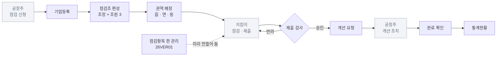
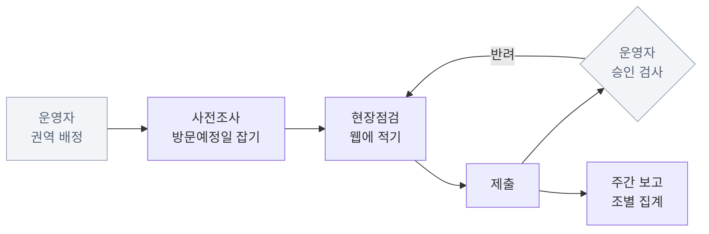
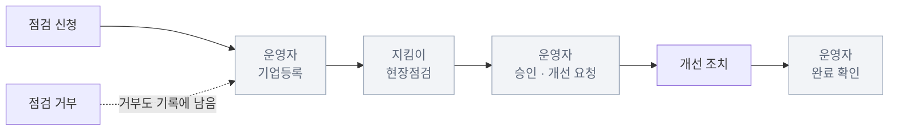
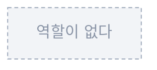
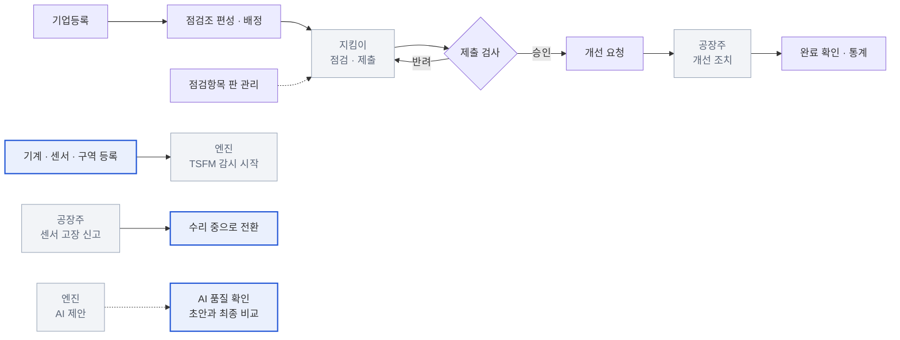
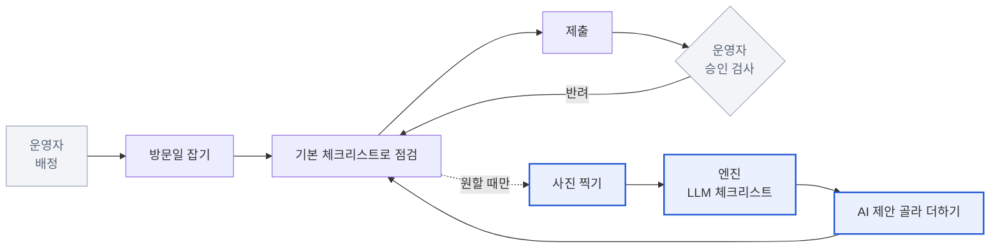
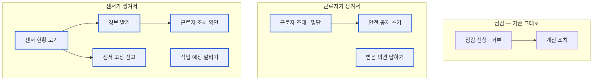
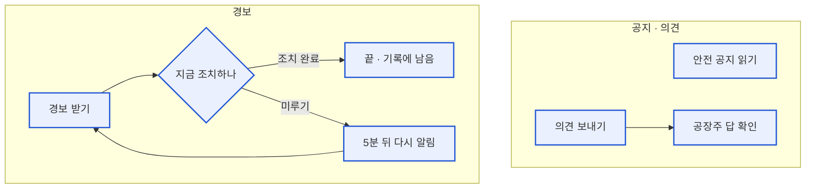

# 기존 시스템 분석 — 화성산업진흥원 산업안전지킴이 (2026-09-21)

우리 서비스가 실제로 올라갈 시스템이다 (화성 · 강원도 양쪽). 주소는 `platform.hsbiz.or.kr/safety`.
관리자 계정으로 로그인해 **화면 구조만** 읽었다. 기업명·사람 이름·사업자번호는 담지 않는다 (이 저장소는 Public이다).

**한계** — 관리자 계정 화면만 봤다. 지킴이·공장주가 로그인했을 때 어떤 메뉴를 보는지, 점검표를 적는 화면이 어떻게 생겼는지는 확인하지 못했다. 짐작은 `가설`로 표시했다.

**규모** — 기업 5,982곳 · 점검 기록 5,949건 · 점검조 18개 · 점검 문항 34개. 우리 실증은 공장 3곳 × 센서 5개다.

**그림 읽는 법** — 회색 점선 칸은 **다른 역할이 하는 일**이고, 파란 칸은 **새로 생기는 것**이다.

---

## 1. 역할

| 기존 가입유형 | 우리 역할 |
|---|---|
| 관리자 | 운영자 |
| 산업안전지킴이 | 지킴이 |
| 일반기업 | 공장주 |
| 행정인력 | — (우리에 없음) `가설` |
| — | **근로자 (기존에 없음)** |

기존 시스템에는 센서도 경보도 없다. 그래서 공장 안 사람에게 알릴 일이 없고, **근로자라는 역할이 아예 없다.**

---

## 2. 기존 업무 프로세스 — 역할별

### 2-1. 운영자 (관리자)

판을 깔고, 지킴이가 낸 것을 검사하고, 개선이 끝났는지 쫓는다.

### 2-2. 지킴이 (산업안전지킴이)

4인 1조로 움직인다. 실제 일이 일어나는 곳이다.

### 2-3. 공장주 (일반기업)

**가장 얇다.** 점검을 받아들이고, 지적된 것을 고치는 정도다.

개선 조치를 **어느 화면에서 올리는지는 확인하지 못했다** `가설`.
다만 통계에 `개선지도 요청 19,986건 / 완료 12,891건`이 잡히므로 되돌아오는 흐름은 분명히 있다.

### 2-4. 근로자

---

## 3. 기존 웹에서 할 수 있는 것 — 역할별

메뉴 단위로 적었다. **어느 역할에게 어느 메뉴가 보이는지는 확인하지 못했다** — 관리자 계정으로 본 전체 메뉴를 일의 성격으로 나눈 것이다 `가설`.

### 3-1. 운영자 (관리자) — 메뉴 전부가 보인다

| 메뉴 | 할 수 있는 일 | 화면에서 본 것 |
|---|---|---|
| 현장관리 › **기업등록** | 점검 대상 공장 등록·검색 | 소유형태(소유·임차·기타) · 기업종류(소공인·소기업·중소기업) · 행정구역 · 등록사유 · 점검일자로 검색 |
| 기업점검 › **사전조사** | 방문 예정 건 보기 | 기업코드 · 점검코드 · 점검조 · 방문예정일 |
| 기업점검 › **현장점검** | 점검 건 검사·승인·반려 | 점검과정(점검중·제출·승인·반려) · 점검결과(점검완료·재점검·패트롤·기타) |
| 주간점검 › **주간점검** | 조별 주간 실적 보기 | 점검조 · 작성자 · 점검기업수 · 완료/재점검/패트롤/기타 수 |
| 운영관리 › **점검조관리** | 조 편성과 권역 배정 | 조장 + 조원1~3 · 담당권역 · 등록년도 |
| 운영관리 › **점검항목관리** | 체크리스트 문항 등록·개정 | 평가영역 · 평가문항 · **문항버전** |
| **자료실** | 자료 배포 | |
| **통계현황** | 월별 점검 실적 집계 | |
| 고객센터 › **공지사항** | 공지 쓰기 | |
| 회원관리 › **회원정보관리** | 가입 승인·반려, 근무 상태 관리 | 가입유형 · 상태(가입신청·승인완료·반려·탈퇴) · 분야(소방·전기·화학·공통) · 근무여부(근무·퇴직·휴직·병가) |
| **마이페이지** | 내 정보 | |

**등록사유**에 `현장등록 · 점검신청 · 점검거부 · 기업DB · 기타`가 있다. 공장이 들어오는 길이 다섯이고 **거부도 기록으로 남긴다.**

### 3-2. 지킴이

| 메뉴 | 할 수 있는 일 |
|---|---|
| **사전조사** | 방문예정일 잡기 |
| **현장점검** | 점검 적기 · 제출 · 반려되면 다시 내기 |
| **주간점검** | 조별 주간 보고 쓰기 (작성자 칸이 있다) |
| 자료실 · 공지사항 | 자료와 공지 보기 |

### 3-3. 공장주

| 메뉴 | 할 수 있는 일 |
|---|---|
| — | 점검 신청 · 점검 거부 (기업등록의 등록사유로 남는다) |
| — | 개선 조치 올리기 `가설` |
| 자료실 · 공지사항 | 자료와 공지 보기 `가설` |

### 3-4. 근로자

**없다.** 계정 종류 자체가 없다.

---

## 4. 새 업무 프로세스 — 역할별

새로 생기는 엔진은 둘이다 — **TSFM 이상탐지**와 **LLM 체크리스트**. 파란 칸이 새로 생기는 것이다.

### 4-1. 운영자 — 기존 일 + 센서 관리 + AI 확인

### 4-2. 지킴이 — 기존 일 + 사진 AI 곁길

**기본 체크리스트가 먼저고 AI는 원할 때 더한다** (2026-09-18 결정). 점선이 곁길이라는 뜻이다.

### 4-3. 공장주 — 일이 두 겹으로 붙는다

### 4-4. 근로자 — 역할 자체가 신설

화면 말은 한국어·베트남어·영어로 나온다. **근로자는 센서 값을 보지 않는다** — 경보와 조치만 본다.

---

## 5. 무엇이 달라지나

| 역할 | 기존 | 새로 붙는 것 |
|---|---|---|
| **근로자** | 없음 | **역할 자체가 신설** — 경보 받기 · 조치 · 미루기 · 다국어 · 공지 읽기 · 의견 보내기 |
| **공장주** | 점검 신청 · 거부 · 개선 조치 | 센서 현황 · 경보 받기 · 센서 고장 신고 · 작업 예정 알리기 · 근로자 초대 · 공지 쓰기 · 의견 답하기 |
| **지킴이** | 사전조사 · 현장점검 · 제출 · 주간 보고 | 사진 찍기 → AI 제안 골라 더하기 |
| **운영자** | 기업등록 · 점검조 · 점검항목 · 승인 · 통계 | 기계·센서·구역 등록 · 고장 신고 처리 · AI 품질 확인 |

### 가장 크게 바뀌는 쪽은 공장주다

엔진은 지킴이와 근로자 쪽에 붙는데, **일은 공장주에게 가장 많이 쌓인다.**
**센서가 생겨서** 한 번(현황 · 고장 신고 · 작업 예정), **근로자가 생겨서** 또 한 번(초대 · 공지 · 의견 답) 붙기 때문이다.
기존 시스템에서 공장주는 거의 아무것도 하지 않았다.

### 엔진에서 나오지 않은 것

`근로자 초대 · 안전 공지 · 의견 보내기`는 TSFM과도 LLM과도 상관이 없다.
**근로자가 앱을 갖게 되니 따라 붙은 기능**이다. 범위를 줄여야 하면 첫 후보이고, 지키기로 했다면 이유를 따로 적어 둬야 한다.

---

## 6. 정해야 할 것

화면이 달라지는 것만 골랐다.

**2026-09-22 사용자 결정 — 기존 웹의 방식을 따른다.** 그래서 3~6번은 기존대로 간다: 승인·반려를 넣고, 배정은 점검조·읍면동 권역, 체크리스트는 공통 + 설비별(판 번호 포함), 주간 보고도 둔다. **1·2번(기존 웹을 그대로 쓰나, 우리 것이 맡나)은 아직 열려 있다** — 방식이 아니라 어느 소프트웨어가 맡느냐의 문제라서.

| # | 물음 | 안 정하면 |
|---|---|---|
| 1 | **기존 판을 다시 만드나?** 기업등록·점검조·점검항목·통계를 우리가 또 만들지, 기존 것을 쓰고 센서·AI만 얹을지 | 운영자 웹을 통째로 만들지 말지가 안 정해진다. 둘 다 만들면 담당자가 같은 일을 두 곳에서 한다 |
| 2 | **지킴이는 어디에 적나?** 우리 앱인지 기존 웹인지 | 우리 앱인데 기존 웹도 쓰면 지킴이가 두 시스템을 오간다 |
| 3 | **승인·반려를 넣나?** | 넣으면 지킴이 앱에 "반려됨" 상태와 다시 내는 흐름이 필요하다. 지금은 내면 끝이다 |
| 4 | **배정 단위는?** 기존은 읍·면·동 권역, 우리는 공장 단위 | 운영자 "지킴이 배정" 화면 모양이 달라진다 |
| 5 | **체크리스트를 공통 + 설비별로 나누나?** | 나누면 G5의 묶음이 셋(기본·AI·직접)에서 넷 이상으로 늘어난다 |
| 6 | **주간 보고가 필요한가?** | 필요하면 지킴이 앱에 화면이 하나 더 생긴다. 자동 집계로 대신할 수도 있다 |

1번과 2번이 가장 급하다. 지킴이 앱 홈이 "내 할 일"로 시작하는 것 자체가 **"배정을 우리가 갖는다"는 전제** 위에 서 있다.

---

## 7. 참고 — 기존 점검 문항 체계

34문항이 다섯 영역으로 나뉘고, 모두 판 번호 `26VER01`이 붙어 있다.

| 영역 | 문항 수 |
|---|---|
| 01.(공통)산업안전 일반 | 4 |
| 02.(공통)소방안전 | 3 |
| 03.(공통)전기안전 | 4 |
| 04.(공통)화학안전 | 3 |
| 05.유해위험기구/시설 | 20 (설비마다 한 문항) |

**공통 14 + 설비별 20** 구조다. 05 영역은 그 공장에 **없는 설비가 대부분**이라,
우리가 2026-09-18에 답을 `이상 없음 / 문제 있음 / 해당 없음` 셋으로 늘린 결정이 여기서 근거를 얻는다.

**판 번호**는 우리에게 없다. 문항이 바뀌어도 예전 점검이 어느 판으로 이뤄졌는지 남는다.
