# 화성 5대 업종 주요 장비

화성산업진흥원이 알려준 대표 업종 5개에서 실제로 쓰는 장비를 공정 순서대로 모았다. 업종마다 "무엇을 만드는지 → 어떤 순서로 만드는지 → 그때 쓰는 장비와 위험"을 적었다. 사진은 위키미디어 공용(Wikimedia Commons)의 자유 라이선스 사진이고, 출처는 맨 끝에 있다.

공장에 가 본 적이 없는 사람도 한 번 읽고 이해할 수 있게 썼다. 처음 보는 말은 그 자리에 짧게 풀었고, 모두 [9장 용어 사전](#9-용어-사전)에 가나다순으로 모았다.

작성: 2026-10-01 · 고침: 2026-10-06 (쉬운 말로 풀고, 0장 공장 기초 · 업종별 예시 · 용어 사전을 더함)

---

## 이 문서 읽는 법

1. **[0장 공장 기초](#0-공장-기초--먼저-알면-쉬운-것)를 먼저 읽는다.** 공장이 하는 일, 재료 이름, 사고 종류, 법으로 관리하는 방식을 10분 안에 잡는다. 뒤의 표가 모두 이 말로 쓰여 있다.
2. [한눈에 보기](#한눈에-보기)에서 다섯 업종을 훑는다.
3. 궁금한 업종 장으로 간다. 각 장은 같은 순서다.
   - **한 줄로**: 이 업종이 무엇인지
   - **주변에서 보는 물건**: 이 업종이 만든 것 중 우리가 아는 것
   - **공정 그림**: 재료가 제품이 되는 순서
   - **예시로 따라가기**: 물건 하나가 공장을 지나가는 이야기
   - **장비 표**: 공정 순서대로 장비 · 하는 일 · 위험 · 법정 관리
4. 모르는 말은 [9장 용어 사전](#9-용어-사전)에서 찾는다.

---

## 0. 공장 기초 — 먼저 알면 쉬운 것

### 0-1. 공장이 하는 일은 결국 몇 가지뿐이다

업종이 달라도 공장이 하는 일은 **부엌에서 요리하는 것**과 비슷하다. 재료를 다듬고(자르기), 모양을 잡고(누르기·녹여 붓기), 다듬고(깎기), 합치고(붙이기), 마무리하고(굽기·칠하기), 맛을 본다(검사).

```
재료 ──▶ ① 자르기 ──▶ ② 모양 만들기 ──▶ ③ 깎기 ──▶ ④ 붙이기 ──▶ ⑤ 마무리 ──▶ ⑥ 검사 ──▶ 출하
         (칼로 썰기)   (틀에 찍기·붓기)   (다듬기)    (합치기)     (굽기·칠하기)  (맛보기)

           그 사이사이 ⑦ 옮기기: 크레인 · 지게차 · 컨베이어
```

| 하는 일 | 부엌 비유 | 쓰는 장비의 예 |
|---|---|---|
| ① 자르기 | 칼로 썰기, 가위로 오리기 | 전단기, 레이저 절단기, 띠톱 |
| ② 모양 만들기 | 쿠키 틀로 찍기, 틀에 반죽 붓기 | 프레스, 절곡기, 사출성형기, 압출기 |
| ③ 깎기 | 감자 껍질 깎기, 칼 갈기 | 선반, 머시닝센터, 연삭기 |
| ④ 붙이기 | 반죽 이어 붙이기, 글루건 | 용접기, 납땜기, 초음파 용착기 |
| ⑤ 마무리 | 오븐에 굽기, 소스 바르기 | 열처리로, 도금 라인, 도장 부스 |
| ⑥ 검사 | 맛보기, 저울에 달기 | 3차원 측정기, 자동 광학 검사기, 내전압 시험기 |
| ⑦ 옮기기 | 쟁반에 나르기 | 천장크레인, 지게차, 컨베이어 |

**업종마다 이 중 어디에 힘을 주는지만 다르다.** 금속가공은 ①~⑤를 다 하고, 플라스틱은 ②가 거의 전부이고, 전자부품은 ④(납땜)가 중심이다.

### 0-2. 재료 이름 — 모양으로 부른다

공장에서는 재료를 **무엇으로 만들었나**보다 **어떤 모양인가**로 자주 부른다.

| 이름 | 모양 | 비유 | 주로 쓰는 업종 |
|---|---|---|---|
| **판재** | 넓고 얇은 금속판 (두께 1~수 mm) | 밀대로 민 반죽 | 금속가공, 전기장비 |
| **코일** | 판재를 길게 이어 둘둘 만 것 | 두루마리 휴지 | 금속가공, 전기장비 |
| **봉재** | 꽉 찬 금속 막대 | 가래떡 | 금속가공 (볼트·축) |
| **파이프** | 속이 빈 관 | 빨대 | 금속가공, 기계 |
| **펠릿** | 쌀알만 한 플라스틱 알갱이 | 쌀 | 플라스틱 |
| **생고무** | 아직 굳히지 않은 고무 덩어리 | 밀가루 반죽 | 고무 |
| **공작물** | 모양이 아니라 *처지*를 말한다. 지금 기계에 물려 가공 중인 물건 | 도마 위에 올린 재료 | 모든 업종 |

### 0-3. 사고 종류 — 문서에 계속 나오는 말

표의 "주로 조심할 위험" 칸에 나오는 말이다. 비슷해 보이지만 **어떻게 다치는지**가 다르다.

| 말 | 무슨 일이 일어나나 | 일상에서 비슷한 것 | 대표 장비 |
|---|---|---|---|
| **끼임** | 닫히는 두 물체 사이에 몸이 낀다 | 문틈에 손가락이 낌 | 프레스, 사출성형기 |
| **물림** | 마주 도는 두 롤 사이로 빨려 들어간다 | 옛날 세탁기 탈수 롤러에 옷이 끌려 들어감 | 2롤 밀, 캘린더, 컨베이어 |
| **말림** | 도는 축에 옷·장갑·머리카락이 감긴다 | 선풍기에 머리카락이 감김 | 선반, 드릴, 권선기 |
| **베임 · 절단** | 날카로운 날이나 판 모서리에 베이거나 잘린다 | 종이에 손 베임, 칼질 | 전단기, 띠톱, 판재 모서리 |
| **맞음 · 깔림** | 떨어지거나 넘어지는 무거운 것에 맞거나 깔린다 | 선반 위 물건이 떨어짐 | 크레인, 지게차 |
| **화상** | 뜨거운 것에 데인다 | 다리미, 프라이팬 | 사출성형기, 열처리로, 납땜 |
| **감전** | 몸에 전기가 흐른다 | 젖은 손으로 콘센트 | 용접기, 내전압 시험기 |
| **흄 · 분진 · 미스트** | 아주 작은 알갱이를 들이마신다. 흄은 금속이 녹을 때 나는 연기, 분진은 가루, 미스트는 기름 안개 | 고기 구울 때 연기, 밀가루 날림 | 용접, 연삭, 도장 |
| **화재 · 폭발** | 불이 나거나 터진다. 가루가 공기 중에 퍼져 있다 불꽃을 만나 터지는 **분진 폭발**도 있다 | 밀가루 공장 폭발 | 도장, 분체 도장, 전지 |
| **산소 결핍 · 질식** | 다른 가스가 공기를 밀어내 숨을 못 쉰다 | 밀폐된 방에서 연탄 | 리플로우(질소), 열처리로 |

**왜 중요하나:** 점검할 때 "이 장비는 어떻게 사람을 다치게 하나"를 알면 무엇을 봐야 할지가 보인다. 끼임 장비는 손이 들어가지 못하게 막는 덮개·센서를, 말림 장비는 장갑·헐렁한 옷을, 흄 장비는 환기를 본다.

### 0-4. 법정 관리 — 장비 표 맨 오른쪽 칸

산업안전보건법은 위험한 장비를 몇 갈래로 묶어 관리한다. **자동차에 빗대면** 쉽다.

| 표기 | 정식 이름 | 자동차 비유 | 실제 뜻 |
|---|---|---|---|
| **인증** | 안전인증 대상 (시행령 제74조) | 출시 전 정부 형식승인 | 만들거나 들여올 때 정부가 정한 기관의 인증을 받아야 한다 |
| **자율** | 자율안전확인 대상 (시행령 제77조) | 제조사 자체 안전 시험 후 신고 | 만든 회사가 스스로 안전기준에 맞는지 확인해 신고한다 |
| **검사** | 안전검사 대상 (시행령 제78조) | 정기 자동차 검사 | 장비를 **쓰는** 공장이 정해진 주기마다 검사를 받는다 |
| **방호** | 방호조치 대상 (시행령 제70조) | 안전벨트 없는 차는 못 판다 | 정해진 안전장치(덮개·급정지장치 등)를 달아야 팔거나 빌려줄 수 있다 |

- 한 장비가 두 가지에 다 들기도 한다. 예를 들어 프레스는 "인증, 검사"다. 만들 때 인증을 받고, 쓰는 동안 정기 검사도 받는다.
- **크기에 따라 빠지는 것이 있다.** 정격하중(들 수 있는 최대 무게) 2톤 미만 크레인, 형 체결력(금형을 닫아 누르는 힘) 294kN(약 30톤의 힘) 미만 사출성형기, 롤이 덮개 안에 숨은 밀폐형 롤러기는 안전검사에서 빠진다.
- **혼합기와 파쇄기·분쇄기는 2026년 6월부터 안전검사 대상에 새로 들어갔다.** 고무·플라스틱 업종에 특히 많은 장비다.
- 법정 관리 칸이 "—"이면 해당 없음을 확인했다는 뜻이 아니다. 이 표에서 따로 표시하지 않았다는 뜻이다.

---

## 한눈에 보기

| 진흥원 표기 | 정식 업종 이름 (한국표준산업분류 11차) | 한 줄로 | 주변에서 보는 물건 | 대표 장비 | 가장 조심할 사고 |
|---|---|---|---|---|---|
| C25 금속가공 | C25 금속 가공제품 제조업 (기계·가구 제외) | 쇠를 자르고 누르고 깎고 붙여 **부품**을 만든다 | 볼트·너트, 철문 경첩, 자동차 속 쇠 받침, 철제 계단 | 프레스, 절곡기, CNC 선반, 용접기 | 끼임, 베임·절단 |
| C29 기타기계 및 장비 | C29 기타 기계 및 장비 제조업 | 그 부품을 모아 **다른 공장이 쓸 기계**를 만든다 | 양수 펌프, 에어컨 실외기 압축기, 엘리베이터 감속기, 농기계 | 대형 머시닝센터, 용접기, 천장크레인 | 끼임, 중량물에 맞음·깔림 |
| C21 고무 플라스틱 | **C22** 고무 및 플라스틱제품 제조업 | 플라스틱·고무를 녹이거나 반죽해 **틀로 모양**을 만든다 | 샴푸 통, 비닐봉지, 수도 파이프, 고무 패킹, 리모컨 케이스 | 사출성형기, 압출기, 롤 밀, 분쇄기 | 롤·금형 끼임, 화상 |
| C26 전자부품 | C26 전자 부품, 컴퓨터, 영상, 음향 및 통신장비 제조업 | 초록 기판에 작은 부품을 **납땜으로 붙인다** | 공유기·TV 속 기판, 반도체 칩, 카메라 모듈 | SMT 라인, 리플로우, 납땜 장비 | 화학물질 노출, 화재 |
| C28 전기전자 | C28 전기장비 제조업 | 전기를 **만들고 바꾸고 보내고 담는** 장비를 만든다 | 선풍기 모터, 전봇대 위 변압기, 건물 전기함, 전선, 전기차 배터리 | 프레스, 권선기, 판금, 충방전기 | 끼임, 감전, 전지 화재 |

> **업종 코드 한 가지 짚을 것.** 진흥원 자료의 "C21 고무 플라스틱"은 한국표준산업분류로는 C22다. C21은 의약품 제조업이다. 이 문서는 C22로 적는다. 또 "C28 전기전자"의 정식 이름은 "전기장비 제조업"이고, 전자부품은 C26에 들어간다.
>
> **업종 코드 읽는 법.** C는 제조업이라는 뜻이고, 뒤 두 자리가 업종이다. 숫자가 세 자리로 늘면 그 안의 하위 업종이다. 예: C25 금속가공 → 251 구조용 금속제품 · 259 기타 금속 가공제품.

**다섯 업종은 서로 이어져 있다.** 금속가공(C25)이 만든 부품을 기계(C29)와 전기장비(C28)가 가져다 쓰고, 그 기계 안에는 전자부품(C26) 기판과 플라스틱(C22) 케이스가 들어간다.

```
        C25 금속 부품 ──┬──▶ C29 기계 (펌프·공작기계)
                       └──▶ C28 전기장비 (모터·배전반)
  C22 플라스틱·고무 ───────▶ 케이스 · 패킹 · 전선 피복
  C26 전자 기판 ───────────▶ 기계와 전기장비의 "두뇌"(제어기)
```

### 표 읽는 법

- **장비는 공정 순서대로** 놓았다. 크레인·지게차·집진기처럼 다섯 업종이 다 쓰는 장비는 [6장 업종 공통 장비](#6-업종-공통-장비)에 한 번만 적었다.
- "하는 일" 칸의 **비유:** 는 그 장비를 떠올리기 쉽게 일상 물건에 빗댄 것이다. 정확한 원리 설명이 아니다.
- 법정 관리 칸은 [0-4](#0-4-법정-관리--장비-표-맨-오른쪽-칸)를 본다.

---

## 1. C25 금속 가공제품 제조업

> **한 줄로:** 쇠판이나 쇠막대를 사 와서 **자르고, 누르고, 깎고, 붙여** 부품이나 구조물을 만든다.

**주변에서 보는 물건:** 볼트·너트·스프링, 철문 경첩, 자동차 의자 밑 쇠 받침(브래킷), 공장 철제 계단과 난간, 가드레일, 금형(물건을 찍어 내는 쇠틀).

**들어가고 빠지는 것:** 기계 완제품은 C29, 가구는 C32로 빠진다. **임가공 공장**(남의 부품을 받아 도금·열처리만 해 주고 삯을 받는 곳)도 이 업종이다.

하위 업종: 구조용 금속제품·탱크·증기발생기(251), 무기·총포탄(252), 기타 금속 가공제품(259: 단조·분말야금, 열처리·도금, 수공구·철물, 볼트·스프링·금속선 가공 등)

**공정 그림**

```
쇠판·쇠막대
   │
   ▼
① 자르기 ────── 필요한 크기로 자른다 (종이 재단기처럼)
   ▼
② 누르고 굽히기 ─ 틀로 찍거나 접어 모양을 낸다 (쿠키 틀, 종이 접기)
   ▼
③ 깎기 ──────── 정밀한 치수로 다듬는다 (연필 깎기)
   ▼
④ 붙이기 ─────── 조각들을 녹여 잇는다 (용접)
   ▼
⑤ 열처리·표면처리 ─ 단단하게 하고, 녹 안 슬게 옷을 입힌다 (도금·칠)
   ▼
⑥ 검사·출하
```

**예시로 따라가기 — 자동차 의자 밑 쇠 받침 하나**

1. 두루마리처럼 감긴 강판 **코일**이 들어온다.
2. **전단기**가 손바닥만 한 크기로 자른다.
3. **프레스**가 금형으로 꽝 눌러 구멍을 뚫고 ㄱ자로 굽힌다. 이 단계에서 가장 많이 다친다. 작업자가 판을 넣고 빼는 동안 손이 금형 사이에 들어가기 때문이다.
4. **용접 로봇**이 다른 조각과 붙인다.
5. **도장 부스**에서 녹 안 슬게 칠한다.
6. 치수를 재고 상자에 담아 자동차 공장으로 보낸다.

볼트라면 길이가 다르다. 쇠막대를 **띠톱**으로 자르고 → **선반**으로 깎고 → **열처리로**로 단단하게 하고 → **도금**해서 내보낸다.

### 1-1. 자르기

| 사진 | 장비 | 하는 일 | 주로 조심할 위험 | 법정 관리 |
|---|---|---|---|---|
| 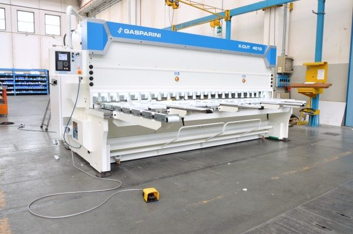 | 전단기 (시어링기) | 위아래 큰 칼날을 내리쳐 강판을 일자로 자른다. **비유:** 종이 재단기, 작두 | 칼날 사이 손 끼임·절단 | 인증, 검사 |
| 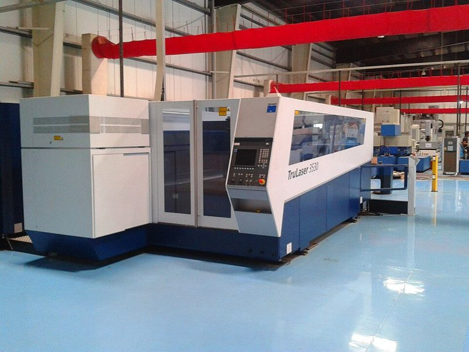 | 레이저 절단기 | 아주 센 빛(레이저)을 한 점에 모아 판재를 녹여 도면대로 오려낸다. 틀이 필요 없어 여러 모양을 조금씩 만들 때 많이 쓴다. **비유:** 돋보기로 햇빛을 모아 종이를 태우기 | 레이저 빛(눈), 금속 흄, 화재 | — |
| 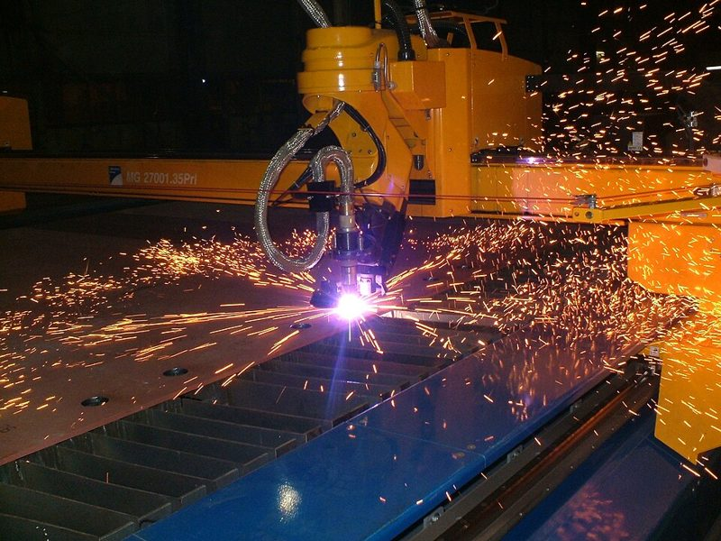 | 플라즈마 절단기 | 전기로 수만 도의 뜨거운 기체 불꽃(플라즈마)을 만들어 두꺼운 철판을 녹여 자른다. 레이저보다 거칠지만 두꺼운 판에 강하다 | 불티·화상, 흄, 소음, 감전 | — |
| 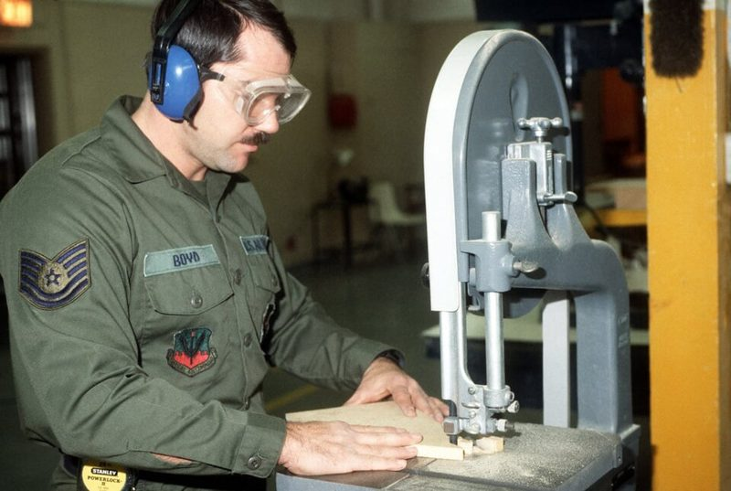 | 띠톱 기계 | 고리 모양으로 이은 톱날이 한 방향으로 계속 돌며 쇠막대·파이프를 길이에 맞게 자른다. **비유:** 정육점 뼈 자르는 톱 | 톱날 접촉 | 방호 (금속절단기) |
| 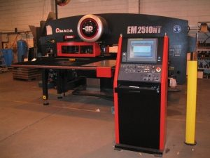 | 터렛 펀치 프레스 | 여러 모양의 펀치(구멍 뚫는 틀)를 회전판(터렛)에 꽂아 두고, 골라 가며 판재에 구멍과 모양을 찍는다. **비유:** 모양 펀치 여러 개를 돌려 가며 쓰는 사무용 펀치 | 끼임, 소음 | 인증, 검사 (프레스) |

### 1-2. 누르고 굽히기 (성형)

**성형**은 재료를 깎아 내지 않고 **눌러서 모양을 바꾸는 것**이다. 여기서 주인공은 **금형**이다. 금형은 같은 모양을 계속 찍어 내는 쇠틀로, 위·아래 한 쌍이 맞물린다. 붕어빵 틀을 떠올리면 된다.

```
  ┌─────┐ ↓ 위 금형이 내려온다
  └─┬─┬─┘
 ═══════   ← 판재 (공작물)
  ┌─┴─┴─┐
  └─────┘   아래 금형
  → 이 사이에 손이 들어가면 끼임 사고
```

| 사진 | 장비 | 하는 일 | 주로 조심할 위험 | 법정 관리 |
|---|---|---|---|---|
| 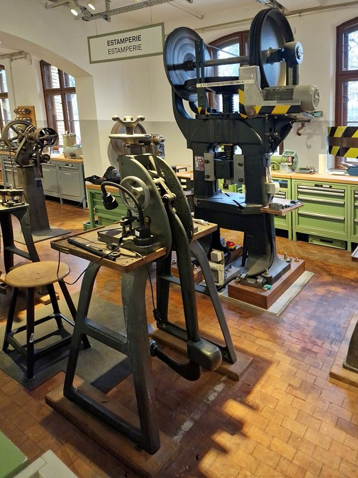 | C형 프레스 (기계식) | 옆에서 보면 C자 모양인 몸체에 금형을 달고, 위 금형을 꽝 내려 판재를 찍고 굽힌다. 작은 공장의 대표 장비. 사진은 박물관에 있는 옛 기계지만 생김새는 지금도 비슷하다. **비유:** 쿠키 틀로 반죽 찍기 | 금형 사이 손 끼임·절단. 금속가공 업종의 대표적인 끼임 사고 장비 | 인증, 검사 |
| 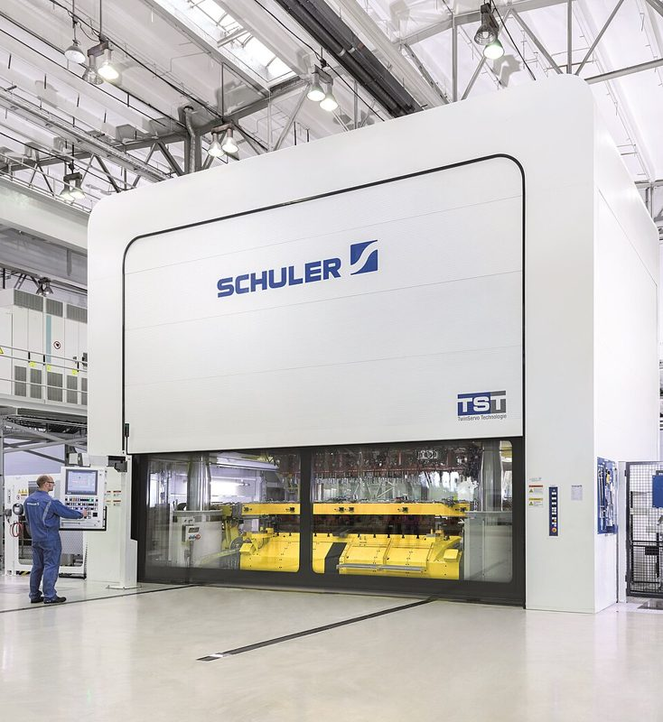 | 대형 트랜스퍼 프레스 | 금형 여러 벌을 한 프레스 안에 나란히 두고, 기계 팔이 판재를 다음 금형으로 자동으로 옮겨 가며 단계별로 찍는다 (자동차 문짝 같은 큰 부품). **비유:** 붕어빵 틀 여러 개를 줄지어 놓고 차례로 굽기 | 금형 교체·청소 중 끼임, 이송장치 | 인증, 검사 |
| 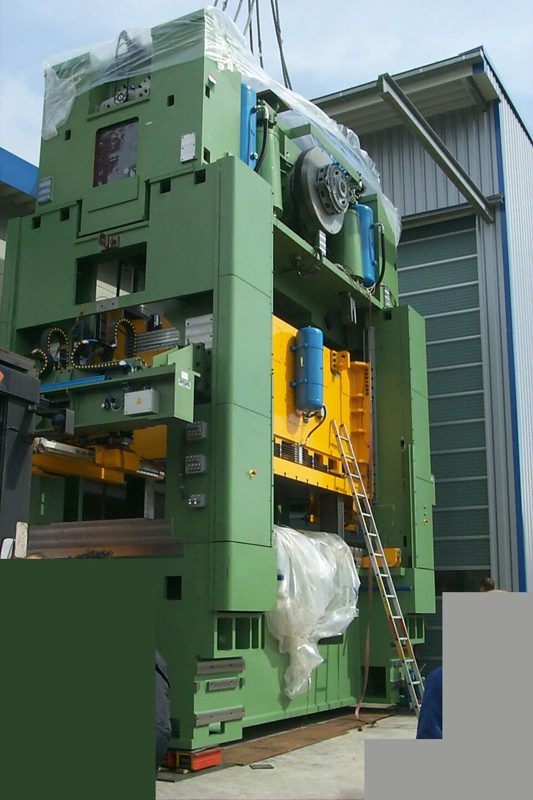 | 유압 프레스 | 기름의 압력(유압)으로 천천히 아주 큰 힘을 준다. 평평한 판을 컵 모양으로 끌어 늘리는 **딥드로잉**(싱크대 개수대, 음료 캔), 부품을 꾹 눌러 끼우는 압입에 쓴다. **비유:** 자동차 잭 | 끼임, 유압 호스 파열 | 인증, 검사 |
| 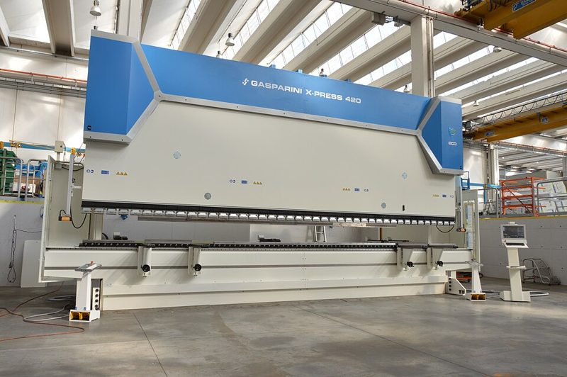 | 절곡기 (프레스 브레이크) | 긴 판재를 V자 홈이 파인 금형에 대고 위에서 눌러 ㄱ자·ㄷ자로 접는다. 전기함·철제 캐비닛 같은 상자를 만든다. **비유:** 종이를 책상 모서리에 대고 접기 | 위아래 금형 사이 끼임, 접힐 때 판재가 튀어 올라 얼굴·손을 침 | 인증 |
| 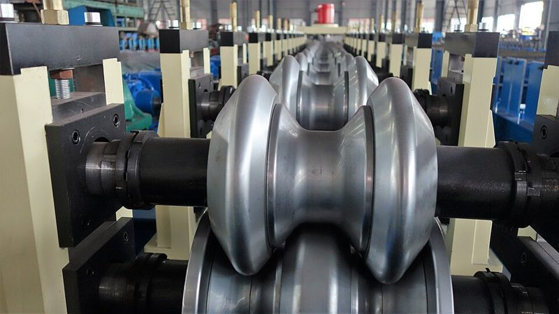 | 롤 포밍기 | 긴 띠 모양 강판을 여러 쌍의 롤(굴림대) 사이로 보내며 조금씩 접어, 같은 단면이 끝없이 이어지게 만든다 (가드레일, ㄷ자 철골, 지붕 골판). **비유:** 종이 띠를 손가락으로 조금씩 접어 가며 앞으로 미는 것 | 롤 물림 | — |
| 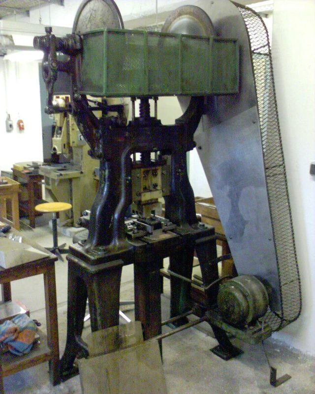 | 단조 프레스·해머 | 시뻘겋게 달군 쇠를 때리거나 눌러 모양을 만든다. 때리면 쇠가 촘촘해져 더 튼튼해진다 (볼트 머리, 렌치, 크랭크축). **비유:** 대장장이의 망치질 | 화상, 튀는 쇳조각, 소음·진동 | 인증, 검사 (프레스형) |

### 1-3. 깎기 (절삭)

**절삭**은 날로 재료를 조금씩 깎아 내 정확한 치수를 만드는 것이다. 깎여 나온 쇠 부스러기를 **칩**이라 한다(대팻밥 같은 것). 깎을 때 날이 뜨거워지지 않게 뿌리는 기름 섞인 물이 **절삭유**다.

깎는 방식은 크게 둘이다.

```
선반: 공작물이 돈다, 날은 가만히        머시닝센터: 날이 돈다, 공작물은 가만히
   ┌──┐                                  │  ← 돌아가는 공구
 ⟳ │██│ ◀── 날                            ▼
   └──┘                                ┌──────┐ ← 고정된 공작물
 (연필깎이·도자기 물레)                 (전동 드릴로 나무에 홈 파기)
```

**CNC**는 "컴퓨터 수치 제어"의 줄임말이다. 사람이 손잡이를 돌리는 대신 컴퓨터가 숫자로 된 프로그램대로 날을 움직인다.

| 사진 | 장비 | 하는 일 | 주로 조심할 위험 | 법정 관리 |
|---|---|---|---|---|
| 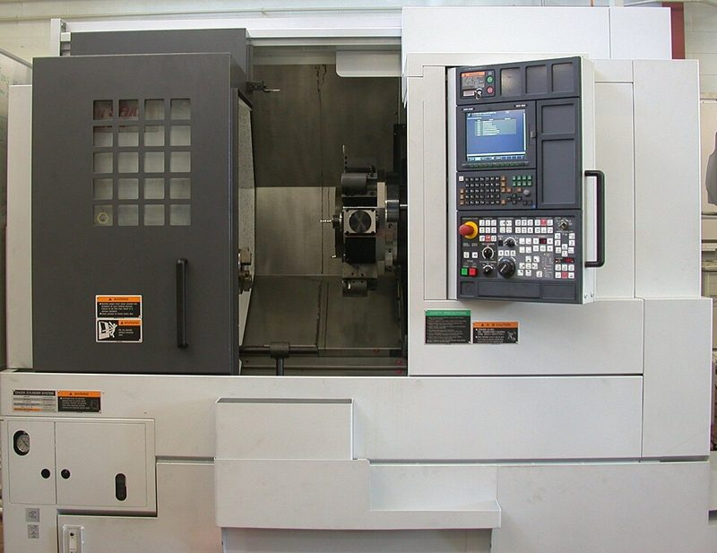 | CNC 선반 | 공작물을 **척**(공작물을 꽉 무는 집게)에 물려 빠르게 돌리고, 가만히 있는 날을 대 둥글게 깎는다. 축, 볼트, **부싱**(축에 끼우는 짧은 통)처럼 둥근 부품을 만든다. **비유:** 연필깎이 | 회전하는 척에 옷·장갑 말림, 칩 튐 | 자율 (공작기계) |
| 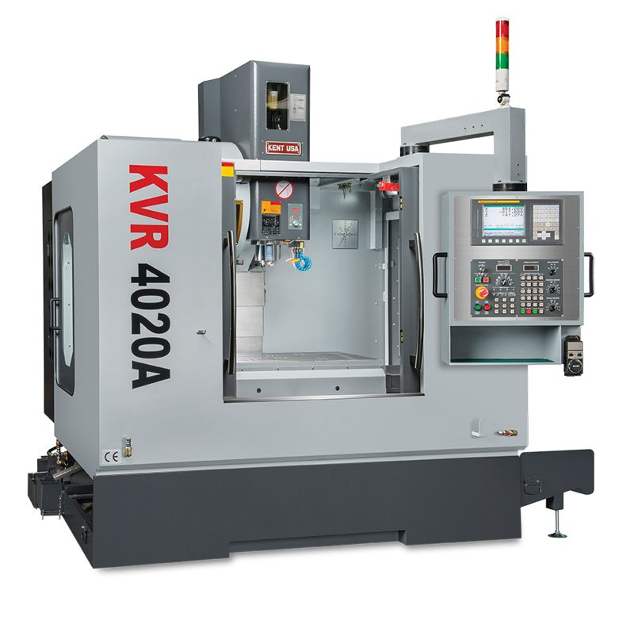 | 머시닝센터 (MCT) | 공구를 돌려 고정된 공작물에 평면·홈·구멍을 깎는다. 드릴·커터 등 공구 수십 개를 보관하다 자동으로 바꿔 끼운다. **비유:** 날을 스스로 갈아 끼우는 전동 드릴 | 문 열고 작업할 때 회전 공구, 절삭유 미스트(기름 안개) | 자율 (공작기계) |
| 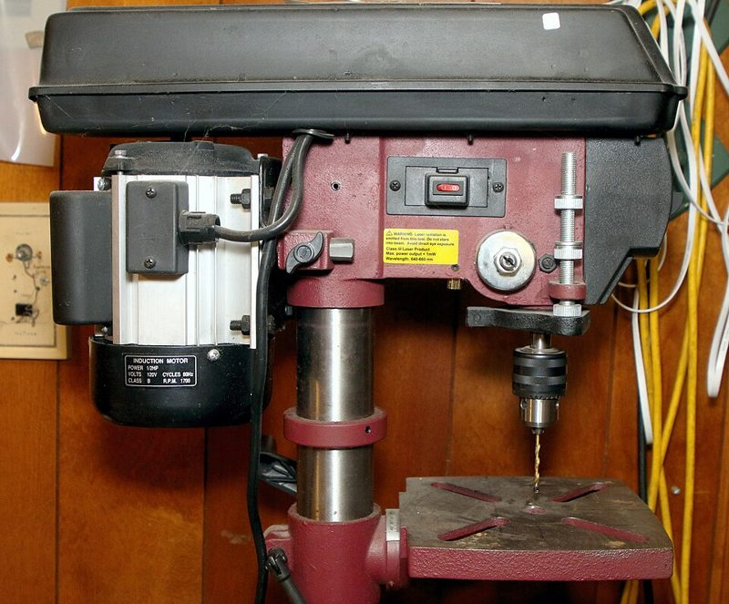 | 드릴링 머신 (탁상 드릴) | 책상 위에 세워 둔 드릴로 구멍을 뚫는다 | 장갑이 드릴에 말림 (**장갑 끼고 쓰면 안 된다** — 장갑이 감기면 손까지 끌려 들어간다) | 자율 (공작기계) |
| 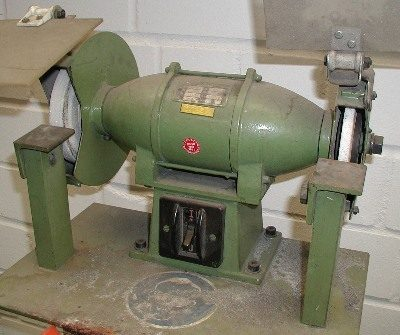 | 탁상 연삭기 | 빠르게 도는 **숫돌**(돌로 된 가는 바퀴)로 공구 날을 갈고, 자른 자리의 날카로운 돌기(**거스러미**)를 다듬는다. **비유:** 칼 가는 숫돌을 모터로 돌림 | 숫돌이 깨져 튐, 튀는 가루 | 자율 |
| 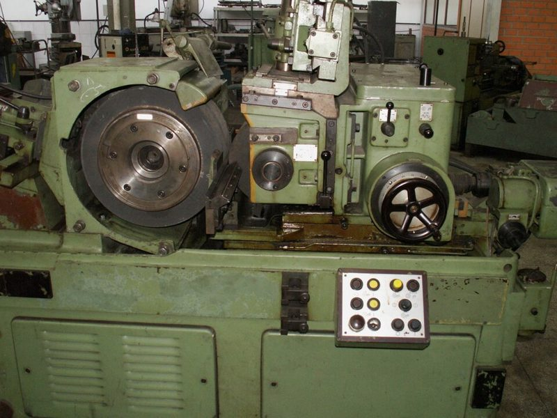 | 원통·평면 연삭기 | 숫돌로 아주 정밀하게(머리카락 굵기보다 훨씬 작은 차이까지) 마무리한다. **비유:** 고운 사포질 | 숫돌 깨짐, 분진 | 자율 |
| 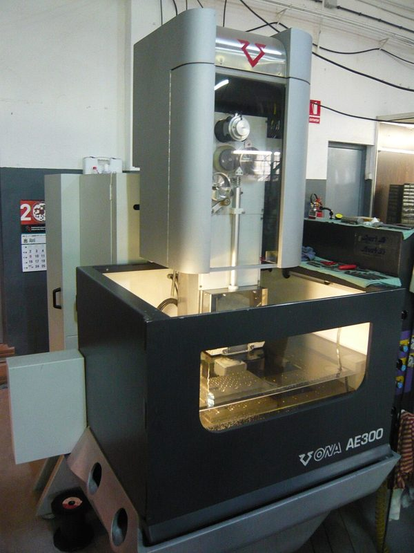 | 와이어 방전가공기 | 머리카락만 한 전선과 공작물 사이에 전기 불꽃을 튀겨 조금씩 녹여 자른다. 너무 단단해 날로 못 깎는 금형을 정밀하게 오릴 때 쓴다. **비유:** 전기로 자르는 실톱 | 감전, 가공액 화재 | — |

### 1-4. 붙이기 (접합)

| 사진 | 장비 | 하는 일 | 주로 조심할 위험 | 법정 관리 |
|---|---|---|---|---|
| 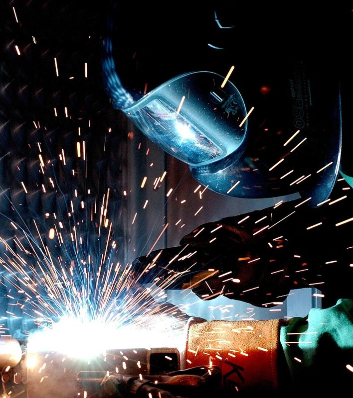 | 아크 용접기 (CO2·MIG·TIG) | 전기 불꽃(**아크**)의 열로 금속을 녹여 이어 붙인다. CO2·MIG·TIG는 녹은 쇠가 공기와 닿지 않게 덮어 주는 가스와 방식의 차이다. **비유:** 아주 뜨거운 글루건 | 감전, 용접 흄(쇠가 녹으며 나는 연기), 아크 빛(눈), 불티 화재 | — (교류 아크 용접기는 자동전격방지기 필요 — 용접하지 않는 동안 전압을 낮춰 감전을 막는 장치) |
| 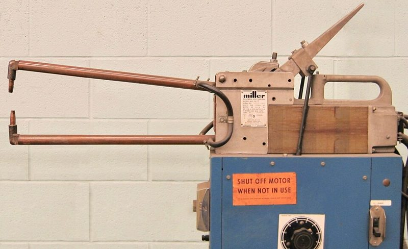 | 스폿 용접기 | 겹친 판재 두 장을 구리 집게(전극)로 꽉 집고 전기를 흘려 한 점만 녹여 붙인다. 자동차 차체에 수천 개씩 찍힌다. **비유:** 스테이플러로 점점이 박기 | 전극 사이 끼임, 불꽃 | — |
| 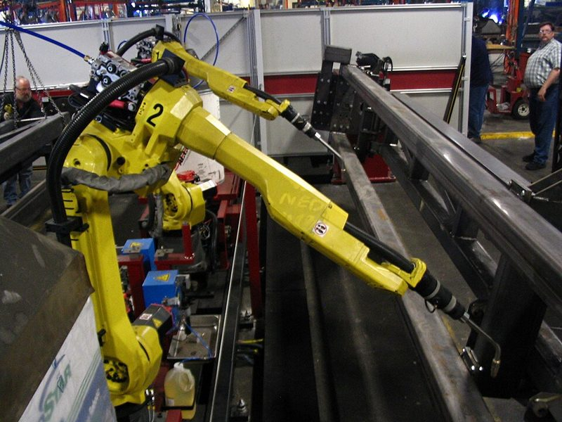 | 용접 로봇 | 같은 자리를 반복해 용접하는 일을 사람 팔처럼 생긴 로봇이 대신한다 | 로봇 팔이 닿는 범위 안에 사람이 들어갔을 때 부딪힘·끼임 | 자율, 검사 (산업용 로봇) |

### 1-5. 열처리·표면처리

**열처리**는 불에 넣었다 빼서 금속의 성질(단단함·질김)을 바꾸는 것이고, **표면처리**는 겉에 옷을 입혀 녹이나 흠을 막는 것이다.

| 사진 | 장비 | 하는 일 | 주로 조심할 위험 | 법정 관리 |
|---|---|---|---|---|
| 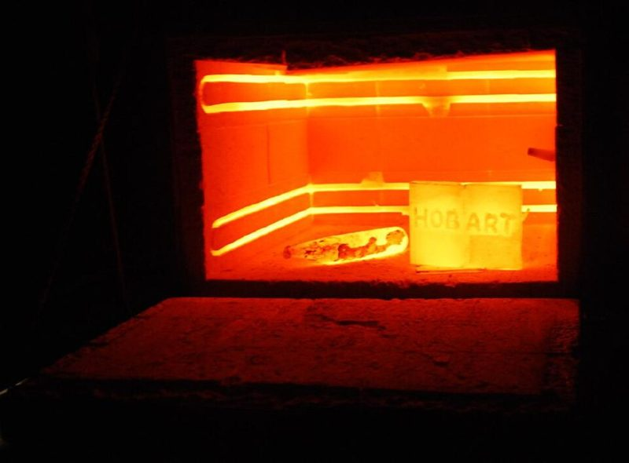 | 열처리로 | 금속을 뜨겁게 했다가 식혀 단단하게 만든다. **담금질**은 달궈서 기름·물에 확 식혀 단단하게(대장장이가 칼을 물에 "치익" 넣는 것), **뜨임**은 다시 살짝 데워 덜 부러지게, **침탄**은 겉에 탄소를 스며들게 해 겉만 단단하게 하는 것이다. 로 안은 쇠가 타지 않게 특수 가스(**분위기 가스**)로 채운다 | 화상, 분위기 가스 폭발·질식, 담금질유 화재 | — |
| 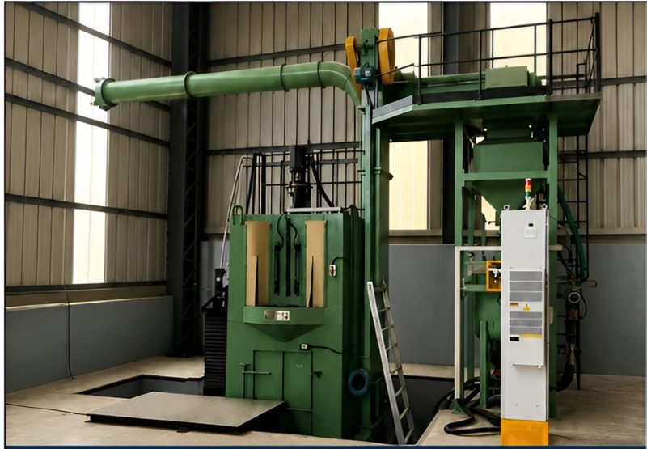 | 쇼트 블라스트 | 작은 쇠구슬을 세게 쏘아 녹과 검은 껍질(**산화막**)을 벗긴다. **비유:** 모래 폭풍으로 때 벗기기 | 분진, 소음, 튀는 쇠구슬 | 집진 설비는 검사 (국소배기장치) |
| (사진 없음) | 도금 라인 | 부품을 약품이 든 큰 통(**조**)에 차례로 담가 전기로 아연·니켈·크롬 같은 다른 금속을 얇게 입힌다. 수도꼭지의 반짝이는 겉이 크롬 도금이다 | 산·시안(맹독 약품)·크롬 노출, 조에 빠짐 | 배기 설비는 검사 (국소배기장치) |
| 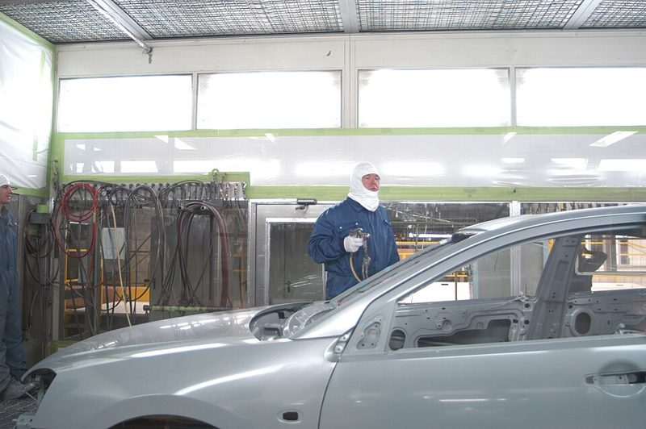 | 도장 부스 | 칸막이 방 안에서 스프레이로 페인트(**도료**)를 뿌린다. 사진은 자동차 도장 부스 | 페인트를 녹이는 액체(**유기용제**, 신나 같은 것)의 증기 — 들이마시면 해롭고 불이 잘 붙는다. 화재·폭발 | 배기 설비는 검사 (국소배기장치) |

---

## 2. C29 기타 기계 및 장비 제조업

> **한 줄로:** C25 같은 부품을 모으고 크게 깎아 **다른 공장이나 건물에서 쓸 기계**를 조립한다.

**주변에서 보는 물건:** 아파트 물탱크 양수 펌프, 에어컨 실외기 속 압축기, 굴착기 팔을 움직이는 유압 실린더, 엘리베이터 감속기(기어 뭉치), 트랙터, 반도체 공장 장비.

일반 목적용(291: 엔진·터빈, 유압기기, 펌프·압축기, 베어링·기어, 산업용 오븐, 운반·하역 기계, 냉동공조 기기 등)과 특수 목적용(292: 농업용 기계, 공작기계, 건설·광산 기계, 음식료·섬유 기계, 반도체·디스플레이 제조용 기계 등)으로 나뉜다.

**C25와 무엇이 다른가:** 자르기·굽히기·깎기·용접 장비는 C25와 거의 같다. 여기에 두 가지가 더해진다.

1. **크고 무거운 부품**을 정밀하게 깎는 장비 — 기계 몸통은 몇 미터, 몇 톤씩 나간다.
2. **조립과 시운전** — 부품을 모아 기계를 만들고 실제로 돌려 본다.

부품이 무거워 **천장크레인**을 많이 쓰고, 그래서 무거운 것에 맞거나 깔리는 사고가 C25보다 큰 비중을 차지한다.

**공정 그림**

```
① 부품 만들기 ── 철판으로 통·틀을 만들고(제관), 큰 덩어리를 깎는다
   ▼
② 열처리·도장 ── C25와 같다
   ▼
③ 조립 ──────── 크레인으로 무거운 부품을 들어 맞추고 볼트로 조인다
   ▼
④ 시운전 ────── 완성 기계를 실제로 돌려 성능을 확인한다
   ▼
⑤ 출하
```

**예시로 따라가기 — 양수 펌프 한 대**

1. 철판을 잘라 용접해 펌프 받침대를 만든다(**제관** — 철판으로 통·탱크·틀을 만드는 일).
2. 펌프 몸통 덩어리를 **머시닝센터**에 올려 물이 지나갈 길을 깎는다.
3. **수평 보링기**로 축이 들어갈 구멍을 아주 정확하게 넓힌다. 여기가 조금만 틀어져도 펌프가 떨고 소리가 난다.
4. 도장한다.
5. **천장크레인**으로 몸통을 들어 받침대 위에 놓고, 날개(임펠러)·축·모터를 조립한다. 크레인에 매단 몸통 아래에 손이나 몸이 들어가면 깔림 사고가 난다.
6. **시운전대**에서 실제로 물을 퍼 올려 본다. 1분에 몇 리터를 내보내는지(**토출량**)를 재서 기준에 맞는지 확인한다.

| 사진 | 장비 | 하는 일 | 주로 조심할 위험 | 법정 관리 |
|---|---|---|---|---|
| 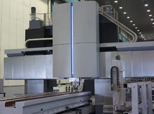 | 문형 머시닝센터 (갠트리 밀) | 문(門) 모양 틀이 큰 테이블 위를 가로질러 다니며, 몇 미터짜리 **베드**(기계의 받침 몸통)·프레임 같은 큰 부품을 깎는다. **비유:** 큰 책상 위를 오가는 문 모양 다리미 | 움직이는 테이블·**주축**(공구를 물고 도는 축)에 끼임, 큰 공작물을 제대로 묶지 않아 움직이거나 떨어짐 | 자율 (공작기계) |
| 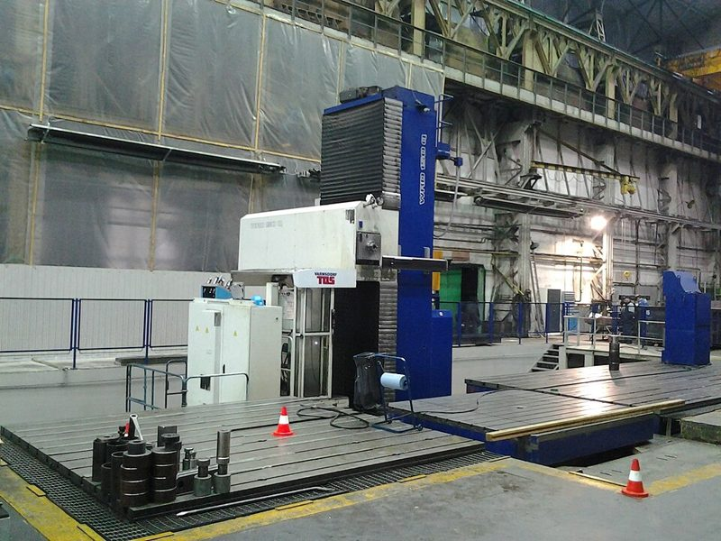 | 수평 보링기 | 큰 몸체에 이미 뚫린 구멍을 아주 정확한 크기로 넓힌다 (베어링이 들어갈 자리 등). **비유:** 대충 판 구멍을 줄자로 재 가며 딱 맞게 다듬기 | 회전 주축에 말림 | — |
| 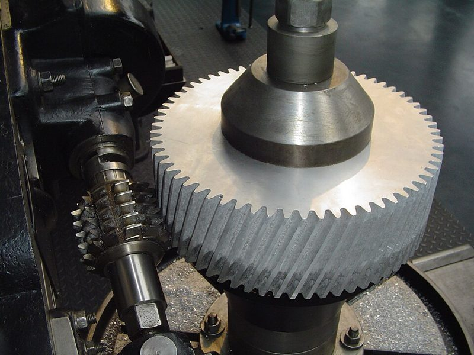 | 기어 호빙기 | 톱니바퀴의 이를 하나하나 깎는다. 공구와 공작물이 같이 돌면서 이가 차례로 생긴다 | 회전 공구 접촉, 절삭유 | — |
| 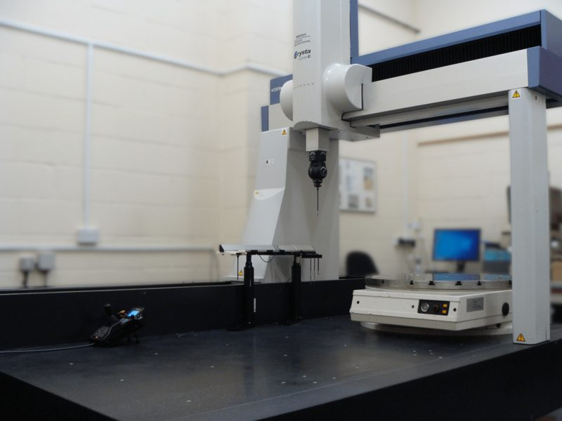 | 3차원 측정기 (CMM) | 가는 바늘(탐침)로 부품 여기저기를 콕콕 찍어 위치를 재고, 도면과 치수가 맞는지 검사한다. **비유:** 아주 정밀한 자 | 위험 낮음 | — |
| (1장 참고) | CNC 선반, 머시닝센터, 연삭기, 레이저 절단기, 절곡기, 용접기, 용접 로봇 | C25와 같다 | C25와 같다 | C25와 같다 |
| (사진 없음) | 조립 작업대·체결 공구 | 부품을 볼트로 조이고(**체결**), 기름·공기가 흐를 관(배관)과 전선(배선)을 잇는다. 정비소에서 "따다닥" 소리 내는 압축 공기 렌치(**공압 공구**)를 많이 쓴다 | 무거운 부품 들다 허리·손 다침, 공압 공구 반동 | — |
| (사진 없음) | 시운전·성능 시험대 | 완성 기계를 실제로 돌려 성능을 확인한다 (펌프가 내보내는 물의 양, 압축기가 만드는 압력 등) | 도는 부분, 압력 시험 중 터짐, 소음 | 압력용기면 인증, 검사 |
| (6장 참고) | 천장크레인 | 큰 부품을 들어 옮기고 조립 위치에 맞춘다 | 매단 짐 떨어짐, 몸이 짐과 구조물 사이에 끼임 | 인증, 검사 |

---

## 3. C22 고무 및 플라스틱제품 제조업 (진흥원 표기 C21)

> **한 줄로:** 플라스틱 알갱이나 생고무를 **녹이거나 반죽해서 틀로 모양**을 만든다.

**주변에서 보는 물건:** 샴푸·세제 통, 비닐봉지, 수도·하수 파이프, 리모컨·가전 케이스, 도시락 용기, 자동차 고무 패킹, 고무호스.

**금속과 무엇이 다른가:** 금속은 단단한 덩어리를 **깎거나 눌러서** 모양을 낸다. 플라스틱·고무는 **물렁하게 만든 뒤 틀에 넣고 굳힌다.** 그래서 이 업종의 핵심은 열(녹이기·굳히기)과 금형이고, 위험도 화상과 끼임이 중심이다.

플라스틱제품(222)과 고무제품(221)은 쓰는 장비가 꽤 달라서 나눠 적는다.

### 3-1. 플라스틱

플라스틱의 원료를 **수지**라고 부른다. 원래 나무진(송진)을 뜻하는 말인데, 플라스틱도 열을 받으면 물렁해지고 식으면 굳어서 **합성수지**라 부르게 됐다. 공장에는 쌀알만 한 알갱이(**펠릿**)로 포대에 담겨 들어온다. 흔한 수지는 PE(비닐봉지·통), PP(용기·자동차 부품), PVC(파이프), ABS(가전 외장)다.

**공정 그림**

```
펠릿 포대
   ▼
① 원료 말리기 ── 알갱이에 밴 습기를 뺀다 (습기가 있으면 제품에 거품·줄이 생김)
   ▼
② 성형 ────── 녹여서 틀에 넣거나 뽑아낸다. 만들 물건에 따라 방법이 다르다:
   │            사출(틀에 쏘기) · 압출(길게 뽑기) · 블로우(부풀리기)
   │            · 필름(풍선처럼 불기) · 진공 성형(빨아 붙이기)
   ▼
③ 후가공 ───── 인쇄, 자르기, 붙이기
   ▼
④ 재활용 ───── 불량품·자투리를 잘게 부숴 ①로 되돌린다
```

**성형 방법 다섯을 한눈에**

| 방법 | 어떻게 | 비유 | 만드는 것 |
|---|---|---|---|
| 사출 | 녹인 수지를 닫힌 금형 안에 세게 쏘아 넣고 식으면 꺼낸다 | 주사기로 틀에 젤리 채우기 | 리모컨 케이스, 병뚜껑, 컵 |
| 압출 | 녹인 수지를 모양 구멍(**다이**)으로 계속 밀어낸다 | 치약 짜기, 가래떡 뽑기 | 파이프, 창틀, 전선 피복 |
| 블로우 | 녹은 튜브를 금형에 넣고 안에 공기를 불어 부풀린다 | 풍선을 틀 안에서 불기 | 샴푸 통, 기름통, 드럼 |
| 필름(인플레이션) | 녹은 튜브를 위로 뽑으며 공기로 크게 부풀려 얇은 막을 만든다 | 비눗방울을 길게 늘이기 | 비닐봉지, 포장 랩 |
| 진공 성형 | 데워 물렁해진 판을 틀 위에 놓고 공기를 빨아 틀에 착 붙인다 | 랩을 그릇에 씌우고 빨아들이기 | 계란판, 도시락 용기, 과자 트레이 |

**예시로 따라가기 — 리모컨 겉 케이스**

1. ABS 펠릿 포대를 뜯어 **호퍼**(기계 위 깔때기 모양 원료통)에 붓는다. **호퍼 건조기**가 습기를 날린다.
2. **사출성형기** 안에서 나사가 돌며 알갱이를 녹이고, 끈적한 물엿 같은 수지를 금형에 쏜다.
3. 몇 초 식힌 뒤 금형이 열리면 **취출 로봇**(제품을 꺼내는 로봇 팔)이 케이스를 집어 컨베이어에 놓는다. 로봇 없이 사람이 손을 넣어 꺼내는 공장에서는 이때 금형이 닫혀 손이 끼는 사고가 난다.
4. 수지가 흘러 들어간 길이 굳은 꼬다리(**런너**)를 떼어 **분쇄기**에 넣는다. 잘게 부서져 다시 원료가 된다.

| 사진 | 장비 | 하는 일 | 주로 조심할 위험 | 법정 관리 |
|---|---|---|---|---|
| 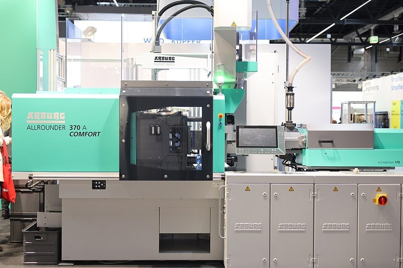 | 사출성형기 | 녹인 수지를 금형에 쏘아 넣고 식혀 꺼낸다. 플라스틱 공장의 대표 장비. 위에 제품을 꺼내는 취출 로봇을 다는 경우가 많다. **비유:** 주사기로 틀에 젤리 채우기 | 제품 꺼낼 때 금형 사이 끼임, 노즐(수지가 나오는 주둥이) 화상, 200℃가 넘는 수지가 튀어 나옴 | 인증, 검사 |
| 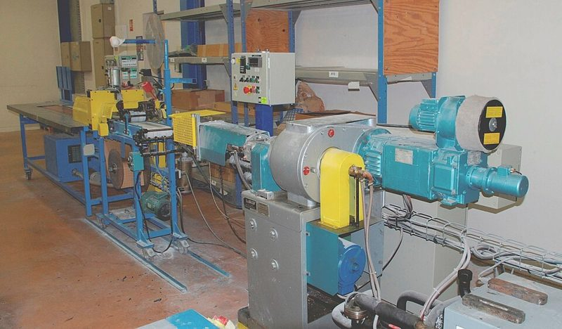 | 압출기 | 녹인 수지를 나사(스크루)로 밀어 모양 구멍(다이)으로 짜내, 파이프·판(시트)·**프로파일**(창틀처럼 단면 모양이 일정한 긴 제품)을 끊김 없이 뽑는다. 뽑힌 제품은 **인취기**가 일정한 속도로 잡아당기고 절단기가 길이대로 자른다. **비유:** 가래떡 기계 | 인취기·절단기 물림, 다이 화상 | — |
| 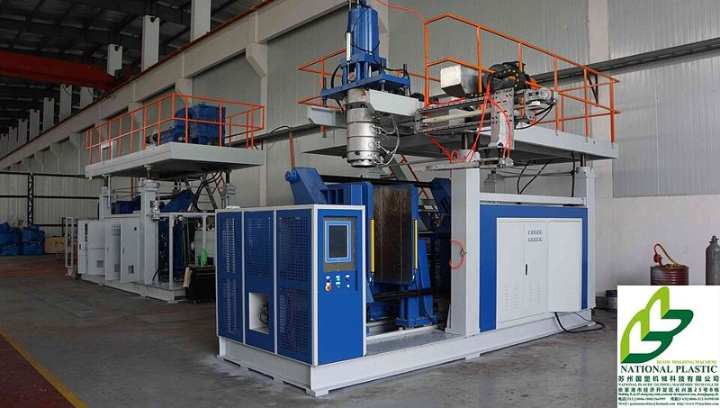 | 블로우 성형기 | 녹은 튜브를 금형에 넣고 공기로 부풀려 병·통·드럼을 만든다. **비유:** 틀 안에서 풍선 불기 | 금형 끼임, 화상 | — |
| 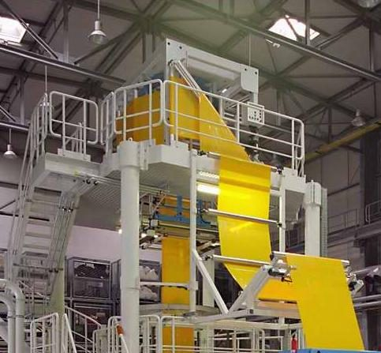 | 필름 성형기 (인플레이션) | 녹은 튜브를 위로 뽑아 올리며 풍선처럼 부풀려 비닐 필름을 만든다. 몇 층 높이의 탑 모양 설비다 | 롤 물림, 탑 위 작업 중 떨어짐 | — |
| 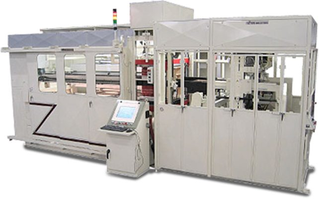 | 진공·압공 성형기 | 플라스틱 판을 히터로 데워 금형에 빨아 붙이거나(진공) 공기로 눌러 붙여(압공) 트레이·용기를 만들고, 날로 잘라 낸다 | 히터 화상, 금형·절단 날 끼임 | — |
| 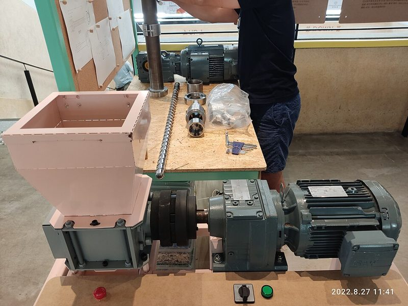 | 분쇄기 | 불량품과 자투리를 잘게 부숴 원료로 다시 쓴다. 사진은 전시용 소형 분쇄기. **비유:** 믹서기 | 넣는 입구(투입구)로 손이 들어가 절단 | 자율, 검사 (2026년 6월부터) |
| (사진 없음) | 호퍼 건조기, 금형 온도조절기, 냉각기 | 원료 습기를 빼고, 금형을 알맞은 온도로 데우거나 식힌다 | 뜨거운 표면 화상 | — |

### 3-2. 고무

고무는 플라스틱과 반대로 **반죽했다가 구워서 굳힌다.** 나무에서 받은 그대로의 **생고무**는 끈적하고 약하다. 여기에 검은 탄소 가루(**카본블랙** — 타이어가 검은 까닭)와 약품을 섞고, 황을 넣고 열을 가해 굳히면 탄력 있는 고무가 된다. 이 굳히기를 **가황**이라 한다. 빵 반죽을 오븐에 구워 빵이 되는 것과 비슷하다.

**공정 그림**

```
생고무 + 카본블랙 + 약품
   ▼
① 배합 ────── 섞어 반죽한다 (혼합기 → 롤 밀)
   ▼
② 시트·압출 ── 얇은 판으로 펴거나 길게 뽑는다 (캘린더 → 판, 압출기 → 호스)
   ▼
③ 성형·가황 ── 금형에 넣고 열과 압력으로 굽는다 (가황 프레스, 가황관)
   ▼
④ 마무리 ──── 금형 틈으로 삐져나온 얇은 군살(바리)을 떼어 낸다
```

**예시로 따라가기 — 자동차 엔진용 고무 오링(동그란 고무 패킹)**

1. 생고무, 카본블랙, 약품을 **밴버리 믹서**에 넣고 섞는다.
2. 나온 덩어리를 **2롤 밀**에서 마주 도는 두 롤 사이로 여러 번 통과시켜 고르게 반죽하고 판으로 뽑는다. 작업자가 손으로 고무를 롤 쪽으로 밀어 넣다 손이 함께 빨려 들어가는 사고가 이 업종의 대표 중대사고다.
3. 판을 작게 잘라 **가황 프레스**의 뜨거운 금형 홈에 넣고 눌러 굽는다.
4. 꺼낸 오링 둘레에 붙은 얇은 군살(**바리**)을 떼어 낸다.

| 사진 | 장비 | 하는 일 | 주로 조심할 위험 | 법정 관리 |
|---|---|---|---|---|
| 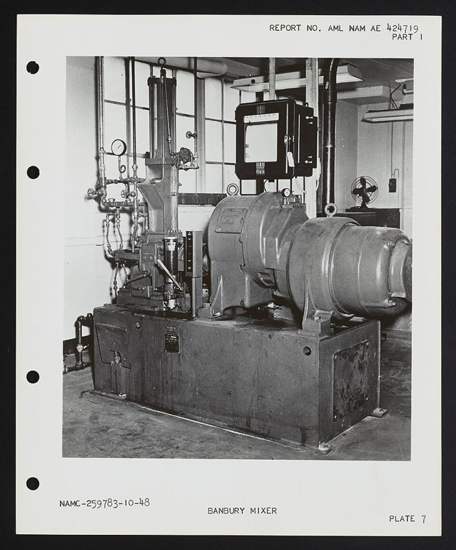 | 밀폐식 혼합기 (밴버리 믹서) | 닫힌 통 안에서 날개가 돌며 생고무에 카본블랙·약품을 넣고 섞는다. **비유:** 뚜껑 닫는 대형 반죽기 | 넣는 입구·나오는 입구 끼임, 분진 | 자율, 검사 (혼합기, 2026년 6월부터) |
| 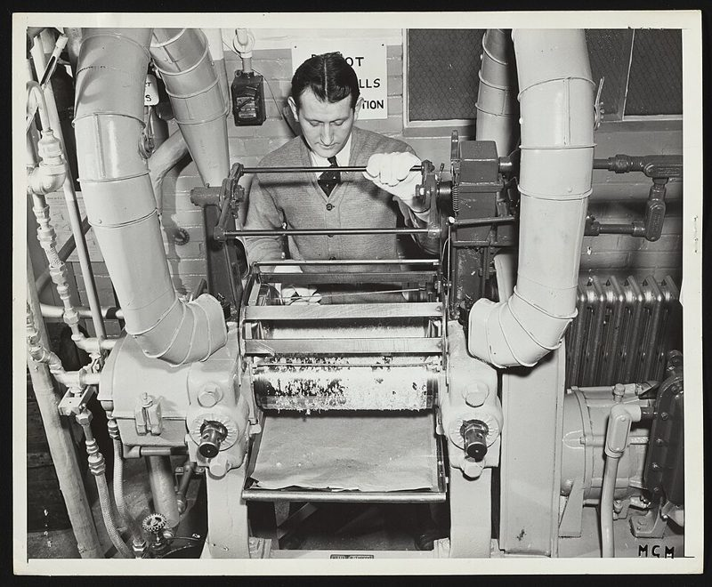 | 2롤 밀 (오픈 롤) | 마주 도는 두 롤 사이로 고무를 반죽하고 판으로 뽑는다. 롤이 드러나 있어 손으로 다룬다. **비유:** 파스타 반죽 롤러 | 롤 사이 손 물림. 고무 공장의 대표적인 중대사고 장비라 **급정지장치**(몸이 닿거나 줄을 당기면 롤이 바로 멈추는 장치)가 필수다 | 인증, 검사 (롤러기) |
| 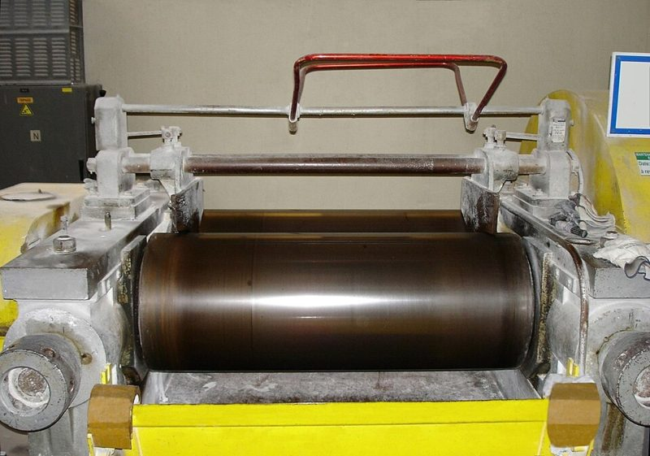 | 캘린더 | 롤 여러 개 사이로 고무 덩어리를 차례로 통과시켜 두께가 고른 얇은 판으로 편다. **비유:** 밀대로 여러 번 밀기 | 롤 물림 | 인증, 검사 (롤러기) |
| (3-1 압출기 참고) | 고무 압출기 | 호스·문틀 고무 같은 긴 제품을 뽑는다 | 스크루·인취기 물림 | — |
| 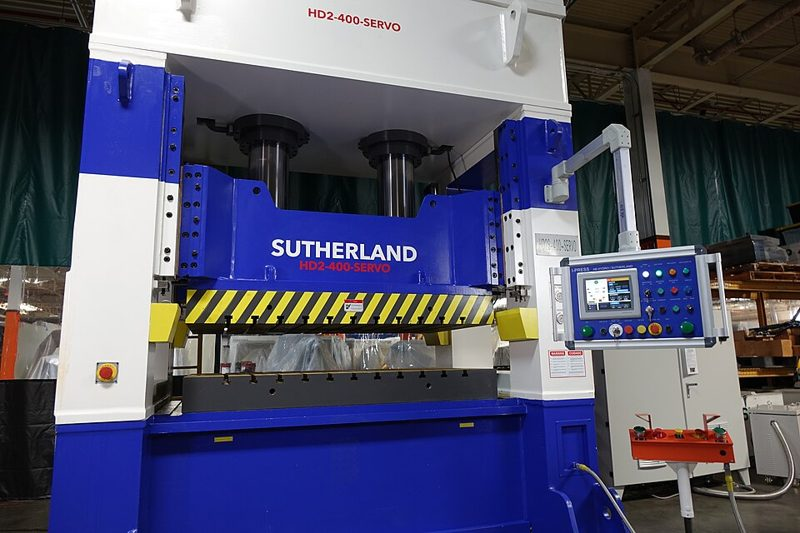 | 압축 성형(가황) 프레스 | 뜨거운 판 사이 금형에 고무를 넣고 눌러 굽는다. **비유:** 와플 기계 | 뜨거운 판 화상, 금형 끼임 | — |
| (사진 없음) | 가황관 (오토클레이브) | 큰 원통 안에 고무 제품을 넣고 뜨거운 고압 증기로 익힌다. **비유:** 아주 큰 압력밥솥 | 압력이 남은 채 문을 열면 폭발·화상 (압력밥솥 김 빼기 전 뚜껑 여는 것과 같다) | 인증, 검사 (압력용기) |

---

## 4. C26 전자 부품, 컴퓨터, 영상, 음향 및 통신장비 제조업

> **한 줄로:** 초록색 기판(PCB)에 쌀알보다 작은 전자 부품 수백 개를 **납으로 붙여** 전자 기기의 두뇌를 만든다.

**주변에서 보는 물건:** 공유기·TV·세탁기 속 초록 기판, 휴대폰 카메라 모듈, 반도체 칩, LED.

범위가 넓다. 반도체(261), 전자부품(262: PCB, 표시장치, 기타 부품), 컴퓨터(263), 통신·방송장비(264), 영상·음향기기(265), 마그네틱·광학 매체(266)가 다 들어간다.

**대부분의 중소 공장이 하는 일:** **PCB**(인쇄회로기판 — 전선 대신 구리 길이 새겨진 초록 판)에 부품을 붙이는 **실장**과 조립이다. 반도체 칩이나 빈 PCB 원판을 만드는 곳은 소수다.

**다른 업종과 무엇이 다른가:** 기계가 크게 움직이지 않아 끼임은 적다. 대신 **납·약품 연기, 뜨거운 오븐, 화학물질**이 중심 위험이다.

### 4-1. PCB 실장·조립 (대부분의 중소 공장)

**SMT**(표면실장기술)는 부품의 다리를 구멍에 꽂지 않고 **기판 표면에 바로 올려 붙이는** 방식이다. 기계 세 대가 컨베이어로 이어져 한 줄(라인)을 이룬다.

**공정 그림**

```
빈 PCB
   ▼
① 납 크림 인쇄 ── 붙일 자리에만 납 풀을 바른다 (스텐실로 그림 그리듯)
   ▼
② 부품 올리기 ── 로봇이 부품을 집어 제자리에 놓는다
   ▼
③ 리플로우 ──── 오븐에 구워 납을 녹이면 부품이 붙는다
   ▼
④ 자동 검사 ─── 카메라로 잘못 붙은 곳을 찾는다
   ▼
⑤ 큰 부품 납땜 ─ 다리 달린 부품(전원 단자 등)은 납 물결이나 사람 손으로 붙인다
   ▼
⑥ 조립·시험 ─── 케이스에 넣고 전원을 넣어 본다
```

**예시로 따라가기 — 공유기 기판 한 장**

1. 빈 초록 기판이 컨베이어에 올라간다.
2. **납 크림 인쇄기**가 구멍 뚫린 얇은 금속판(**스텐실**)을 대고, 치약 같은 **납 크림**(납 가루를 끈적한 풀에 섞은 것)을 밀어 바른다. 부품이 앉을 자리에만 회색 점이 찍힌다.
3. **칩 마운터**가 1초에 수십 개씩 부품을 집어 그 점 위에 올린다.
4. **리플로우 오븐**을 몇 분 동안 지나며 서서히 데워졌다 식는다. 납이 녹았다 굳으며 부품이 붙는다.
5. **자동 광학 검사기**가 사진을 찍어 빠지거나 삐뚤어진 부품을 찾는다.
6. 랜선 꽂는 단자처럼 다리가 긴 부품은 **웨이브 납땜기**나 사람이 **인두**로 붙인다.
7. 케이스에 넣고 전원을 넣어 와이파이가 잡히는지 시험한다.

| 사진 | 장비 | 하는 일 | 주로 조심할 위험 | 법정 관리 |
|---|---|---|---|---|
| 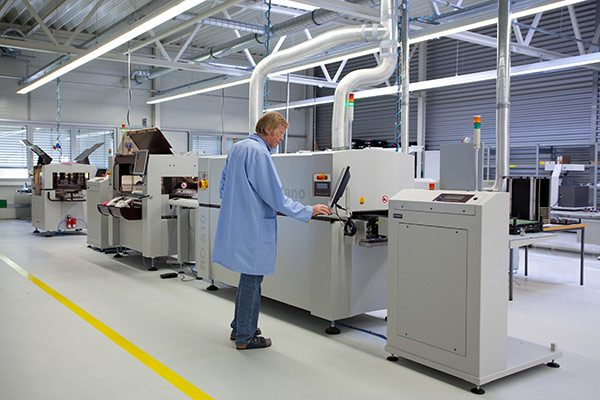 | SMT 라인 (전체) | 인쇄기 → 마운터 → 리플로우가 컨베이어로 이어진 한 줄 | 아래 장비별 위험 | — |
| 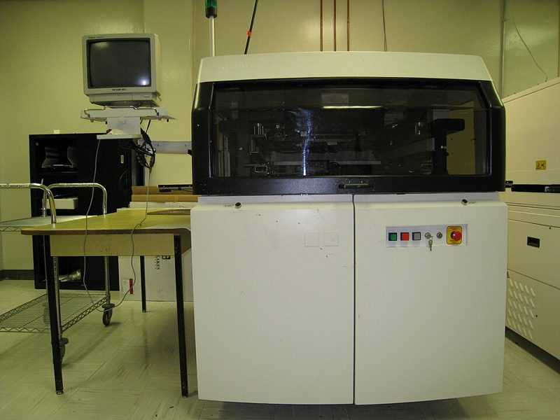 | 납 크림 인쇄기 (스크린 프린터) | 구멍 뚫린 금속판을 대고 기판에 납 크림을 바른다. **비유:** 스텐실 판 대고 페인트 칠하기 | 기판 옮기는 부분 끼임, 판 닦는 세척 용제 | — |
| 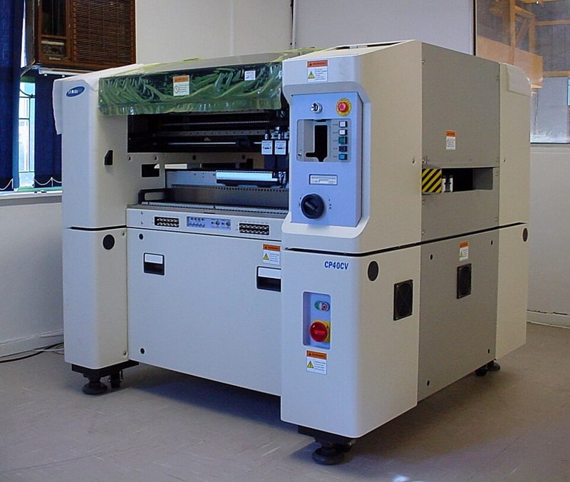 | 칩 마운터 | 빨대 같은 노즐로 부품을 빨아 집어 기판 위 제자리에 올린다. **비유:** 아주 빠른 인형 뽑기 집게 | 덮개 열고 손 넣을 때 빠르게 움직이는 머리(헤드)에 다침 | — |
| 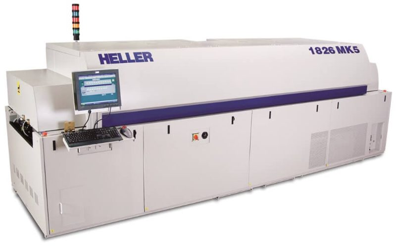 | 리플로우 오븐 | 기판을 구간별로 데워 납을 녹여 부품을 붙인다. **비유:** 컨베이어가 지나가는 긴 토스터 | 고온, **플럭스**(납이 잘 붙게 돕는 약품)가 타며 나는 연기, 질소를 쓰면 산소 결핍 | — |
| 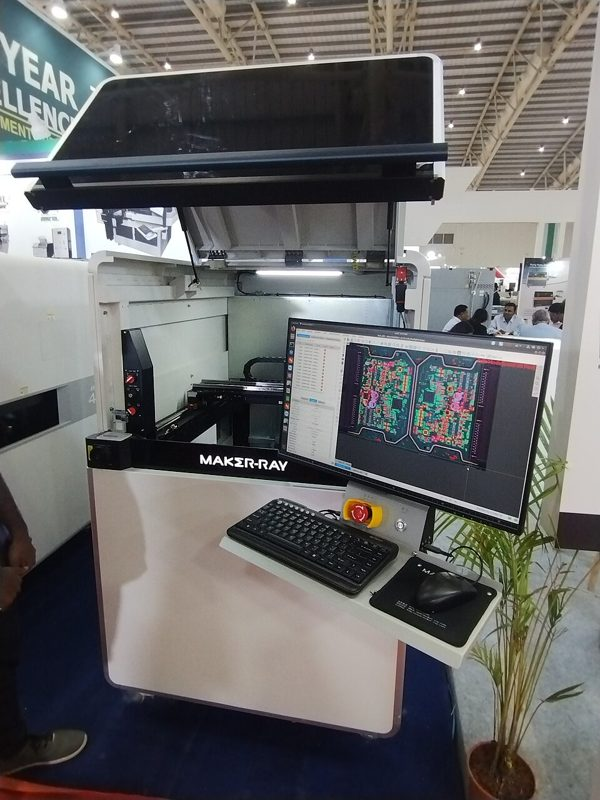 | 자동 광학 검사기 (AOI) | 카메라로 사진을 찍어 납땜 불량을 찾는다 | 위험 낮음 | — |
| 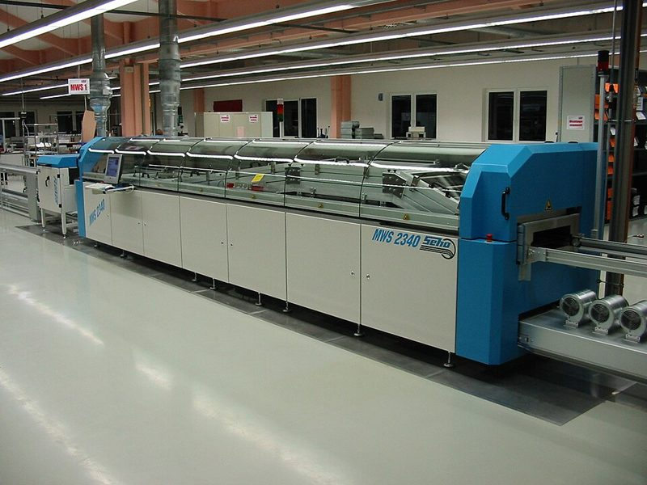 | 웨이브 납땜기 | 녹은 납을 분수처럼 물결치게 하고 그 위로 기판을 지나가게 해, 구멍에 꽂은 다리 달린 부품을 한꺼번에 납땜한다 | 납 통(약 250℃ 이상) 화상, 납·플럭스 연기 | 배기 설비는 검사 (국소배기장치) |
| 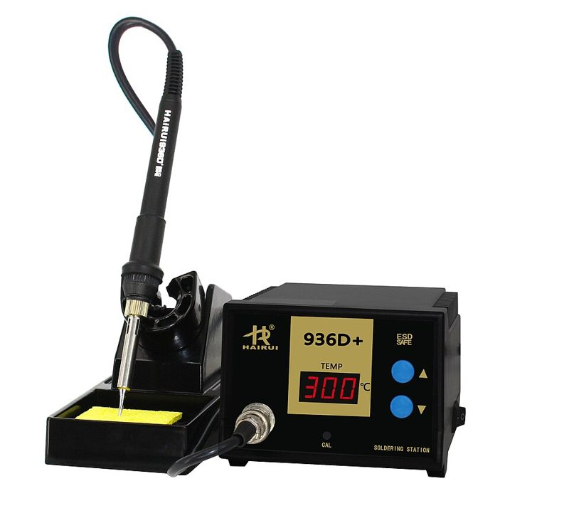 | 납땜 인두 (스테이션) | 뜨거운 쇠 펜(인두)으로 손으로 납땜하고 고친다 | 화상, 납·플럭스 연기 | — |

### 4-2. 반도체·PCB 원판 제조 (소수 업체)

반도체는 얇은 실리콘 원판(**웨이퍼**) 위에 아주 얇은 막을 쌓고(**증착**), 빛으로 회로 무늬를 찍고(**노광** — 사진 현상과 비슷하다), 필요 없는 부분을 약품이나 가스로 깎아 내(**식각**·에칭) 회로를 만든다. 이 과정을 수백 번 되풀이한다. 먼지 한 알도 불량이 되어 먼지를 관리하는 방(**클린룸**)에서 한다.

| 사진 | 장비 | 하는 일 | 주로 조심할 위험 | 법정 관리 |
|---|---|---|---|---|
| 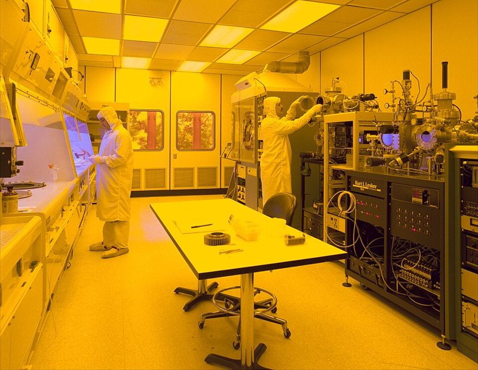 | 클린룸 | 먼지를 관리하는 작업 공간. 방진복을 입고 들어간다. 노광 구역은 회로 찍는 약품이 반응하지 않게 노란 조명을 쓴다 | 가스·약품이 샐 때 문이 겹겹이라 대피가 어렵다 | — |
| 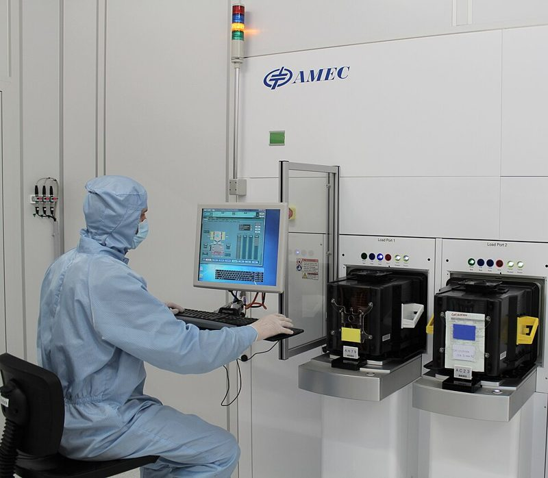 | 반도체 공정 장비 (식각·증착 등) | 웨이퍼 위에 막을 쌓고 깎아 회로를 만든다 | 독성 가스, 공기에 닿기만 해도 저절로 불이 붙는 가스(실레인 등), 고전압 | 화학물질관리법 대상 물질 다수 |
| (사진 없음) | 습식 세정·에칭 장비 | 산·알칼리 약품으로 씻고 녹인다. PCB 공장의 에칭·도금 라인도 비슷하다 | 불산 같은 강한 산이 피부에 닿음 (불산은 피부를 뚫고 뼈까지 상하게 한다) | 배기 설비는 검사 (국소배기장치) |
| (사진 없음) | 후공정 장비 (다이싱 소, 와이어 본더, 몰딩기) | 웨이퍼를 칩 하나하나로 자르고(다이싱 소), 칩과 다리를 머리카락보다 가는 금선으로 잇고(와이어 본더), 검은 플라스틱으로 감싼다(몰딩기). 우리가 보는 검은 네모 칩이 이렇게 나온다 | 회전 날, 몰딩 열 | — |

---

## 5. C28 전기장비 제조업 (진흥원 표기 "전기전자")

> **한 줄로:** 전기를 **만들고(발전기), 바꾸고(변압기), 나누고(배전반), 보내고(전선), 담고(전지), 쓰는(모터·조명)** 장비를 만든다.

**주변에서 보는 물건:**

| 하위 업종 | 주변에서 보는 것 |
|---|---|
| 전동기·발전기·변압기·배전반 (281) | 선풍기·엘리베이터 모터, 전봇대 위 회색 원통(변압기), 건물 지하 전기실의 큰 철제 함(아파트 두꺼비집의 큰 형님) |
| 전지 (282) | 휴대폰·전기차 배터리 |
| 전선·케이블 (283) | 벽 속 전선, 전봇대 사이 전깃줄 |
| 조명 (284) | LED 등, 가로등 |
| 가정용 기기 (285) | 전기밥솥, 헤어드라이어 |
| 기타 전기장비 (289) | 그 밖의 전기 부품 |

하위 업종마다 장비가 꽤 달라서 묶음별로 적는다. 판금·프레스·사출처럼 다른 업종 장비를 많이 빌려 쓰고, **감전**과 **전지 화재**가 이 업종에 특히 많은 위험이다.

### 5-1. 전동기·변압기

모터와 변압기는 속이 비슷하다. **철심**(얇은 쇠판을 겹겹이 쌓은 몸통)에 **코일**(구리선을 둘둘 감은 것)을 감은 구조다. 전기가 코일을 지나면 철심이 자석이 되어, 모터는 돌고 변압기는 전압이 바뀐다.

**공정 그림**

```
전기강판 코일 (모터·변압기용 특수 얇은 강판)
   ▼
① 자르기·찍기 ── 폭대로 자르고(슬리터), 프레스로 철심 조각을 찍어 낸다
   ▼
② 철심 쌓기 ─── 얇은 조각을 수백 장 겹친다 (식빵 쌓기)
   ▼
③ 코일 감기 ─── 구리선을 철심에 감는다 (실패에 실 감기)
   ▼
④ 함침·건조 ─── 코일을 절연 니스에 담갔다 말린다 (전기가 엉뚱한 데로 새지 않게 코팅)
   ▼
⑤ 조립 → ⑥ 시험 (높은 전압을 걸어 새는 곳이 없나 본다)
```

| 사진 | 장비 | 하는 일 | 주로 조심할 위험 | 법정 관리 |
|---|---|---|---|---|
| 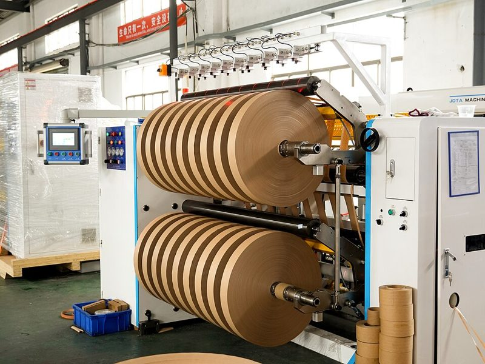 | 슬리터 | 넓은 코일(전기강판, **동박**=얇은 구리박, 필름)을 풀면서 원하는 폭으로 길게 자른다. **비유:** 큰 두루마리 휴지를 칼로 여러 개의 작은 두루마리로 나누기 | 회전 칼날·롤 물림 | — |
| (1-2 프레스 참고) | 철심 타발 프레스 | 전기강판을 1분에 수백 번 찍어 철심 조각을 뽑아낸다(**타발** — 찍어 뽑기) | 끼임, 소음 | 인증, 검사 |
| (사진 없음) | 권선기 (코일 와인딩 머신) | 구리선을 돌려 감아 코일을 만든다. **비유:** 실패에 실 감기 | 도는 부분에 말림, 선이 끊어져 튐 | — |
| (사진 없음) | 함침 설비·건조로 | 코일에 전기가 새지 않게 하는 니스(절연 **바니시**)를 스며들게 하고(**함침**) 오븐에서 굳힌다 | 니스 용제 증기 화재·폭발, 고온 | 배기 설비는 검사 (국소배기장치) |
| 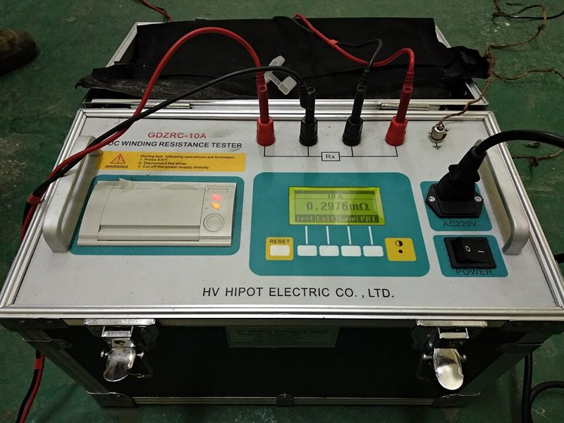 | 내전압 시험기 | 실제로 쓸 때보다 훨씬 높은 전압을 걸어, 전기가 새지 않고 버티는지(**절연**) 확인한다 | 감전 (수천 V) | — |

### 5-2. 배전반·제어반

**배전반**은 들어온 큰 전기를 여러 갈래로 나눠 보내는 철제 함이다. 안에 차단기(전기가 너무 많이 흐르면 끊는 스위치)와 계기가 줄지어 있다. 아파트 두꺼비집을 크게 키운 것으로 보면 된다.

**공정 그림:** 철판으로 함 만들기(레이저·터렛 펀치·절곡, 1장 참고) → 가루 페인트 칠(분체 도장) → 굵은 구리 띠 가공(부스바) → 차단기 달고 선 잇기 → 시험

| 사진 | 장비 | 하는 일 | 주로 조심할 위험 | 법정 관리 |
|---|---|---|---|---|
| 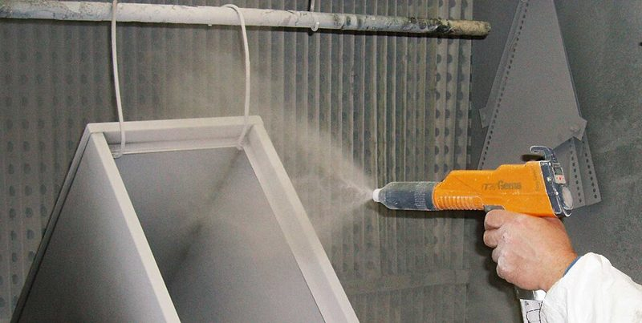 | 분체 도장 설비 | 액체 페인트 대신 **가루 페인트**를 정전기로 철판에 붙이고, 오븐에서 녹여 굳힌다. **비유:** 문지른 풍선에 머리카락이 달라붙는 것 | 날린 가루가 불꽃을 만나 터지는 분진 폭발, 정전기 불꽃 | 배기 설비는 검사 (국소배기장치) |
| 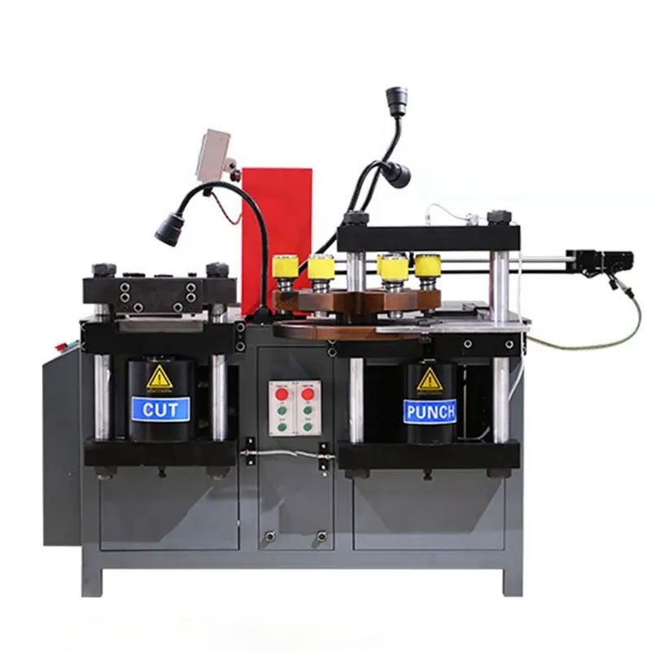 | 부스바 가공기 | 전선 대신 큰 전기를 나르는 굵은 구리 띠(**부스바**)를 자르고, 구멍 뚫고, 굽힌다 | 금형 끼임 | — |
| 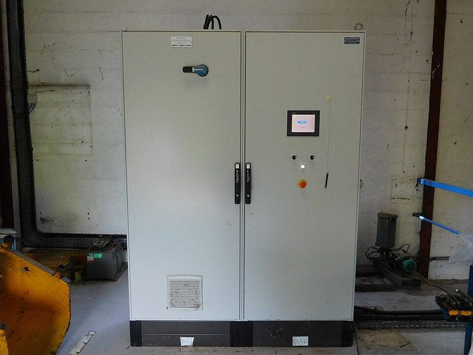 | 배전반 조립·배선 | 차단기·계기를 함에 달고 선을 잇는다. 사진은 완성된 배전반 | 시험 중 감전 | — |

### 5-3. 전선·케이블 (사진 없음)

전선은 **굵은 구리 막대 → 가늘게 뽑기 → 여러 가닥 꼬기 → 플라스틱 옷 입히기 → 감기** 순서로 만든다.

| 장비 | 하는 일 | 주로 조심할 위험 |
|---|---|---|
| 신선기 | 굵은 구리·알루미늄 선을 점점 작은 구멍(다이)에 차례로 통과시켜 가늘게 뽑는다. 선을 당기는 회전 드럼을 **캡스턴**이라 한다. **비유:** 엿 늘이기 | 도는 캡스턴에 말림, 선 튐 |
| 연선기 | 가는 선 여러 가닥을 꼬아 한 줄로 만든다. **비유:** 새끼 꼬기 | 빠르게 도는 틀 |
| 압출 피복기 | 선 겉에 전기가 안 통하는 플라스틱(절연 수지)을 씌운다(**피복**). 3-1 압출기와 같은 원리 | 다이 화상, 인취기 물림 |
| 권취기 (드럼) | 완성된 케이블을 큰 나무·쇠 드럼에 감는다 | 드럼에 말림, 드럼이 굴러 깔림 |

### 5-4. 전지 (2차전지)

**2차전지**는 다시 충전해 쓰는 전지다(휴대폰·전기차 배터리). 안은 **양극 · 분리막 · 음극**을 겹친 샌드위치이고, 그 사이를 **전해액**(전기를 띤 알갱이가 오가는 액체)이 채운다.

> **"화성"이라는 말에 주의.** 전지 공정의 **화성**(化成)은 "처음 충전해 쓸 수 있게 깨우는 공정"이라는 뜻이다. 화성시(華城)와 상관없다.

**공정 그림**

```
① 전극 만들기
   믹서(재료 반죽) → 코터(얇은 금속박에 반죽을 고르게 바름 — 김에 밥 펴기)
   → 롤프레스(눌러 다짐) → 슬리터(폭대로 자름) → 노칭(모양대로 따냄)
   ▼
② 조립 ── 양극·분리막·음극을 겹쳐 쌓거나(적층) 둘둘 말고(권취), 통에 넣고 전해액을 붓는다
   ▼
③ 화성 ── 처음으로 충전·방전해 전지를 깨운다
   ▼
④ 검사
```

| 사진 | 장비 | 하는 일 | 주로 조심할 위험 | 법정 관리 |
|---|---|---|---|---|
| 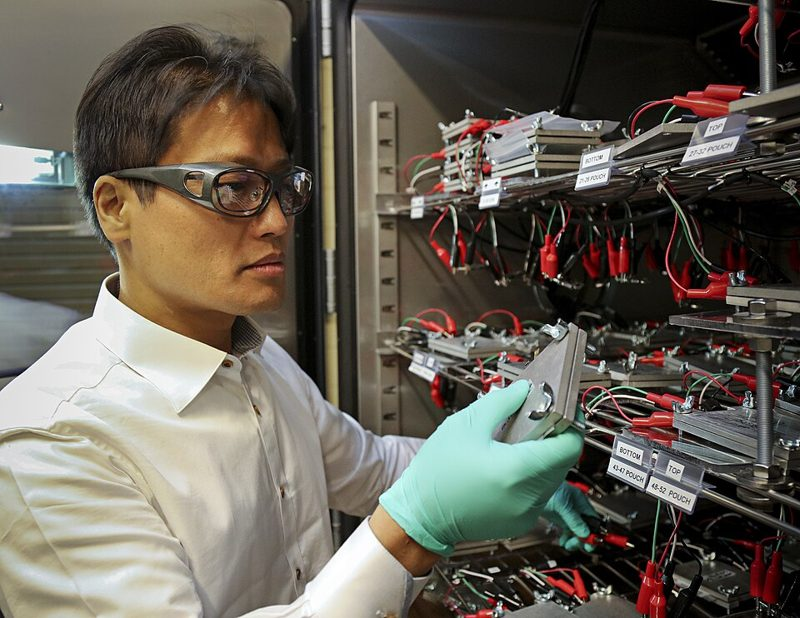 | 충방전 (화성) 장비 | 조립한 전지(셀) 수백 개를 선반에 꽂아 처음으로 충전·방전해 쓸 수 있는 상태로 만든다 | **열폭주** 화재 — 전지 하나가 뜨거워지면 스스로 더 뜨거워지며 옆 전지로 번지고, 물로도 잘 안 꺼진다. 전지 공장의 대표 위험 | — |
| (사진 없음) | 믹서, 코터, 롤프레스, 노칭·적층기 | 전극 재료를 섞고, 금속박에 바르고, 눌러 다지고, 모양대로 잘라 쌓는다 | 롤 물림, 반죽용 용제(NMP) 노출, 분진 | 믹서는 자율, 검사 (혼합기, 2026년 6월부터) |

### 5-5. 조립 공통

| 사진 | 장비 | 하는 일 | 주로 조심할 위험 | 법정 관리 |
|---|---|---|---|---|
| 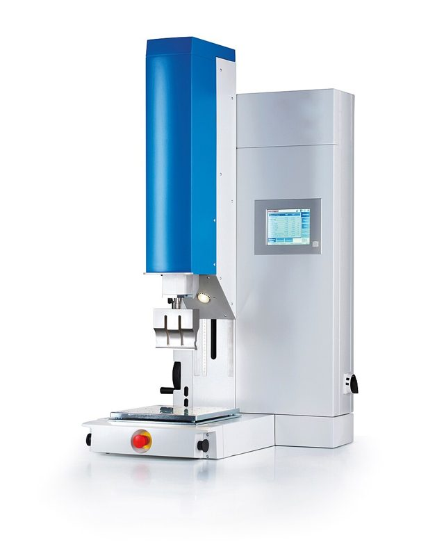 | 초음파 용착기 | 1초에 수만 번 떨리는 진동으로 마찰열을 내 플라스틱 케이스나 금속 단자를 녹여 붙인다(**용착**). 누르는 쇠 막대를 **혼**이라 한다. **비유:** 손바닥을 빠르게 비비면 뜨거워지는 것 | 혼 끼임, 소음 | — |
| (3-1 참고) | 사출성형기 | 가전·조명 외장, 커넥터(전선 꽂는 단자) 몸체를 만든다 | 3-1과 같다 | 인증, 검사 |

---

## 6. 업종 공통 장비

다섯 업종 어느 공장에 가도 있는 장비다. 주로 **옮기기**와 **공기 관리**를 맡는다.

| 사진 | 장비 | 하는 일 | 주로 조심할 위험 | 법정 관리 |
|---|---|---|---|---|
| 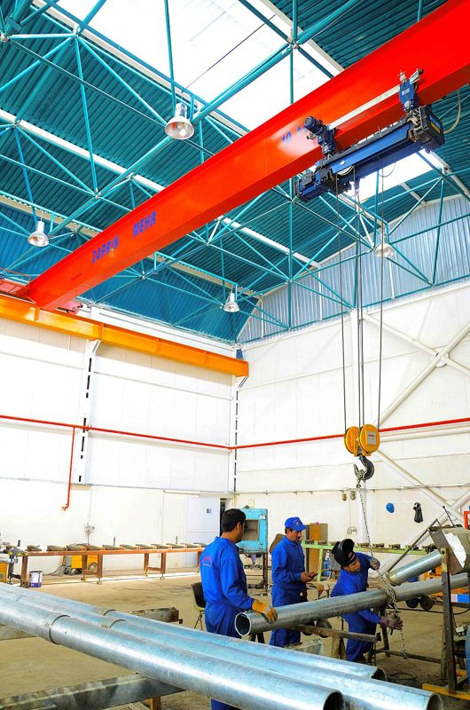 | 천장크레인·호이스트 | 천장 레일을 따라 움직이며 무거운 소재·금형·제품을 쇠줄(**와이어로프**)로 매달아 옮긴다. **호이스트**는 그중 작은 들어 올림 장치. **비유:** 인형 뽑기 기계를 공장 크기로 | 매단 짐 떨어짐, 와이어로프 끊어짐 | 인증, 검사 (2톤 이상) |
| 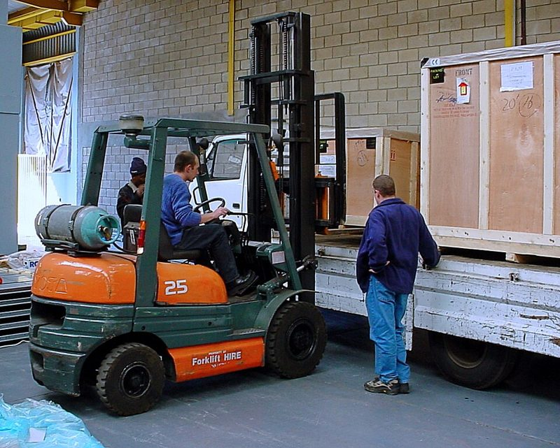 | 지게차 | 앞의 두 갈퀴로 짐 받침(팔레트)째 소재·제품을 들어 싣고 옮긴다 | 사람과 부딪힘·깔림, 짐 떨어짐 (짐에 가려 앞이 잘 안 보인다) | 방호 |
| 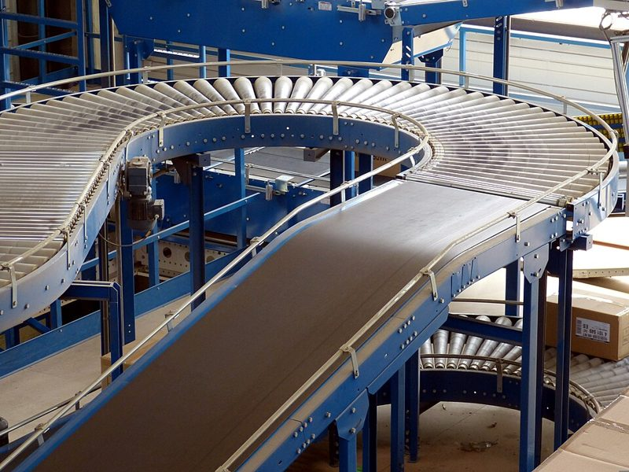 | 컨베이어 | 움직이는 벨트나 굴림대로 공정 사이 물건을 나른다. **비유:** 공항 수하물 벨트, 회전 초밥 | 벨트·롤러 물림 | 자율, 검사 |
| (1-4 사진 참고) | 산업용 로봇 | 용접·옮기기·쌓기를 자동으로 한다 | 로봇 팔이 닿는 범위 안 부딪힘·끼임 | 자율, 검사 |
| 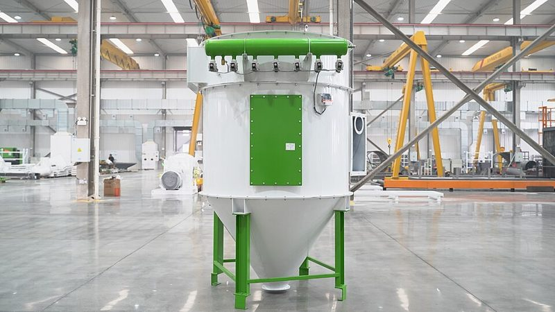 | 집진기 (국소배기장치) | 가루·연기가 생기는 바로 그 자리에서 빨아들여 필터로 거른다. **국소배기장치**는 "그 자리(국소)에서 빼낸다(배기)"는 뜻이다. **비유:** 부엌 가스레인지 위 후드 + 진공청소기 | 모인 금속·플라스틱 가루가 터지는 분진 폭발, 필터 갈 때 가루를 마심 | 검사 |
| (사진 없음) | 공기압축기 | 공기를 눌러 담아 공압 공구와 장비에 보낸다. **비유:** 자전거 펌프를 모터로 돌림 | 공기 탱크 터짐, 소음 | 방호. 탱크가 압력용기면 인증, 검사 |

---

## 7. 업종별로 겹치는 장비

어느 장비가 어느 업종에서 많이 쓰이는지 대략 보여 주는 표다. ●는 그 업종의 주력 장비, ○는 일부 공장에서 쓰는 장비다.

**읽는 예:** "사출성형기"는 C22에서 ●이고 C26·C28에서 ○다. 플라스틱 공장의 주력이지만, 전자·전기 공장도 케이스나 단자를 직접 찍는 곳이 있다는 뜻이다. 그래서 전기장비 공장을 점검할 때도 사출성형기 끼임을 봐야 할 수 있다.

| 장비 | C25 금속가공 | C29 기계장비 | C22 고무·플라스틱 | C26 전자부품 | C28 전기장비 |
|---|:-:|:-:|:-:|:-:|:-:|
| 프레스 | ● | ○ | | | ● (철심·단자) |
| 전단기·절곡기·레이저 절단기 | ● | ● | | | ● (배전반 함) |
| CNC 선반·머시닝센터 | ● | ● | ○ (금형) | | ○ |
| 용접기·용접 로봇 | ● | ● | | | ○ |
| 사출성형기 | | | ● | ○ (커넥터·케이스) | ○ (외장) |
| 압출기 | | | ● | | ● (케이블 피복) |
| 롤러기 (롤 밀·캘린더) | | | ● (고무) | | |
| 혼합기·분쇄기 | | | ● | | ○ (전지 믹서) |
| SMT·납땜 장비 | | ○ (제어기) | | ● | ○ |
| 도장 (액체·분체) | ● | ● | | | ● |
| 열처리로·건조로 | ● | ○ | | ○ | ● (함침 건조) |
| 천장크레인 | ● | ● | ○ | | ● |
| 지게차·컨베이어 | ● | ● | ● | ● | ● |
| 집진기·국소배기장치 | ● | ● | ● | ● | ● |

C22의 "CNC 선반·머시닝센터 ○ (금형)"은 플라스틱 공장 중 금형을 직접 깎거나 고치는 곳이 있다는 뜻이다.

---

## 8. 사진 출처

모든 사진은 위키미디어 공용에서 받아 긴 변 800px로 줄였다. 라이선스가 CC BY·CC BY-SA인 사진은 다른 곳에 옮겨 쓸 때도 작성자와 라이선스를 함께 밝혀야 한다.

| 파일 | 원본 | 작성자 | 라이선스 |
|---|---|---|---|
| `shear.jpg` | [Gasparini guillotine shear.jpg](https://commons.wikimedia.org/wiki/File:Gasparini_guillotine_shear.jpg) | GaspariniMB | CC BY-SA 4.0 |
| `laser_cut.jpg` | [CNC Laser Cutting Machine.jpg](https://commons.wikimedia.org/wiki/File:CNC_Laser_Cutting_Machine.jpg) | S zillayali | CC BY 3.0 |
| `plasma_cut.jpg` | [Cnc plasma cutting.jpg](https://commons.wikimedia.org/wiki/File:Cnc_plasma_cutting.jpg) | Devaes (English Wikipedia) | CC BY-SA 3.0 |
| `band_saw.jpg` | [Band saw photo.jpg](https://commons.wikimedia.org/wiki/File:Band_saw_photo.jpg) | The U.S. National Archives | Public domain |
| `turret_punch.jpg` | [Amadapunch.jpg](https://commons.wikimedia.org/wiki/File:Amadapunch.jpg) | Torgeir Arnøy | Public domain |
| `press_c_frame.jpg` | [20260210 Maschinen in der Estamperie 1 Deutsche…](https://commons.wikimedia.org/wiki/File:20260210_Maschinen_in_der_Estamperie_1_Deutsches_Technikmuseum_Berlin_anagoria.jpg) | anagoria | CC BY 3.0 |
| `press_transfer.jpg` | [16.000 Kilonewton starke Transferpresse am Stan…](https://commons.wikimedia.org/wiki/File:16.000_Kilonewton_starke_Transferpresse_am_Standort_Erfurt.jpg) | NeleKirk | CC BY-SA 4.0 |
| `press_hydraulic.jpg` | [1000toGesamtAnsicht.jpg](https://commons.wikimedia.org/wiki/File:1000toGesamtAnsicht.jpg) | PeFi | Public domain |
| `press_brake.jpg` | [High-tonnage press brake.jpg](https://commons.wikimedia.org/wiki/File:High-tonnage_press_brake.jpg) | GaspariniIndustries | CC BY-SA 4.0 |
| `roll_forming.jpg` | [Highway Guardrail Roll Forming Machine.jpg](https://commons.wikimedia.org/wiki/File:Highway_Guardrail_Roll_Forming_Machine.jpg) | Maxontony | CC BY-SA 4.0 |
| `forging.jpg` | [Alte Presse.JPG](https://commons.wikimedia.org/wiki/File:Alte_Presse.JPG) | User:Matthias.Gruber | CC BY-SA 3.0 |
| `cnc_lathe.jpg` | [MoriSeikiLathe.jpg](https://commons.wikimedia.org/wiki/File:MoriSeikiLathe.jpg) | Glenn McKechnie | CC BY-SA 3.0 |
| `machining_center.jpg` | [Kent USA MACHINING CENTER KVR-4020A.jpg](https://commons.wikimedia.org/wiki/File:Kent_USA_MACHINING_CENTER_KVR-4020A.jpg) | Mike Zielinski | CC BY-SA 4.0 |
| `drill_press.jpg` | [Induction motor drill press.jpg](https://commons.wikimedia.org/wiki/File:Induction_motor_drill_press.jpg) | Hardyplants | CC0 |
| `bench_grinder.jpg` | [Schleifbock-800.jpg](https://commons.wikimedia.org/wiki/File:Schleifbock-800.jpg) | 1-1111 at German Wikipedia | Public domain |
| `cyl_grinder.jpg` | [Centerless cylindrical grinder.jpg](https://commons.wikimedia.org/wiki/File:Centerless_cylindrical_grinder.jpg) | Carlos Vieira from Brazil | CC BY-SA 2.0 |
| `wire_edm.jpg` | [Ona AE300 (Wire EDM Cutting Machine).jpg](https://commons.wikimedia.org/wiki/File:Ona_AE300_(Wire_EDM_Cutting_Machine).jpg) | Ricard Polls | Public domain |
| `mig_weld.jpg` | [GMAW.welding.af.ncs.jpg](https://commons.wikimedia.org/wiki/File:GMAW.welding.af.ncs.jpg) | William M. Plate Jr. | Public domain |
| `spot_weld.jpg` | [Spot welder (Miller 12,000 amp model).jpg](https://commons.wikimedia.org/wiki/File:Spot_welder_(Miller_12,000_amp_model).jpg) | Triddle | CC0 |
| `weld_robot.jpg` | [FANUC 6-axis welding robots.jpg](https://commons.wikimedia.org/wiki/File:FANUC_6-axis_welding_robots.jpg) | Phasmatisnox | CC BY 3.0 |
| `heat_treat.jpg` | [Heat-Treating-Furnace.jpg](https://commons.wikimedia.org/wiki/File:Heat-Treating-Furnace.jpg) | Ichudov | CC BY-SA 3.0 |
| `shot_blast.jpg` | [Airless Shot Blasting Machine By Surface Intern…](https://commons.wikimedia.org/wiki/File:Airless_Shot_Blasting_Machine_By_Surface_International.png) | WXS2OFF | CC0 |
| `paint_booth.jpg` | [Spray booth.jpg](https://commons.wikimedia.org/wiki/File:Spray_booth.jpg) | Chrysler Restorers SA | CC0 |
| `gantry_mill.jpg` | [WaldrichSiegen ProfiMill.jpg](https://commons.wikimedia.org/wiki/File:WaldrichSiegen_ProfiMill.jpg) | Andreasalbers | CC BY-SA 3.0 |
| `boring.jpg` | [Horizontal boring machine, floor type TOS WRD.jpg](https://commons.wikimedia.org/wiki/File:Horizontal_boring_machine,_floor_type_TOS_WRD.jpg) | R21M-cz | CC BY-SA 3.0 |
| `hobbing.jpg` | [Wälzfräsen.jpg](https://commons.wikimedia.org/wiki/File:W%C3%A4lzfr%C3%A4sen.jpg) | User:Kolossos | CC BY-SA 3.0 |
| `cmm.jpg` | [5 Axis Scanning Coordinate Measurement Machine …](https://commons.wikimedia.org/wiki/File:5_Axis_Scanning_Coordinate_Measurement_Machine_(CMM).png) | AB Technology (Newark) Ltd. | CC BY-SA 4.0 |
| `injection_molding.jpg` | [Arburg-swiss plastic 2026.jpg](https://commons.wikimedia.org/wiki/File:Arburg-swiss_plastic_2026.jpg) | Bricetofly | CC0 |
| `extruder.jpg` | [Plastic extruder.jpg](https://commons.wikimedia.org/wiki/File:Plastic_extruder.jpg) | Cjp24 | CC BY-SA 3.0 |
| `blow_molding.jpg` | [Plastic drum blow molding machine.jpg](https://commons.wikimedia.org/wiki/File:Plastic_drum_blow_molding_machine.jpg) | national plastic | CC BY-SA 4.0 |
| `film_blowing.jpg` | [Wendestangen.jpg](https://commons.wikimedia.org/wiki/File:Wendestangen.jpg) | SB68Manm | Public domain |
| `thermoforming.jpg` | [Zed-Inline-Pressure-SC-Series.png](https://commons.wikimedia.org/wiki/File:Zed-Inline-Pressure-SC-Series.png) | Wiki drews | CC0 |
| `granulator.jpg` | [HK 中環街市 Central Market shopping mall 商場 exhibit…](https://commons.wikimedia.org/wiki/File:HK_%E4%B8%AD%E7%92%B0%E8%A1%97%E5%B8%82_Central_Market_shopping_mall_%E5%95%86%E5%A0%B4_exhibition_recycle_plastic_materials_n_crusher_machine_August_2022_Px3_07.jpg) | Nai Min Buyaut Liam | CC BY-SA 4.0 |
| `banbury.jpg` | [Banbury Mixer in the Rubber Compounding and Pro…](https://commons.wikimedia.org/wiki/File:Banbury_Mixer_in_the_Rubber_Compounding_and_Processing_Laboratory_-_DPLA_-_9a5caa5e0f5409d4fc992d892f3dac06.jpg) | Naval Air Experimental Station; United States. Navy | Public domain |
| `two_roll_mill.jpg` | [Felix G. Nakielny operating two-roll mill in He…](https://commons.wikimedia.org/wiki/File:Felix_G._Nakielny_operating_two-roll_mill_in_Hercules_Experimental_Plastics_laboratory_-_DPLA_-_125f31299b8cdda4f83fd0981ebde992.jpg) | Hercules Incorporated; ACME | No restrictions |
| `calender.jpg` | [Calender machine.jpg](https://commons.wikimedia.org/wiki/File:Calender_machine.jpg) | Cjp24 | CC BY-SA 3.0 |
| `rubber_press.jpg` | [SERVO HYDRAULIC COMPRESSION MOLDING PRESSES.jpg](https://commons.wikimedia.org/wiki/File:SERVO_HYDRAULIC_COMPRESSION_MOLDING_PRESSES.jpg) | Sam D. Wilbur | CC BY-SA 4.0 |
| `smt_line.jpg` | [SMT-Bestueckung.jpg](https://commons.wikimedia.org/wiki/File:SMT-Bestueckung.jpg) | ECD Electronic Components GmbH Dresden | CC BY-SA 3.0 |
| `stencil_printer.jpg` | [Solder printing machine.jpg](https://commons.wikimedia.org/wiki/File:Solder_printing_machine.jpg) | Nelatan | Public domain |
| `pick_place.jpg` | [CP40CV 2003 RSA.jpg](https://commons.wikimedia.org/wiki/File:CP40CV_2003_RSA.jpg) | Ossewa | CC BY 4.0 |
| `reflow.jpg` | [Mark5 1826 Reflow Oven.jpg](https://commons.wikimedia.org/wiki/File:Mark5_1826_Reflow_Oven.jpg) | Heller Industries Inc. | CC BY-SA 3.0 |
| `aoi.jpg` | [Electronica, Bangalore International Exhibition…](https://commons.wikimedia.org/wiki/File:Electronica,_Bangalore_International_Exhibition_Centre_(2025)_261.jpg) | Gpkp | CC BY-SA 4.0 |
| `wave_solder.jpg` | [Seho MWS 2340.JPG](https://commons.wikimedia.org/wiki/File:Seho_MWS_2340.JPG) | Pedro ximenez | CC BY-SA 2.0 de |
| `soldering_station.jpg` | [936D+.jpg](https://commons.wikimedia.org/wiki/File:936D%2B.jpg) | Solderingironstation | CC BY-SA 4.0 |
| `cleanroom.jpg` | [Clean room.jpg](https://commons.wikimedia.org/wiki/File:Clean_room.jpg) | NASA Glenn Research Center | Public domain |
| `semi_equipment.jpg` | [AMEC 2.jpg](https://commons.wikimedia.org/wiki/File:AMEC_2.jpg) | Abkorshak | CC BY-SA 4.0 |
| `slitter.jpg` | [Dual Shaft Slitting machine.jpg](https://commons.wikimedia.org/wiki/File:Dual_Shaft_Slitting_machine.jpg) | Acheolg | CC BY-SA 4.0 |
| `hipot.jpg` | [Hipot tester.jpg](https://commons.wikimedia.org/wiki/File:Hipot_tester.jpg) | Dr Lotus Black | CC BY-SA 4.0 |
| `powder_coating.jpg` | [Powder-Coat-Gun.jpg](https://commons.wikimedia.org/wiki/File:Powder-Coat-Gun.jpg) | Alexandros T | CC BY-SA 4.0 |
| `busbar.jpg` | [Busbar Processing Machine.jpg](https://commons.wikimedia.org/wiki/File:Busbar_Processing_Machine.jpg) | SunShine Busbar Machine | CC0 |
| `switchgear.jpg` | [Armoire électrique des turbines de barrage.jpg](https://commons.wikimedia.org/wiki/File:Armoire_%C3%A9lectrique_des_turbines_de_barrage.jpg) | Cjp24 | CC BY-SA 4.0 |
| `battery_formation.jpg` | [Lithium-ion batteries (32206461334).jpg](https://commons.wikimedia.org/wiki/File:Lithium-ion_batteries_(32206461334).jpg) | Oak Ridge National Laboratory | CC BY 2.0 |
| `ultrasonic_weld.jpg` | [Ultraschall-Schweißmaschine.jpg](https://commons.wikimedia.org/wiki/File:Ultraschall-Schwei%C3%9Fmaschine.jpg) | Herrmann Ultraschalltechnik GmbH & Co. KG | CC BY-SA 4.0 |
| `overhead_crane.jpg` | [1198-zarrinmehr-min.jpg](https://commons.wikimedia.org/wiki/File:1198-zarrinmehr-min.jpg) | Zarrinmehr.cranes | CC BY-SA 4.0 |
| `forklift.jpg` | [Toyota forklift 25 RSA 2003.jpg](https://commons.wikimedia.org/wiki/File:Toyota_forklift_25_RSA_2003.jpg) | Ossewa | CC BY 4.0 |
| `conveyor.jpg` | [Conveyor system in a factory.jpg](https://commons.wikimedia.org/wiki/File:Conveyor_system_in_a_factory.jpg) | falco | CC0 |
| `dust_collector.jpg` | [Pulse Dust Collector.jpg](https://commons.wikimedia.org/wiki/File:Pulse_Dust_Collector.jpg) | RICHI Manufacture | CC BY 4.0 |

---

## 9. 용어 사전

가나다순이다. "나오는 곳"은 처음 나오거나 가장 중요한 장이다. 사고 종류는 [0-3](#0-3-사고-종류--문서에-계속-나오는-말), 법정 관리는 [0-4](#0-4-법정-관리--장비-표-맨-오른쪽-칸)의 표가 더 자세하다.

| 용어 | 쉬운 뜻 | 나오는 곳 |
|---|---|---|
| 가황 | 생고무에 황을 넣고 열과 압력으로 구워 탄력 있게 굳히는 것. 반죽을 구워 빵으로 만드는 것과 비슷하다. **가황관**(오토클레이브)은 이 일을 하는 큰 압력솥 | 3-2 |
| 감전 | 몸에 전기가 흘러 다치는 것 | 0-3 |
| 갠트리 | 문(門) 모양으로 걸친 틀. 테이블 위를 가로질러 움직인다 | 2 |
| 거스러미 (버) | 자르거나 깎은 자리에 남는 날카로운 돌기 | 1-3 |
| 공구 | 기계에 끼워 실제로 깎거나 뚫는 날 (드릴 날, 커터 등) | 1-3 |
| 공압 공구 | 전기 대신 압축 공기로 돌아가는 공구. 정비소의 "따다닥" 렌치 | 2 |
| 공작기계 | 금속을 깎는 기계를 통틀어 이르는 말 (선반, 머시닝센터, 연삭기 등) | 1-3 |
| 공작물 | 지금 기계에 물려 가공 중인 물건 | 0-2 |
| 국소배기장치 | 가루·연기가 생기는 그 자리에서 바로 빨아들여 밖으로 빼는 장치. 부엌 후드와 같은 생각 | 6 |
| 권선 | 구리선을 감아 코일을 만드는 것 | 5-1 |
| 권취 | 길게 나온 것을 둘둘 감는 것 (케이블을 드럼에, 전극을 원통으로) | 5-3, 5-4 |
| 금형 | 같은 모양을 계속 찍어 내는 쇠틀. 위·아래 한 쌍. 붕어빵 틀 | 1-2 |
| 급정지장치 | 몸이 닿거나 줄을 당기면 기계를 바로 멈추는 장치 | 3-2 |
| 깔림 | 무거운 것에 깔리는 사고 | 0-3 |
| 끼임 | 닫히는 두 물체 사이에 몸이 끼는 사고 | 0-3 |
| 납 크림 | 납 가루를 끈적한 풀에 섞은 것. 치약처럼 생겼다 (솔더 페이스트) | 4-1 |
| 노광 | 빛을 비춰 회로 무늬를 찍는 것. 사진 현상과 비슷하다 | 4-2 |
| 노즐 | 액체·공기가 나오는 좁은 주둥이 | 3-1 |
| 노칭 | 전극 판을 정해진 모양대로 따내는 것 | 5-4 |
| 다이 | ① 압출기 끝의 모양 구멍(가래떡 기계 구멍) ② 신선기의 선 뽑는 구멍 ③ 프레스 금형을 부르는 다른 말 | 3-1, 5-3 |
| 단조 | 달군 쇠를 때리거나 눌러 모양을 만드는 것. 대장장이 망치질 | 1-2 |
| 담금질 | 금속을 달궜다가 물·기름에 확 식혀 단단하게 하는 것 | 1-5 |
| 도금 | 다른 금속을 얇게 입히는 것. 수도꼭지의 반짝이는 크롬 | 1-5 |
| 도장 | 페인트(도료)를 칠하는 것 | 1-5 |
| 동박 | 아주 얇은 구리 판. 전지 전극과 PCB에 쓴다 | 5-1 |
| 딥드로잉 | 평평한 판을 컵 모양으로 깊게 끌어 늘리는 프레스 가공. 음료 캔, 개수대 | 1-2 |
| 뜨임 | 담금질한 금속을 다시 살짝 데워 덜 부러지게 하는 것 | 1-5 |
| 런너 | 사출할 때 수지가 금형 안 제품까지 흘러간 길이 그대로 굳은 꼬다리 | 3-1 |
| 롤러기 | 마주 도는 롤(굴림대) 사이로 재료를 통과시키는 기계 (2롤 밀, 캘린더). 법에서 쓰는 이름 | 3-2 |
| 리플로우 | 납 크림을 바른 기판을 오븐에 구워 납을 녹였다 굳혀 부품을 붙이는 것 | 4-1 |
| 마운터 | 부품을 집어 기판 위에 놓는 기계 | 4-1 |
| 말림 | 도는 축에 옷·장갑·머리카락이 감기는 사고 | 0-3 |
| 맞음 | 떨어지거나 튀는 것에 맞는 사고 | 0-3 |
| 머시닝센터 (MCT) | 공구를 돌려 고정된 공작물을 깎는 CNC 기계. 공구를 자동으로 바꿔 끼운다 | 1-3 |
| 물림 | 마주 도는 두 롤 사이로 몸이 빨려 들어가는 사고 | 0-3 |
| 미스트 | 기름이나 약품이 아주 작은 방울로 떠 있는 안개 | 1-3 |
| 바니시 | 전기가 새지 않게 코일에 바르는 니스 | 5-1 |
| 바리 | 금형 틈으로 삐져나와 굳은 얇은 군살 | 3-2 |
| 방전가공 | 전기 불꽃으로 금속을 조금씩 녹여 깎는 것 | 1-3 |
| 방호장치 | 사람이 위험한 곳에 닿지 않게 막는 장치 (덮개, 급정지장치, 광선 센서 등) | 0-4 |
| 배전반 | 들어온 전기를 여러 갈래로 나눠 보내는 철제 함. 큰 두꺼비집 | 5-2 |
| 베드 | 기계의 무거운 받침 몸통 | 2 |
| 보링 | 이미 뚫린 구멍을 정확한 크기로 넓히는 것 | 2 |
| 봉재 | 속이 꽉 찬 금속 막대 | 0-2 |
| 부스바 | 전선 대신 큰 전기를 나르는 굵은 구리 띠 | 5-2 |
| 부싱 | 축 둘레에 끼우는 짧은 통 모양 부품 | 1-3 |
| 분리막 | 전지의 양극과 음극이 닿지 않게 사이에 끼우는 얇은 막 | 5-4 |
| 분위기 가스 | 열처리로 안을 채워 쇠가 타거나 녹슬지 않게 하는 가스 | 1-5 |
| 분진 | 공기 중에 떠다니는 가루 | 0-3 |
| 분진 폭발 | 공기 중에 퍼진 가루가 불꽃을 만나 한꺼번에 타며 터지는 것 | 0-3 |
| 분체 | 가루. **분체 도장**은 가루 페인트를 정전기로 붙이고 구워 굳히는 칠 | 5-2 |
| 산소 결핍 | 다른 가스가 공기를 밀어내 숨 쉴 산소가 모자라는 것 | 0-3 |
| 산화막 | 금속 겉에 생긴 녹이나 검은 껍질 | 1-5 |
| 생고무 | 아직 굳히지(가황하지) 않은 고무 | 3-2 |
| 선반 | 공작물을 돌리고 날을 대어 둥글게 깎는 기계. 연필깎이 | 1-3 |
| 성형 | 깎지 않고 누르거나 녹여 붓거나 부풀려 모양을 만드는 것 | 1-2, 3-1 |
| 수지 | 플라스틱 원료. 정식으로는 합성수지 | 3-1 |
| 숫돌 | 갈아 내는 데 쓰는 돌 바퀴 | 1-3 |
| 시안 | 도금에 쓰는 맹독성 약품 | 1-5 |
| 시운전 | 완성 기계를 실제로 돌려 보는 것 | 2 |
| 식각 (에칭) | 약품이나 가스로 필요 없는 부분을 녹여 깎는 것 | 4-2 |
| 실장 | 기판에 전자 부품을 붙이는 것 | 4 |
| 아크 | 두 전극 사이에 튀는 강한 전기 불꽃. 용접에 쓴다 | 1-4 |
| 안전검사 | 장비를 쓰는 공장이 정해진 주기마다 받는 검사. 자동차 정기검사 | 0-4 |
| 안전인증 | 장비를 만들거나 들여올 때 받아야 하는 정부 인증 | 0-4 |
| 압력용기 | 안에 높은 압력의 공기·증기·가스를 담는 통. 터지면 위험해 법으로 관리한다 | 2, 6 |
| 압출 | 녹인 재료를 모양 구멍으로 밀어 길게 뽑는 것. 치약 짜기, 가래떡 | 3-1 |
| 연삭 | 숫돌로 갈아 내 정밀하게 다듬는 것 | 1-3 |
| 열처리 | 금속을 데웠다 식혀 단단함·질김을 바꾸는 것 | 1-5 |
| 열폭주 | 전지 하나가 뜨거워지면 스스로 더 뜨거워지며 멈추지 않고 번지는 현상 | 5-4 |
| 와이어로프 | 크레인에서 짐을 매다는 쇠줄 | 6 |
| 용접 | 금속을 녹여 이어 붙이는 것 | 1-4 |
| 용착 | 플라스틱 등을 열로 녹여 붙이는 것 | 5-5 |
| 웨이퍼 | 반도체를 만드는 얇고 둥근 실리콘 판 | 4-2 |
| 유기용제 | 페인트·접착제를 녹이는 액체 (신나, 아세톤 등). 증기가 해롭고 불이 잘 붙는다 | 1-5 |
| 유압 | 기름에 압력을 주어 큰 힘을 내는 방식. 자동차 잭 | 1-2 |
| 인취기 | 압출되어 나오는 제품을 일정한 속도로 잡아당기는 장치 | 3-1 |
| 임가공 | 남의 재료를 받아 가공만 해 주고 삯을 받는 일 | 1 |
| 자동전격방지기 | 용접하지 않는 동안 용접기 전압을 낮춰 감전을 막는 장치 | 1-4 |
| 자율안전확인 | 만든 회사가 스스로 안전기준에 맞는지 확인해 신고하는 제도 | 0-4 |
| 전극 | 전기가 드나드는 끝. 전지에서는 양극·음극 판, 용접에서는 전기를 흘리는 막대·집게 | 1-4, 5-4 |
| 전기강판 | 모터·변압기 철심용으로 만든 얇은 특수 강판 | 5-1 |
| 전단 | 위아래 칼날로 자르는 것. 가위질 | 1-1 |
| 전해액 | 전지 안에서 양극과 음극 사이를 채운 액체 | 5-4 |
| 절곡 | 판을 접어 굽히는 것 | 1-2 |
| 절삭 | 날로 깎아 내는 것 | 1-3 |
| 절삭유 | 깎을 때 날을 식히고 미끄럽게 하려 뿌리는 기름 섞인 물 | 1-3 |
| 절연 | 전기가 엉뚱한 곳으로 흐르지 않게 막는 것 | 5-1 |
| 정격하중 | 크레인 등이 안전하게 들 수 있는 최대 무게 | 0-4 |
| 제관 | 철판을 자르고 굽히고 용접해 통·탱크·틀을 만드는 일 | 2 |
| 조 | 약품이나 녹인 재료를 담아 두는 큰 통 (도금 조, 납 조) | 1-5 |
| 주축 | 공구나 공작물을 물고 도는 기계의 중심 축 | 2 |
| 증착 | 아주 얇은 막을 표면에 쌓는 것 | 4-2 |
| 집진기 | 가루를 빨아들여 필터로 거르는 장치 | 6 |
| 철심 | 모터·변압기 안의 쇠 몸통. 얇은 전기강판을 겹겹이 쌓아 만든다 | 5-1 |
| 취출 로봇 | 사출성형기에서 제품을 꺼내는 로봇 팔 | 3-1 |
| 침탄 | 금속 겉에 탄소를 스며들게 해 겉만 단단하게 하는 열처리 | 1-5 |
| 칩 | ① 깎을 때 나오는 쇠 부스러기(대팻밥) ② 반도체 칩 — 문맥으로 구분한다 | 1-3, 4-2 |
| 카본블랙 | 고무에 섞는 검은 탄소 가루. 타이어가 검은 까닭 | 3-2 |
| 캡스턴 | 선을 감아 당기는 회전 드럼 | 5-3 |
| 코일 | ① 둘둘 만 판재(두루마리) ② 구리선을 감은 전기 부품 — 문맥으로 구분한다 | 0-2, 5-1 |
| 클린룸 | 먼지를 관리하는 작업 공간 | 4-2 |
| 타발 | 프레스로 판에서 모양을 찍어 뽑아내는 것 | 5-1 |
| 터렛 | 여러 공구·펀치를 꽂아 두고 돌려 고르는 회전판 | 1-1 |
| 토출량 | 펌프 등이 정해진 시간에 내보내는 양 | 2 |
| 판금 | 판재를 자르고 접고 붙여 물건을 만드는 일 | 1 |
| 판재 | 넓고 얇은 금속판 | 0-2 |
| 펠릿 | 쌀알만 한 플라스틱 원료 알갱이 | 3-1 |
| 표면처리 | 겉에 옷을 입히거나 겉을 다듬는 일 (도금, 도장, 쇼트 블라스트) | 1-5 |
| 프로파일 | 창틀처럼 단면 모양이 일정한 긴 제품 | 3-1 |
| 플럭스 | 납이 잘 붙게 돕는 약품. 가열하면 연기가 난다 | 4-1 |
| 피복 | 전선 겉에 씌운 플라스틱 옷 | 5-3 |
| 한국표준산업분류 | 나라가 정한 업종 분류표. C25·C22 같은 코드가 여기서 나온다. 지금은 11차 | 한눈에 보기 |
| 함침 | 액체를 속까지 스며들게 하는 것 | 5-1 |
| 형 체결력 | 사출성형기가 금형을 닫아 누르는 힘 | 0-4 |
| 호이스트 | 무거운 것을 들어 올리는 작은 장치. 크레인에 달려 있다 | 6 |
| 호퍼 | 기계 위의 깔때기 모양 원료통 | 3-1 |
| 화성 (化成) | 전지를 처음 충전·방전해 쓸 수 있게 깨우는 공정. 화성시와 상관없다 | 5-4 |
| 흄 | 금속·플라스틱이 녹거나 탈 때 나는 아주 작은 알갱이 연기 | 0-3 |
| AOI | 자동 광학 검사기. 카메라로 불량을 찾는다 | 4-1 |
| CMM | 3차원 측정기. 탐침으로 콕콕 찍어 치수를 잰다 | 2 |
| CNC | 컴퓨터 수치 제어. 컴퓨터가 숫자 프로그램대로 기계를 움직인다 | 1-3 |
| CO2 · MIG · TIG | 아크 용접의 종류. 녹은 쇠를 감싸는 가스와 전극 방식이 다르다 | 1-4 |
| kN (킬로뉴턴) | 힘의 단위. 1kN은 약 100kg을 들 때 드는 힘. 294kN ≈ 30톤 | 0-4 |
| NMP | 전지 전극 반죽에 쓰는 용제. 들이마시거나 피부에 닿지 않게 관리한다 | 5-4 |
| PCB | 인쇄회로기판. 전선 대신 구리 길이 새겨진 초록 판 | 4 |
| SMT | 표면실장기술. 부품을 기판 표면에 바로 올려 붙이는 방식 | 4-1 |
